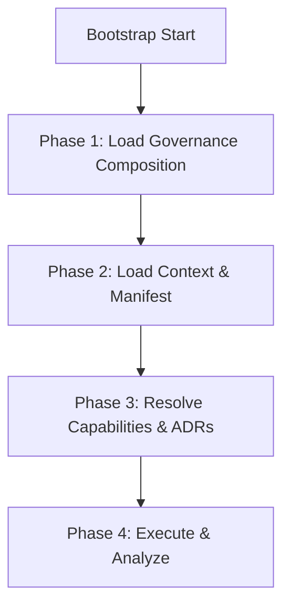

# AI Bootstrap Sequence & Operating Environment

---
Status: Implemented
Version: 1.0.0
Owner: AI Governance Architect
Last Updated: 2026-07-07
---

Berkas ini mendefinisikan langkah wajib inisialisasi (*Boot Sequence*) dan siklus hidup (*AI Lifecycle*) untuk setiap model AI yang memasuki repositori AetherOS. Desain proses ini dibuat simetris dengan **Bootstrap Engine** pada Runtime Platform.

---

## 1. AI Lifecycle (Siklus Hidup Model AI)

Setiap sesi interaksi model AI wajib beroperasi dalam status daur hidup yang teratur:

```text
[Idle] ──> [Bootstrap] ──> [Analyze] ──> [Planning] ──> [Execution] ──> [Validation] ──> [Review] ──> [Completed]
```

- **Idle**: Sesi belum dimulai.
- **Bootstrap**: Pemuatan berkas tata kelola dan inisiasi konteks dasar.
- **Analyze**: Pemeriksaan struktur repositori dan fungsionalitas kode aktual.
- **Planning**: Penyusunan implementasi rencana kerja dan draf keputusan jika diperlukan.
- **Execution**: Modifikasi kode sumber (baca aturan bebas komentar secara mutlak).
- **Validation**: Eksekusi pengujian lokal (`pytest`, linter, typing).
- **Review**: Pelaksanaan kriteria evaluasi mandiri (*self-review*).
- **Completed**: Penyerahan hasil ke Chief Architect dan penutupan sesi (*shutdown*).

---

## 2. Boot Sequence (Sekuens Inisiasi Konteks)

Model AI wajib mengeksekusi sekuens berikut sebelum mulai memproses instruksi Chief Architect:



### Phase 1: Load Governance Composition
- Muat berkas [GOVERNANCE.md](../GOVERNANCE.md) sebagai peta hub utama.
- Muat berkas Konstitusi [constitution.md](../01_constitution/constitution.md).

### Phase 2: Load Context & Manifest
- Muat berkas [project_context.md](../02_context/project_context.md) untuk memahami roadmap dan milestones.
- Muat berkas [architecture_context.md](../02_context/architecture_context.md) untuk mendapatkan peta arsitektur platform.

### Phase 3: Resolve Capabilities & ADRs
- Gunakan [discovery.md](../02_context/discovery.md) untuk memetakan lokasi ADR, RFC, dan berkas kode.
- Baca indeks ADR untuk memetakan aturan teknis yang sudah disepakati.

### Phase 4: Execute & Analyze
- Lakukan pemetaan direktori menggunakan [repository_map.md](../02_context/repository_map.md) untuk menemukan batas kode.
- Mulai analisis fungsional sebelum menulis baris kode pertama.
