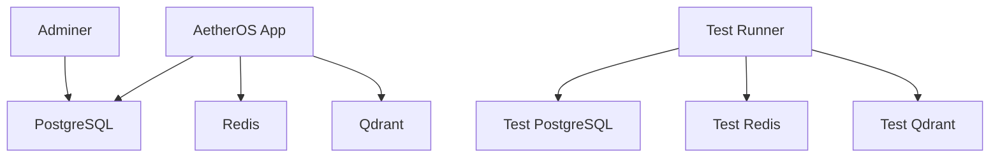

# AetherOS Docker Setup Guide

This guide provides comprehensive instructions for setting up and using AetherOS with Docker.

## Table of Contents

- [Prerequisites](#prerequisites)
- [Quick Start](#quick-start)
- [Docker Compose Configuration](#docker-compose-configuration)
- [Service Architecture](#service-architecture)
- [Development Workflow](#development-workflow)
- [Testing](#testing)
- [Production Deployment](#production-deployment)
- [Monitoring and Maintenance](#monitoring-and-maintenance)

## Prerequisites

### System Requirements

- **Docker Engine**: Version 24.0+ (Docker Desktop on macOS/Windows)
- **Docker Compose**: Version 2.0+
- **Hardware**:
  - Minimum: 4GB RAM, 2 CPU cores, 10GB disk space
  - Recommended: 8GB RAM, 4 CPU cores, 20GB disk space

### Install Docker

**macOS/Windows:**
- Download and install [Docker Desktop](https://www.docker.com/products/docker-desktop)

**Linux (Ubuntu/Debian):**
```bash
# Remove old versions
sudo apt-get remove docker docker-engine docker.io containerd runc

# Install dependencies
sudo apt-get update
sudo apt-get install -y ca-certificates curl gnupg

# Add Docker's official GPG key
sudo install -m 0755 -d /etc/apt/keyrings
curl -fsSL https://download.docker.com/linux/ubuntu/gpg | sudo gpg --dearmor -o /etc/apt/keyrings/docker.gpg
sudo chmod a+r /etc/apt/keyrings/docker.gpg

# Add repository
echo \
  "deb [arch="$(dpkg --print-architecture)" signed-by=/etc/apt/keyrings/docker.gpg] https://download.docker.com/linux/ubuntu \
  "$(. /etc/os-release && echo "$VERSION_CODENAME")" stable" | \
  sudo tee /etc/apt/sources.list.d/docker.list > /dev/null

# Install Docker Engine
sudo apt-get update
sudo apt-get install -y docker-ce docker-ce-cli containerd.io docker-buildx-plugin docker-compose-plugin

# Verify installation
docker --version
docker compose version
```

### Configure Docker Resources

1. Open Docker Desktop settings
2. Navigate to **Resources**
3. Set memory limit to at least 4GB (8GB recommended)
4. Set CPU limit to at least 2 cores (4 recommended)
5. Set disk image size to at least 20GB

## Quick Start

### Start Development Environment

```bash
# Clone repository (if not already done)
git clone https://github.com/aetheros/aetheros.git
cd aetheros

# Start all services
docker compose up -d

# Verify services are running
docker compose ps

# Run health checks
python tools/docker/test_docker_health.py
```

### Access Services

- **AetherOS Application**: `http://localhost:8000`
- **Adminer (Database UI)**: `http://localhost:8080`
- **PostgreSQL**: `localhost:5432` (user: `aetheros`, password: `aetheros`, db: `aetheros`)
- **Redis**: `localhost:6379`
- **Qdrant**: `http://localhost:6333`

### Stop Services

```bash
# Stop all containers
docker compose down

# Stop and remove volumes (WARNING: data loss)
docker compose down -v
```

## Docker Compose Configuration

### Main Configuration (`docker-compose.yml`)

The main configuration includes:

- **aetheros**: Main application service
- **postgres**: PostgreSQL database with health checks
- **redis**: Redis cache with persistence
- **qdrant**: Vector database
- **adminer**: Database management UI

### Test Configuration (`docker-compose.test.yml`)

Isolated test environment with:

- **test-runner**: Dedicated test container
- **test-postgres**: Test database
- **test-redis**: Test cache
- **test-qdrant**: Test vector database

### Environment Variables

Key environment variables (can be overridden in `.env` file):

```env
# AetherOS Configuration
AETHEROS_ENV=development
AETHEROS_PORT=8000
AETHEROS_HOST=0.0.0.0
AETHEROS_LOG_LEVEL=debug

# Database Configuration
POSTGRES_HOST=postgres
POSTGRES_PORT=5432
POSTGRES_DB=aetheros
POSTGRES_USER=aetheros
POSTGRES_PASSWORD=aetheros

# Cache Configuration
REDIS_HOST=redis
REDIS_PORT=6379

# Vector Database Configuration
QDRANT_HOST=qdrant
QDRANT_PORT=6333
```

## Service Architecture

### Service Overview



### Service Dependencies

- **aetheros**: Depends on PostgreSQL (healthy), Redis (healthy), Qdrant (started)
- **adminer**: Depends on PostgreSQL (started)
- **test-runner**: Depends on test services (healthy/started)

### Network Configuration

All services run on a dedicated bridge network `aetheros-network` for secure inter-service communication.

### Volume Configuration

Persistent data storage:

- `aetheros-postgres-data`: PostgreSQL database files
- `aetheros-redis-data`: Redis persistent storage
- `aetheros-qdrant-data`: Qdrant vector data
- `aetheros-cache`: Python package cache
- `aetheros-data`: Application data

## Development Workflow

### Building the Application

```bash
# Build all services
docker compose build

# Build specific service
docker compose build aetheros

# Force rebuild (no cache)
docker compose build --no-cache
```

### Interactive Development

```bash
# Get shell in running container
docker exec -it aetheros-app bash

# Run commands in container
docker exec -it aetheros-app python -m pytest tests/

# Install additional packages
docker exec -it aetheros-app pip install package-name
```

### Code Changes and Hot Reload

The development container mounts the local directory at `/workspace`, so code changes are immediately available inside the container.

### Debugging

```bash
# View logs for specific service
docker logs aetheros-app

# Follow logs in real-time
docker logs -f aetheros-app

# View resource usage
docker stats

# Inspect container details
docker inspect aetheros-app
```

## Testing

### Running Health Checks

```bash
# Run comprehensive health checks
python tools/docker/test_docker_health.py

# Example output:
# ✅ POSTGRES     - PostgreSQL is healthy
# ✅ REDIS        - Redis is healthy
# ✅ QDRANT       - Qdrant is healthy
# ✅ AETHEROS     - AetherOS port accessible
# ✅ ADMINER      - Adminer is healthy
```

### Running Test Suite

```bash
# Run full Docker test suite
python tools/docker/docker_test_suite.py

# Run specific test class
python -m unittest tools.docker.docker_test_suite.DockerServiceHealthTest

# Run tests with verbose output
python tools/docker/docker_test_suite.py -v
```

### Test Categories

1. **Service Health Tests**: Verify individual service health
2. **Integration Tests**: Test service interactions
3. **Performance Tests**: Measure response times
4. **Dependency Tests**: Verify service dependencies

### Running Tests in Isolation

```bash
# Start test environment
docker compose -f docker-compose.test.yml up -d

# Run tests
docker exec -it aetheros-test-runner pytest /workspace/tests -v

# Stop test environment
docker compose -f docker-compose.test.yml down -v
```

## Production Deployment

### Production Configuration

Use `Dockerfile.prod` and adjust `docker-compose.yml` for production:

```yaml
# Example production overrides
services:
  aetheros:
    build:
      dockerfile: Dockerfile.prod
    environment:
      AETHEROS_ENV: production
      AETHEROS_LOG_LEVEL: info
    restart: always
```

### Deployment Steps

```bash
# Build production images
docker compose -f docker-compose.yml build

# Start production services
docker compose -f docker-compose.yml up -d

# Verify deployment
python tools/docker/test_docker_health.py
```

### Scaling Services

```bash
# Scale specific services
docker compose up -d --scale aetheros=3

# Check scaled services
docker compose ps
```

### Updates and Rollbacks

```bash
# Update to new version
git pull origin main
docker compose build --no-cache
docker compose up -d

# Rollback to previous version
git checkout previous-commit
docker compose build --no-cache
docker compose up -d
```

## Monitoring and Maintenance

### Monitoring Tools

```bash
# View real-time resource usage
docker stats

# View container logs
docker logs -f <container>

# Check disk usage
docker system df
```

### Maintenance Tasks

```bash
# Clean up unused containers, networks, and images
docker system prune

# Clean up unused volumes
docker volume prune

# Remove all stopped containers
docker container prune

# Remove all unused networks
docker network prune
```

### Backup and Restore

```bash
# Backup PostgreSQL database
docker exec -it aetheros-postgres pg_dump -U aetheros -d aetheros > backup.sql

# Restore PostgreSQL database
docker exec -i aetheros-postgres psql -U aetheros -d aetheros < backup.sql

# Backup Redis data (if persistence enabled)
docker cp aetheros-redis:/data/redis_backup.tar .

# Restore Redis data
docker cp redis_backup.tar aetheros-redis:/data/
docker exec -it aetheros-redis tar -xvf /data/redis_backup.tar -C /
```

### Updating Services

```bash
# Pull latest images
docker compose pull

# Update specific service
docker compose pull postgres

# Rebuild local services
docker compose build --no-cache
```

## Troubleshooting

For comprehensive troubleshooting, see [DOCKER_TROUBLESHOOTING.md](DOCKER_TROUBLESHOOTING.md)

### Common Issues

1. **Port conflicts**: Change host ports in `docker-compose.yml`
2. **Memory issues**: Increase Docker resource limits
3. **Health check failures**: Increase timeout values
4. **Dependency issues**: Start services manually in order

### Getting Help

```bash
# Run health checks
python tools/docker/test_docker_health.py

# Run test suite
python tools/docker/docker_test_suite.py

# Check troubleshooting guide
# See DOCKER_TROUBLESHOOTING.md
```

## Advanced Configuration

### Custom Networks

```yaml
networks:
  aetheros-network:
    driver: bridge
    driver_opts:
      com.docker.network.bridge.name: aetheros-bridge
    ipam:
      config:
        - subnet: 172.20.0.0/16
```

### Custom Volumes

```yaml
volumes:
  postgres_data:
    driver: local
    driver_opts:
      type: none
      device: ./data/postgres
      o: bind
```

### Resource Limits

```yaml
deploy:
  resources:
    limits:
      cpus: '2.0'
      memory: 2G
    reservations:
      cpus: '1.0'
      memory: 1G
```

## Security Best Practices

### Production Security

1. **Use non-root users**: Configure services to run as non-root
2. **Secrets management**: Use Docker secrets or vault
3. **Network isolation**: Use separate networks for different tiers
4. **Resource limits**: Set CPU and memory limits
5. **Regular updates**: Keep images and dependencies updated

### Security Configuration

```yaml
# Example security-enhanced service
services:
  aetheros:
    user: "1000:1000"  # Run as non-root
    read_only: true
    tmpfs:
      - /tmp:size=100M,mode=1777
    security_opt:
      - no-new-privileges:true
    cap_drop:
      - ALL
    cap_add:
      - NET_BIND_SERVICE
```

## Performance Optimization

### Caching Strategies

```yaml
# Build caching
build:
  context: .
  cache_from:
    - aetheros:aetheros
  cache_to:
    - type=inline
```

### Multi-stage Builds

Use `Dockerfile.prod` for optimized production images with minimal layers.

### Volume Performance

For macOS/Windows, consider using named volumes instead of bind mounts for better performance:

```yaml
volumes:
  - aetheros_data:/workspace/data
```

## CI/CD Integration

### Example GitHub Actions Workflow

```yaml
name: Docker CI/CD

on:
  push:
    branches: [ main ]
  pull_request:
    branches: [ main ]

jobs:
  test:
    runs-on: ubuntu-latest
    steps:
    - uses: actions/checkout@v4
    
    - name: Set up Docker
      uses: docker/setup-buildx-action@v2
    
    - name: Build and test
      run: |
        docker compose -f docker-compose.test.yml up -d
        docker exec aetheros-test-runner pytest /workspace/tests -v
        docker compose -f docker-compose.test.yml down -v
  
  deploy:
    needs: test
    runs-on: ubuntu-latest
    steps:
    - uses: actions/checkout@v4
    
    - name: Login to Docker Hub
      uses: docker/login-action@v2
      with:
        username: ${{ secrets.DOCKER_HUB_USERNAME }}
        password: ${{ secrets.DOCKER_HUB_TOKEN }}
    
    - name: Build and push
      run: |
        docker compose build
        docker compose push
```

## Migration from Previous Versions

### From v1.x to v2.x

```bash
# Backup existing data
docker exec aetheros-postgres pg_dump -U aetheros -d aetheros > backup_v1.sql

# Update configuration
# Edit docker-compose.yml to match new version

# Start new version
docker compose up -d

# Restore data
docker exec -i aetheros-postgres psql -U aetheros -d aetheros < backup_v1.sql
```

## Support and Resources

- **Documentation**: [AetherOS Docs](https://aetheros.com/docs)
- **GitHub Issues**: [AetherOS GitHub](https://github.com/aetheros/aetheros)
- **Community**: Join our Discord community
- **Troubleshooting**: [DOCKER_TROUBLESHOOTING.md](DOCKER_TROUBLESHOOTING.md)

## Appendix

### Docker Commands Cheat Sheet

```bash
# Start services
docker compose up -d

# Stop services
docker compose down

# View logs
docker logs <container>

# Enter container
docker exec -it <container> bash

# List containers
docker ps -a

# List images
docker images

# Remove container
docker rm <container>

# Remove image
docker rmi <image>

# View resource usage
docker stats

# Clean system
docker system prune
```

### Environment Variable Reference

| Variable | Default | Description |
|----------|---------|-------------|
| `AETHEROS_ENV` | `development` | Environment mode |
| `AETHEROS_PORT` | `8000` | Application port |
| `POSTGRES_HOST` | `postgres` | Database host |
| `POSTGRES_PORT` | `5432` | Database port |
| `REDIS_HOST` | `redis` | Cache host |
| `REDIS_PORT` | `6379` | Cache port |
| `QDRANT_HOST` | `qdrant` | Vector DB host |
| `QDRANT_PORT` | `6333` | Vector DB port |

### Port Reference

| Service | Host Port | Container Port | Protocol |
|---------|-----------|----------------|----------|
| AetherOS | 8000 | 8000 | HTTP |
| PostgreSQL | 5432 | 5432 | TCP |
| Redis | 6379 | 6379 | TCP |
| Qdrant | 6333 | 6333 | HTTP |
| Qdrant (gRPC) | 6334 | 6334 | gRPC |
| Adminer | 8080 | 8080 | HTTP |