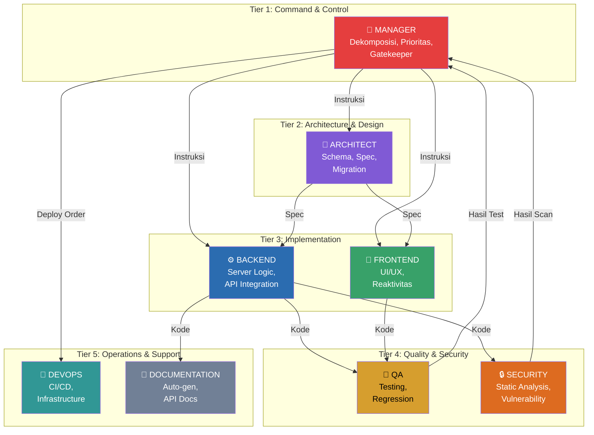
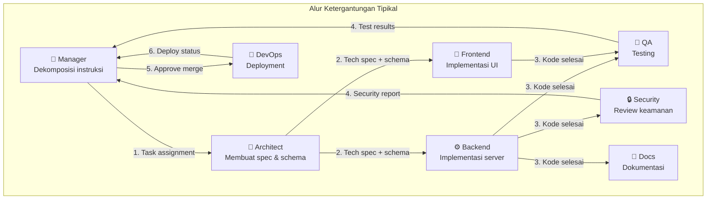

# 04.2 — Katalog Agen

> Dokumen ini mendeskripsikan 8 peran agen dalam AetherOS secara detail, termasuk kemampuan, I/O schemas, tools, dan dependency graph.

---

## 4.2.1 Gambaran Umum Organisasi Agen

---

## 4.2.2 Manager Agent

### Profil

| Atribut | Nilai |
|---------|-------|
| **Peran** | Komandan dan koordinator utama organisasi agen |
| **Tier** | 1 — Command & Control |
| **HITL Level** | Level 2 (Review sebelum merge ke main) |
| **Model Preference** | "best" — memerlukan reasoning terkuat |
| **Temperature** | 0.1 |

### Tanggung Jawab

1. Menerima instruksi dari manusia dan mendekomposisinya menjadi task graph (DAG)
2. Menentukan prioritas, dependensi, dan assignment agen untuk setiap tugas
3. Memonitor progress dan menangani eskalasi
4. Bertindak sebagai gatekeeper untuk merge ke branch utama (main)
5. Membuat keputusan akhir pada konflik antar agen
6. Mengelola budget token dan biaya per proyek

### Tools yang Diizinkan

| Tool | Akses |
|------|-------|
| `query_brain` | ✅ Full |
| `read_file` | ✅ Full |
| `git_diff` | ✅ Full |
| `search_code` | ✅ Full |
| `write_file` | ❌ |
| `run_command` | ❌ |
| `git_commit` | ❌ |

### Output Schema

| Field | Tipe | Deskripsi |
|-------|------|-----------|
| `task_graph` | DAG | Graph tugas dengan dependensi |
| `assignments` | Map[TaskID, AgentRole] | Penugasan agen per task |
| `priorities` | Map[TaskID, Priority] | Prioritas per task |
| `estimated_duration` | Duration | Estimasi waktu total |
| `risk_assessment` | RiskLevel | Penilaian risiko proyek |

---

## 4.2.3 Architect Agent

### Profil

| Atribut | Nilai |
|---------|-------|
| **Peran** | Perancang arsitektur dan penjaga integritas desain |
| **Tier** | 2 — Architecture & Design |
| **HITL Level** | Level 1 (Notify setelah selesai) |
| **Model Preference** | "best" |
| **Temperature** | 0.1 |

### Tanggung Jawab

1. Mendefinisikan skema Pydantic untuk data contracts antar komponen
2. Merancang migrasi database (PostgreSQL schema changes)
3. Menyusun Technical Specification yang menjadi acuan agen implementasi
4. Mendefinisikan API contracts (OpenAPI spec)
5. Membuat keputusan arsitektur dan mendokumentasikannya

### Tools yang Diizinkan

| Tool | Akses |
|------|-------|
| `query_brain` | ✅ Full |
| `read_file` | ✅ Full |
| `write_file` | ✅ Terbatas: schemas/, specs/, migrations/ |
| `search_code` | ✅ Full |
| `git_commit` | ✅ Feature branch |
| `run_command` | ❌ |

### Output Schema

| Field | Tipe | Deskripsi |
|-------|------|-----------|
| `schemas` | list[PydanticSchema] | Definisi schema data |
| `api_spec` | OpenAPISpec | Spesifikasi API |
| `migration_plan` | MigrationPlan | Rencana migrasi database |
| `tech_spec` | TechnicalSpec | Spesifikasi teknis untuk agen lain |
| `decisions` | list[ArchDecision] | Keputusan arsitektur + justifikasi |

---

## 4.2.4 Backend Agent

### Profil

| Atribut | Nilai |
|---------|-------|
| **Peran** | Implementor logika server-side |
| **Tier** | 3 — Implementation |
| **HITL Level** | Level 1 |
| **Model Preference** | "best" untuk logika kompleks, "fast" untuk boilerplate |
| **Temperature** | 0.0 |

### Tanggung Jawab

1. Mengimplementasikan logika server-side berdasarkan spec dari Architect
2. Integrasi API (internal dan eksternal)
3. Memastikan kepatuhan terhadap arsitektur yang ditetapkan
4. Menulis unit tests dasar untuk kode yang dihasilkan
5. Mengelola database queries dan ORM models

### Tools yang Diizinkan

| Tool | Akses |
|------|-------|
| `query_brain` | ✅ Full |
| `read_file` | ✅ Full |
| `write_file` | ✅ src/, api/, tests/ |
| `run_command` | ✅ Terbatas: python, pytest, pip |
| `git_commit` | ✅ Feature branch |
| `search_code` | ✅ Full |

---

## 4.2.5 Frontend Agent

### Profil

| Atribut | Nilai |
|---------|-------|
| **Peran** | Implementor antarmuka pengguna |
| **Tier** | 3 — Implementation |
| **HITL Level** | Level 1 |
| **Model Preference** | "best" |
| **Temperature** | 0.2 (sedikit lebih kreatif untuk UI) |

### Tanggung Jawab

1. Membangun komponen UI/UX berbasis reaktivitas
2. Memastikan integrasi API yang mulus dengan backend
3. Implementasi responsive design dan aksesibilitas
4. Mengelola state management di sisi klien
5. Optimasi performa rendering

### Tools yang Diizinkan

| Tool | Akses |
|------|-------|
| `query_brain` | ✅ Full |
| `read_file` | ✅ Full |
| `write_file` | ✅ dashboard/, frontend/, public/ |
| `run_command` | ✅ Terbatas: npm, node, npx |
| `git_commit` | ✅ Feature branch |
| `search_code` | ✅ Full |

---

## 4.2.6 QA Agent

### Profil

| Atribut | Nilai |
|---------|-------|
| **Peran** | Penjamin kualitas dan penguji |
| **Tier** | 4 — Quality & Security |
| **HITL Level** | Level 0 (Fully autonomous) |
| **Model Preference** | "fast" |
| **Temperature** | 0.0 |

### Tanggung Jawab

1. Menghasilkan unit tests berdasarkan spesifikasi arsitektur
2. Melakukan pengujian regresi otomatis
3. Validasi bahwa implementasi sesuai dengan spec Architect
4. Mengidentifikasi edge cases dan menulis test untuk mereka
5. Melaporkan code coverage dan test results

### Tools yang Diizinkan

| Tool | Akses |
|------|-------|
| `query_brain` | ✅ Full |
| `read_file` | ✅ Full |
| `write_file` | ✅ tests/ |
| `run_command` | ✅ pytest, coverage, tox |
| `run_tests` | ✅ Full |
| `git_commit` | ✅ Feature branch |
| `search_code` | ✅ Full |

### Output Schema Khusus

| Field | Tipe | Deskripsi |
|-------|------|-----------|
| `test_results` | TestReport | Hasil pengujian lengkap |
| `coverage` | CoverageReport | Laporan code coverage |
| `failures` | list[TestFailure] | Daftar test yang gagal |
| `recommendations` | list[str] | Rekomendasi perbaikan |
| `verdict` | Enum | pass, fail, needs_review |

---

## 4.2.7 Security Agent

### Profil

| Atribut | Nilai |
|---------|-------|
| **Peran** | Penjaga keamanan kode dan sistem |
| **Tier** | 4 — Quality & Security |
| **HITL Level** | Level 2 (Review sebelum merge) |
| **Model Preference** | "best" — keamanan memerlukan reasoning tinggi |
| **Temperature** | 0.0 |

### Tanggung Jawab

1. Melakukan analisis statis pada kode di workspace/
2. Memindai kebocoran API Key, credentials, dan secrets
3. Melakukan vulnerability assessment sebelum merge
4. Memvalidasi input sanitization dan output encoding
5. Memeriksa dependency vulnerabilities

### Tools yang Diizinkan

| Tool | Akses |
|------|-------|
| `query_brain` | ✅ Full |
| `read_file` | ✅ Full |
| `search_code` | ✅ Full |
| `security_scan` | ✅ Full |
| `run_command` | ✅ bandit, safety, semgrep |
| `write_file` | ❌ (hanya laporan) |
| `git_commit` | ❌ |

### Output Schema Khusus

| Field | Tipe | Deskripsi |
|-------|------|-----------|
| `vulnerabilities` | list[Vulnerability] | Kerentanan yang ditemukan |
| `severity_summary` | SeverityCounts | Ringkasan per severity (critical, high, medium, low) |
| `credential_leaks` | list[CredentialLeak] | Kebocoran credential |
| `recommendations` | list[SecurityRecommendation] | Rekomendasi perbaikan |
| `verdict` | Enum | pass, fail, needs_review |

---

## 4.2.8 DevOps Agent

### Profil

| Atribut | Nilai |
|---------|-------|
| **Peran** | Pengelola infrastruktur dan deployment |
| **Tier** | 5 — Operations & Support |
| **HITL Level** | Level 3 (Approve sebelum deploy produksi) |
| **Model Preference** | "fast" |
| **Temperature** | 0.0 |

### Tanggung Jawab

1. Mengelola CI/CD pipeline
2. Orkestrasi Docker containers
3. Konfigurasi infrastruktur cloud
4. Manajemen environment variables dan secrets
5. Monitoring deployment health

### Tools yang Diizinkan

| Tool | Akses |
|------|-------|
| `query_brain` | ✅ Full |
| `read_file` | ✅ Full |
| `write_file` | ✅ docker/, .github/, infra/, ci/ |
| `run_command` | ✅ docker, kubectl, terraform (HITL gated) |
| `deploy` | ✅ HITL Level 3 |
| `git_commit` | ✅ Feature branch |
| `search_code` | ✅ Full |

---

## 4.2.9 Documentation Agent

### Profil

| Atribut | Nilai |
|---------|-------|
| **Peran** | Pemelihara dokumentasi otomatis |
| **Tier** | 5 — Operations & Support |
| **HITL Level** | Level 0 (Fully autonomous) |
| **Model Preference** | "fast" |
| **Temperature** | 0.3 (sedikit kreatif untuk penulisan) |

### Tanggung Jawab

1. Secara otomatis memperbarui file Markdown berdasarkan aktivitas kode
2. Menghasilkan dokumentasi API dari OpenAPI specs
3. Menyinkronkan status proyek dengan dokumentasi publik
4. Membuat changelog dari git history
5. Menghasilkan README dan getting-started guides

### Tools yang Diizinkan

| Tool | Akses |
|------|-------|
| `query_brain` | ✅ Full |
| `read_file` | ✅ Full |
| `write_file` | ✅ docs/, README.md, CHANGELOG.md |
| `git_commit` | ✅ Feature branch |
| `search_code` | ✅ Full |
| `run_command` | ❌ |

---

## 4.2.10 Capability Matrix

| Kemampuan | MGR | ARC | BKD | FE | QA | SEC | DEV | DOC |
|-----------|-----|-----|-----|----|----|-----|-----|-----|
| Task decomposition | ✅ | ❌ | ❌ | ❌ | ❌ | ❌ | ❌ | ❌ |
| Schema design | ❌ | ✅ | ❌ | ❌ | ❌ | ❌ | ❌ | ❌ |
| Code implementation | ❌ | ❌ | ✅ | ✅ | ❌ | ❌ | ❌ | ❌ |
| Test generation | ❌ | ❌ | ⚠️ | ❌ | ✅ | ❌ | ❌ | ❌ |
| Security scanning | ❌ | ❌ | ❌ | ❌ | ❌ | ✅ | ❌ | ❌ |
| Deployment | ❌ | ❌ | ❌ | ❌ | ❌ | ❌ | ✅ | ❌ |
| Documentation | ❌ | ❌ | ❌ | ❌ | ❌ | ❌ | ❌ | ✅ |
| Merge approval | ✅ | ❌ | ❌ | ❌ | ❌ | ❌ | ❌ | ❌ |
| File write | ❌ | ⚠️ | ✅ | ✅ | ⚠️ | ❌ | ⚠️ | ⚠️ |
| Command execution | ❌ | ❌ | ✅ | ✅ | ✅ | ⚠️ | ✅ | ❌ |

> ✅ = Penuh, ⚠️ = Terbatas, ❌ = Tidak diizinkan

---

## 4.2.11 Inter-Agent Dependency Graph

---

🔗 **Selanjutnya:** [Komunikasi Agen →](agent-communication.md)

🔗 **Kembali:** [Framework Agen ←](agent-framework.md)
