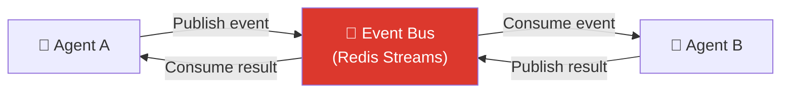
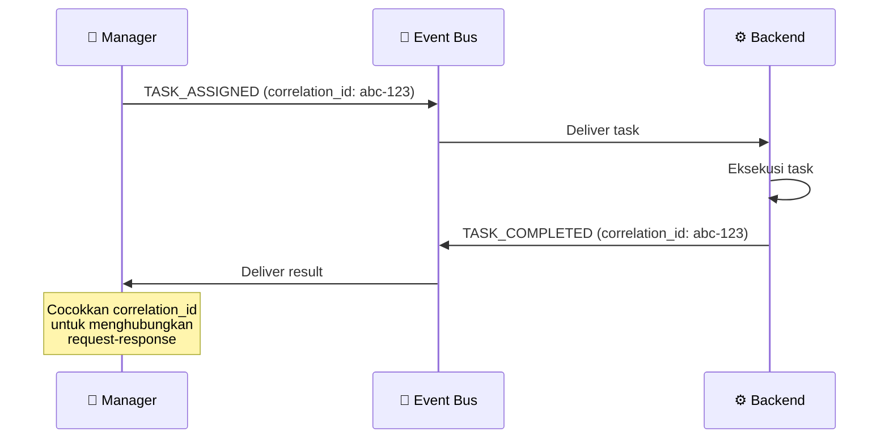
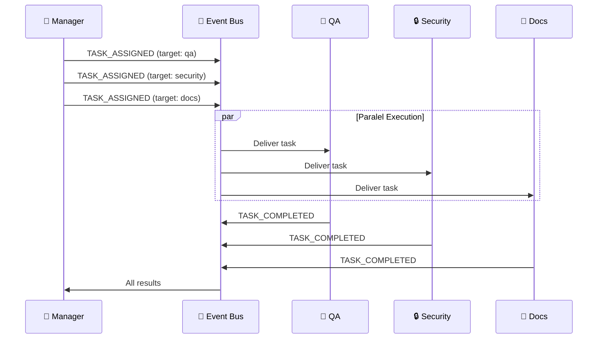
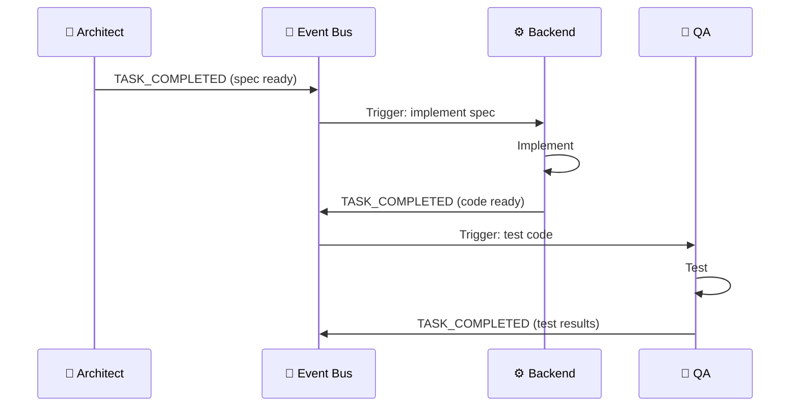
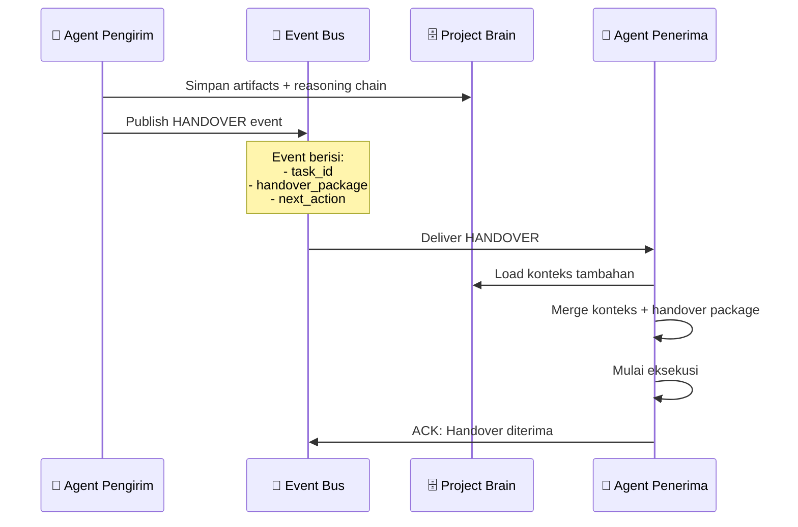
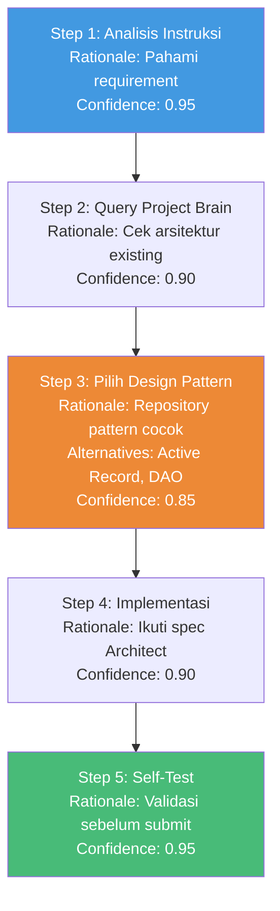
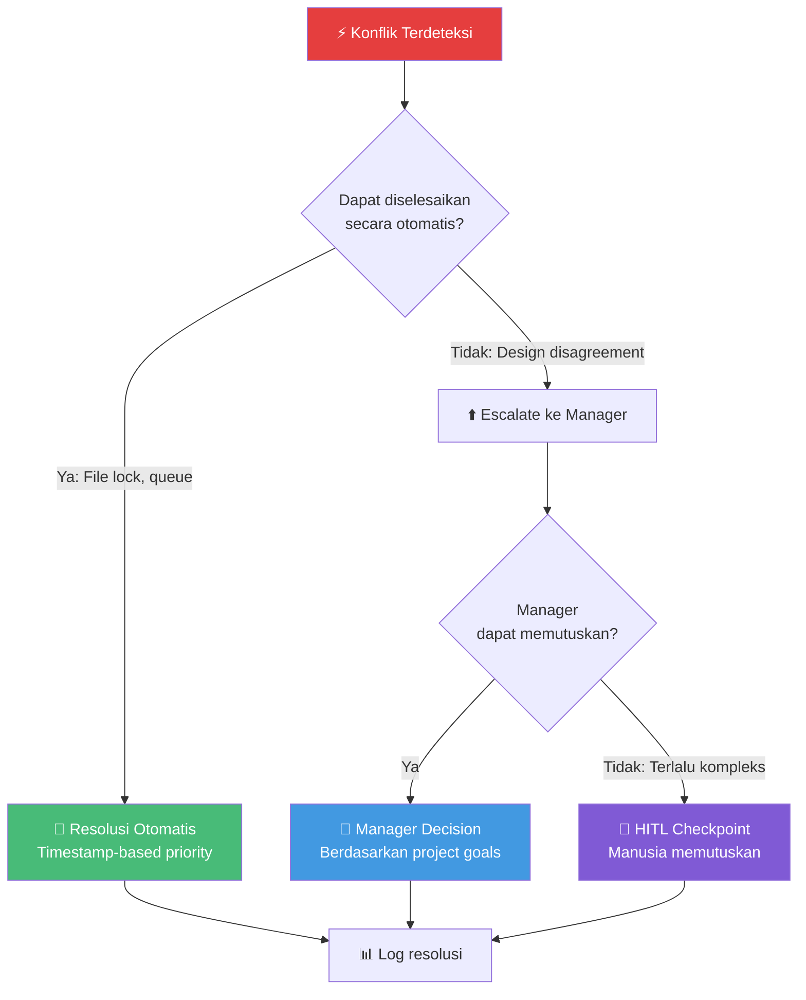

# 04.3 — Komunikasi Antar Agen

> Dokumen ini mendeskripsikan protokol komunikasi antar agen, mekanisme serah terima tugas, Reasoning Chain, dan resolusi konflik.

---

## 4.3.1 Protokol Komunikasi

Agen dalam AetherOS **tidak berkomunikasi secara langsung**. Semua komunikasi melewati Event Bus (Redis Streams), memastikan decoupling total.

### Message Protocol

Setiap pesan antar agen mengikuti format standar:

| Field | Tipe | Deskripsi |
|-------|------|-----------|
| `message_id` | UUID | Identifier unik pesan |
| `correlation_id` | UUID | ID untuk menghubungkan request-response |
| `trace_id` | string | OpenTelemetry TraceID |
| `source_agent` | string | Agen pengirim |
| `target_role` | string | Peran agen tujuan |
| `message_type` | Enum | task_assignment, task_result, information_request, handover |
| `priority` | Enum | critical, high, normal, low |
| `payload` | JSON | Data spesifik per tipe pesan |
| `timestamp` | ISO 8601 | Waktu pengiriman |
| `ttl` | integer | Time-to-live dalam detik |
| `requires_ack` | bool | Apakah memerlukan acknowledgment |

---

## 4.3.2 Pola Komunikasi

### Request-Response (via Event Bus)

### Fan-out (Satu ke Banyak)

### Pipeline (Berurutan)

---

## 4.3.3 Agent Handover Protocol

### Kapan Handover Terjadi

| Skenario | Dari | Ke | Trigger |
|----------|------|-----|---------|
| Spec selesai, mulai implementasi | Architect | Backend | TASK_COMPLETED |
| Implementasi selesai, mulai testing | Backend | QA | TASK_COMPLETED |
| Kode selesai, review keamanan | Backend | Security | TASK_COMPLETED |
| Semua validasi lulus, deploy | Manager | DevOps | All validations passed |
| Agen gagal, reassign | Worker (gagal) | Worker (baru) | TASK_FAILED + max_retries |

### Handover Data Package

Saat serah terima, agen pengirim menyiapkan paket data yang berisi:

| Data | Deskripsi |
|------|-----------|
| `task_context` | Konteks lengkap tugas |
| `artifacts_produced` | Daftar file yang dihasilkan/dimodifikasi |
| `decisions_made` | Keputusan yang dibuat selama eksekusi |
| `dependencies_resolved` | Dependensi yang telah diselesaikan |
| `warnings` | Peringatan atau catatan untuk agen penerima |
| `reasoning_chain` | Langkah-langkah berpikir yang mengarah ke hasil |

### Alur Handover

---

## 4.3.4 Reasoning Chain

### Struktur

Setiap agen wajib mendokumentasikan langkah-langkah berpikir dalam Reasoning Chain. Ini memungkinkan traceability dan debugging.

| Field | Tipe | Deskripsi |
|-------|------|-----------|
| `step_number` | integer | Urutan langkah |
| `action` | string | Aksi yang dilakukan |
| `rationale` | string | Justifikasi untuk aksi ini |
| `input` | JSON | Input yang digunakan |
| `output` | JSON | Output yang dihasilkan |
| `confidence` | float | Tingkat kepercayaan (0.0 - 1.0) |
| `alternatives_considered` | list | Alternatif yang dipertimbangkan |
| `timestamp` | ISO 8601 | Waktu langkah |

### Contoh Reasoning Chain

---

## 4.3.5 Resolusi Konflik

### Jenis Konflik

| Konflik | Contoh | Strategi |
|---------|--------|----------|
| **File Conflict** | Dua agen memodifikasi file yang sama | File locking + antrian berbasis timestamp |
| **Design Conflict** | Architect dan Backend tidak setuju tentang pattern | Escalate ke Manager |
| **Resource Conflict** | Dua agen memerlukan resource yang sama | Backoff + queue |
| **Output Conflict** | QA dan Security memberikan verdict berbeda | Manager membuat keputusan akhir |
| **Priority Conflict** | Dua task urgent bersaing untuk satu agen | Manager re-prioritize |

### Alur Resolusi

---

🔗 **Selanjutnya:** [RBAC & Permissions →](rbac-and-permissions.md)

🔗 **Kembali:** [Katalog Agen ←](agent-catalog.md)
