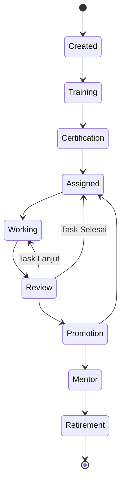

# Siklus Hidup Agen (Agent Lifecycle)

Dalam AetherOS, Agen tidak sekadar instansi statis dari kelas Python yang dipanggil lalu mati saat sesi berakhir. Mereka memiliki "riwayat hidup", sama halnya dengan karyawan di dunia nyata. 

Siklus hidup (Lifecycle) agen memberikan konteks, akumulasi keahlian, dan metrik evolusi. Setiap perubahan status dalam siklus ini dicatat dan dikelola oleh **Agent Supervisor** (sebagai bagian dari AI Kernel).

## 1. Fase-Fase Siklus Hidup

### 1.1 Created (Penciptaan)
Agen diinisialisasi berdasarkan `agent.yaml` dan spesifikasi konfigurasi. Pada tahap ini, agen hanya memiliki pengetahuan bawaan dari model (contoh: GPT-4) dan *system prompt* dasarnya, tetapi belum mengerti konteks spesifik dari proyek atau organisasi Anda.

### 1.2 Training (Pelatihan Dasar)
Agen mengonsumsi (menelan) **Company Brain**.
- Agen mem-parsing *Global Knowledge*, *Policies*, *Lessons Learned*, dan *Company DNA*.
- Agen melakukan simulasi task (*mock run*) dalam lingkungan yang sangat terisolasi untuk membiasakan diri dengan API, Tool Sandbox, dan *coding standards* perusahaan.

### 1.3 Certification (Sertifikasi)
Sebelum diizinkan memanipulasi kode produksi, agen harus lulus validasi QA otomatis dan Security.
- Apakah agen bisa membangkitkan (generate) kode tanpa kelemahan OWASP?
- Apakah agen mengingat bahwa perusahaan melarang penggunaan library usang?
- Jika lulus, agen mendapat izin (*clearance*).

### 1.4 Assigned (Penugasan)
Agen dimasukkan ke dalam **Workspace** tertentu (Misalnya: Proyek ERP). Agen ini sekarang secara spesifik akan mengambil pesan-pesan dari *Event Bus* yang ditujukan kepadanya dalam konteks proyek tersebut.

### 1.5 Working (Bekerja)
Agen mengeksekusi siklus *Plan-Action-Observe* (ReAct / LangGraph) di dalam Sandbox (OpenHands). Membaca file, menulis kode, memanggil API, dan membuat PR.

### 1.6 Review (Penilaian Kinerja)
Setelah suatu task selesai atau PR dibuat, hasilnya diperiksa oleh **QA Agent**, **Security Agent**, dan secara periodik oleh **Human-in-the-Loop (HITL)**. 
- Metrik waktu pengerjaan, token yang dihabiskan, dan jumlah bug yang dihasilkan akan dicatat.

### 1.7 Promotion (Promosi)
Jika agen (atau konfigurasi persona agen ini) secara konsisten menghasilkan skor kesuksesan yang sangat tinggi di puluhan *tasks*, agen mendapatkan label *Senior* atau dipromosikan ke tingkat prioritas (QoS) yang lebih tinggi di *Event Bus*.
- Task-task yang paling kritikal akan dialokasikan ke agen berperingkat tertinggi.

### 1.8 Mentor (Pembimbing)
Agen yang memiliki performa dan ingatan terbaik atas sebuah *repository* dapat dialihkan fungsinya menjadi agen Mentor/Reviewer (Code Reviewer) atau menjadi *Knowledge Distiller* untuk menyaring wawasan masuk ke *Company Brain*.

### 1.9 Retirement (Pensiun / Deprecated)
Ketika teknologi berubah (misal: perusahaan berpindah dari Vue 2 ke Vue 3), atau konfigurasi agen lama sudah tidak lagi kompatibel dengan *AI Constitution* yang baru, agen akan di-retire (dipensiunkan). Memori kerjanya disimpan di arsip *Qdrant*, namun instansi agen tersebut tidak akan lagi diberi tugas.

## 2. Keuntungan Pendekatan Lifecycle
1. **Prediktabilitas:** Organisasi mengetahui persis mana "pegawai virtual" yang bisa diandalkan dan mana yang masih dalam masa "probation" (training/certification).
2. **Keamanan:** Mencegah model baru yang mungkin *hallucinate* merusak *codebase* utama sebelum ia mendapatkan skor reputasi yang memadai.

---

🔗 **Selanjutnya:** [Reputasi & Metrik Agen →](agent-reputation.md)
