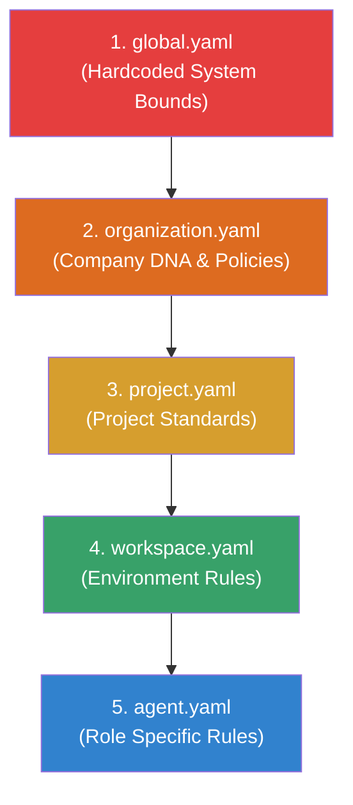

# AI Constitution

Dalam arsitektur AetherOS, **AI Constitution** adalah sekumpulan aturan sistem (*system rules*) definitif yang mengatur etika, batas operasional, kebijakan, dan gaya kerja yang wajib dipatuhi oleh seluruh sistem AI.

Berbeda dengan instruksi *prompt* standar yang dapat dilupakan atau diabaikan oleh agen ketika *context window* penuh, Konstitusi AI diberlakukan secara ketat di tingkat **AI Kernel** melalui Permission Engine dan Agent Supervisor.

## 1. Mengapa Konstitusi AI Diperlukan?

Dalam organisasi manusia, visi, budaya, dan aturan tidak dijelaskan ulang dari nol kepada karyawan setiap kali mereka mendapat tugas baru. Organisasi memiliki buku panduan (DNA Perusahaan). AetherOS mereplikasi konsep ini.

Konstitusi memastikan bahwa:
1. **Keamanan:** Agen tidak akan pernah menjalankan kode destruktif (`rm -rf /`) meskipun diperintah oleh prompt.
2. **Kepatuhan:** Agen HR tidak akan membocorkan gaji karyawan.
3. **Konsistensi:** Agen Backend selalu menulis *unit test* tanpa harus diperintah di setiap tiket JIRA.

## 2. Hierarki Konstitusi

Konstitusi AetherOS dirancang berjenjang seperti sistem perundang-undangan. Aturan di tingkat yang lebih tinggi bersifat mutlak dan tidak dapat dibatalkan oleh aturan di tingkat yang lebih rendah. Semakin ke bawah, aturan semakin spesifik.

Semua file konstitusi disimpan dalam format YAML agar mudah dikelola dan diaudit.

### 2.1 `global.yaml`
Konstitusi dasar AetherOS yang tidak dapat diubah oleh *User*. Berisi protokol keselamatan AI yang bersifat universal.
- Contoh: Mencegah agen mengubah file konstitusinya sendiri.
- Contoh: Tidak menjalankan eksekusi shell di luar batas container Sandbox.

### 2.2 `organization.yaml`
DNA Perusahaan dan identitas organisasi. Berlaku untuk seluruh divisi dan proyek.
- Contoh: "Perusahaan ini menggunakan Bahasa Indonesia dalam dokumentasi internal."
- Contoh: "Tidak boleh menyimpan kredensial plaintext di database."

### 2.3 `project.yaml`
Standar khusus untuk satu proyek tertentu.
- Contoh: "Proyek ERP menggunakan Laravel 11 dan Vue 3."
- Contoh: "Ketentuan code coverage minimal adalah 80%."

### 2.4 `workspace.yaml`
Aturan lingkungan kerja yang terisolasi, misalnya untuk branch `staging` atau `production`.
- Contoh: "Workspace production hanya bersifat read-only untuk agen tipe reguler."

### 2.5 `agent.yaml`
Instruksi dan batas persona spesifik untuk satu jenis agen.
- Contoh: *Backend Agent* harus menggunakan pola *Service-Repository* di Laravel.
- Contoh: *Security Agent* akan memblokir PR yang memiliki kerentanan OWASP Top 10.

## 3. Penegakan Aturan (Enforcement)

Konstitusi tidak dibaca sebagai teks biasa oleh LLM. AetherOS Kernel memparsing YAML ini menjadi:
1. **System Prompt Injection:** Disuntikkan secara persisten di layer terdalam interaksi LLM.
2. **Permission Engine Policies:** Mengubah aturan YAML menjadi kebijakan OPA (*Open Policy Agent*) atau sistem RBAC internal untuk membatasi akses alat (tools).
3. **Automated Validators:** Menambahkan tahap *check* pada Pipeline Eksekusi sebelum aksi benar-benar dijalankan.

---

🔗 **Selanjutnya:** [Arsitektur AI Kernel →](../02-architecture/ai-kernel.md)
