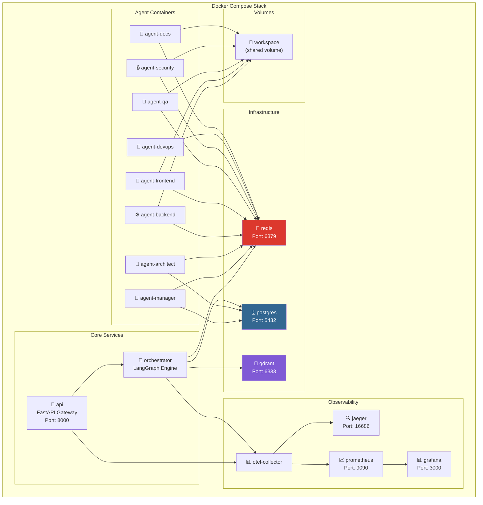

# 08.2 — CI/CD Pipeline

> Dokumen ini mendeskripsikan CI/CD pipeline AetherOS, Docker orchestration, dan strategi deployment.

---

## 8.2.1 Pipeline Architecture

```mermaid
graph LR
    subgraph "Source"
        GIT["📂 Git Repository<br/>(Feature Branch)"]
    end

    subgraph "CI Pipeline"
        LINT["🔍 Lint & Format"]
        TEST["🧪 Unit Tests"]
        SEC["🔒 Security Scan"]
        BUILD["🏗️ Build"]
    end

    subgraph "Review Gate"
        QA_GATE["🧪 QA Agent Review"]
        SEC_GATE["🔒 Security Agent Review"]
        MGR_GATE["👔 Manager Approval"]
    end

    subgraph "CD Pipeline"
        STAGE["🟡 Deploy Staging"]
        INT_TEST["🧪 Integration Tests"]
        HITL["👤 HITL Approval"]
        PROD["🟢 Deploy Production"]
    end

    GIT --> LINT --> TEST --> SEC --> BUILD
    BUILD --> QA_GATE --> SEC_GATE --> MGR_GATE
    MGR_GATE --> STAGE --> INT_TEST --> HITL --> PROD

    style GIT fill:#f05032,color:#fff
    style HITL fill:#805ad5,color:#fff
    style PROD fill:#48bb78,color:#fff
```

---

## 8.2.2 Docker Architecture

### Container Topology

### Resource Limits per Container

| Container | CPU Limit | Memory Limit | Replicas |
|-----------|-----------|-------------|----------|
| api | 1 core | 512 MB | 2 |
| orchestrator | 2 cores | 1 GB | 1 |
| agent-manager | 1 core | 1 GB | 1 |
| agent-architect | 1 core | 1 GB | 1 |
| agent-backend | 2 cores | 2 GB | 1-3 |
| agent-frontend | 1 core | 1 GB | 1 |
| agent-qa | 2 cores | 2 GB | 1-2 |
| agent-security | 1 core | 1 GB | 1 |
| agent-devops | 1 core | 1 GB | 1 |
| agent-docs | 0.5 core | 512 MB | 1 |
| redis | 1 core | 1 GB | 1 |
| postgres | 2 cores | 4 GB | 1 |
| qdrant | 2 cores | 4 GB | 1 |

---

## 8.2.3 Environment Strategy

| Environment | Purpose | Auto-deploy | HITL Required |
|-------------|---------|------------|---------------|
| **development** | Pengembangan lokal | — | Tidak |
| **staging** | Testing terintegrasi | Dari main branch | Tidak |
| **production** | Produksi | Dari staging | ✅ Level 3 |

---

## 8.2.4 Health Checks

| Service | Endpoint | Interval | Timeout | Unhealthy After |
|---------|----------|----------|---------|-----------------|
| API Gateway | `/health` | 10s | 5s | 3 failures |
| Orchestrator | `/health` | 15s | 10s | 3 failures |
| Agent (any) | heartbeat via Redis | 30s | 15s | 2 failures |
| PostgreSQL | `pg_isready` | 10s | 5s | 3 failures |
| Redis | `PING` | 5s | 3s | 3 failures |
| Qdrant | `/healthz` | 10s | 5s | 3 failures |

---

🔗 **Selanjutnya:** [Strategi Skalabilitas →](scalability-strategy.md)

🔗 **Kembali:** [Observabilitas ←](observability.md)
