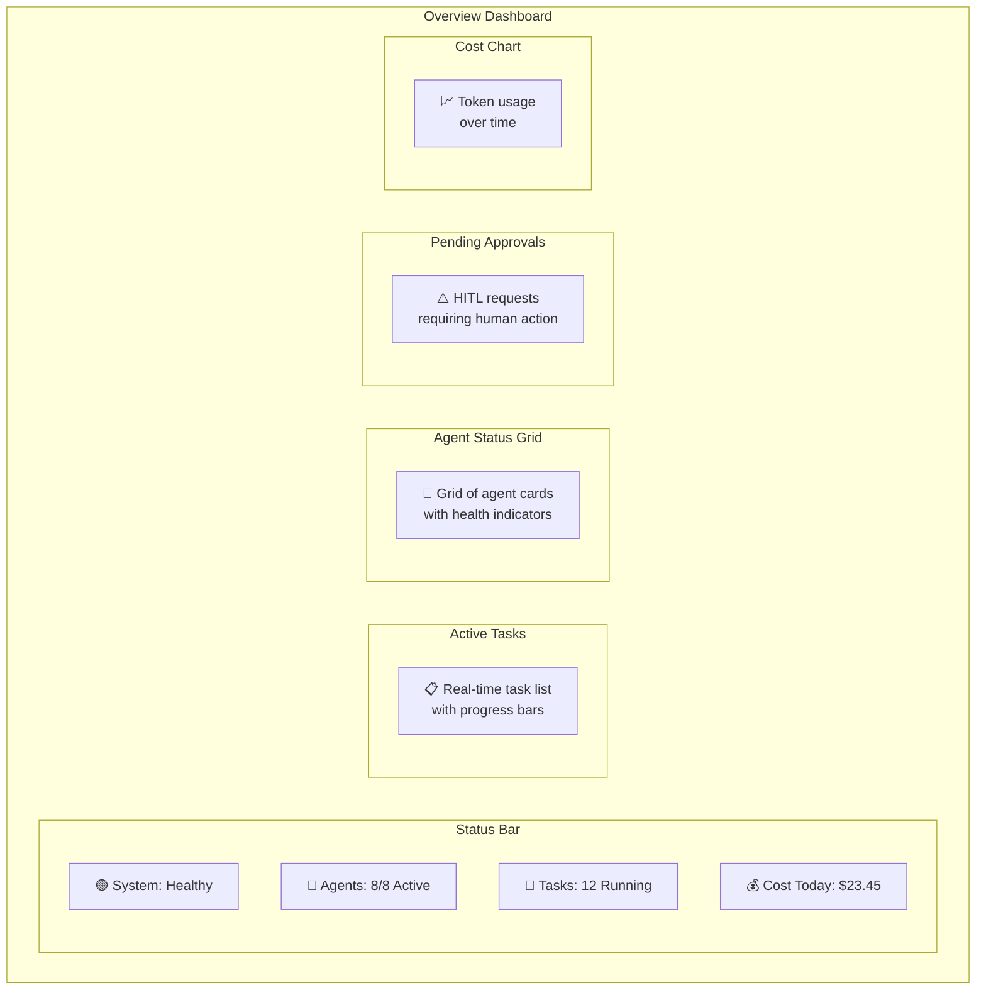
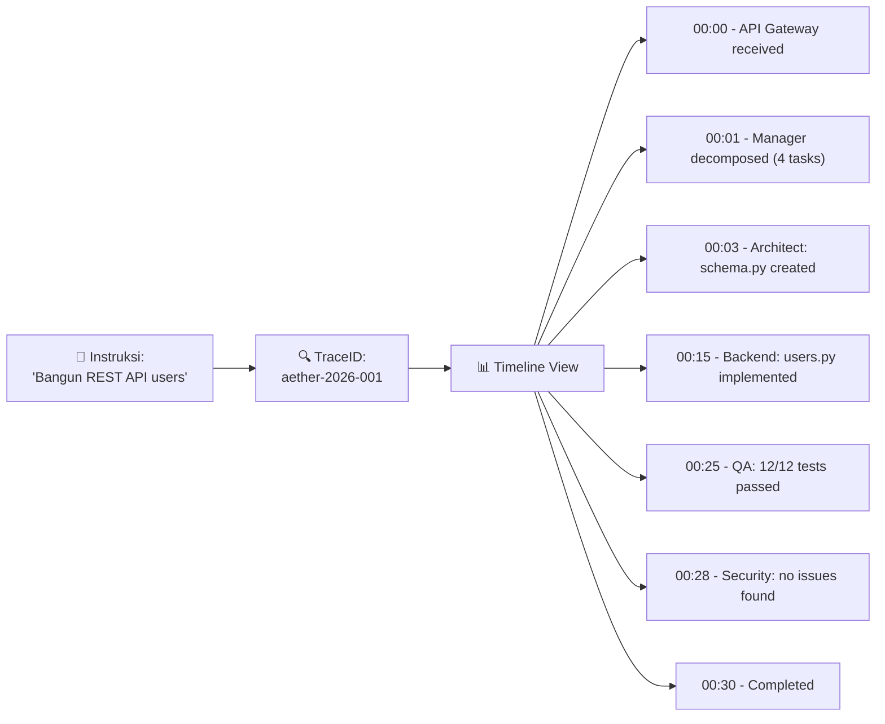

# 09.3 — Desain Dashboard

> Dokumen ini mendeskripsikan desain Web Dashboard AetherOS untuk monitoring, manajemen, dan Human Approval Interface.

---

## 9.3.1 Dashboard Overview

Dashboard AetherOS berfungsi sebagai **pusat komando visual** bagi manusia untuk memantau, mengontrol, dan berinteraksi dengan organisasi AI.

### Halaman Utama

| Halaman | Fungsi |
|---------|--------|
| **Overview** | Ringkasan real-time: agen aktif, tasks, cost, health |
| **Projects** | Manajemen proyek: buat, lihat, arsipkan |
| **Tasks** | Monitoring tugas: status, progress, logs |
| **Agents** | Status agen: health, workload, performance |
| **Approvals** | HITL interface: review, approve, deny |
| **Knowledge** | Browser Project Brain: search, explore |
| **Analytics** | Dashboard biaya, token, performance |
| **Audit** | Audit trail: search, filter, trace |
| **Settings** | Konfigurasi: providers, budgets, HITL levels |

---

## 9.3.2 Komponen Dashboard

### Overview Page

### Approval Interface (HITL)

| Komponen | Deskripsi |
|----------|-----------|
| **Request Card** | Ringkasan: agen peminta, tipe aksi, severity |
| **Detail Panel** | Penjelasan lengkap: apa yang akan dilakukan, resource yang terpengaruh |
| **Risk Assessment** | Penilaian risiko otomatis: low/medium/high/critical |
| **Rollback Plan** | Rencana pembatalan jika terjadi masalah |
| **Diff View** | Preview perubahan (kode, config, schema) |
| **Action Buttons** | Approve / Deny (dengan field alasan) |
| **History** | Riwayat keputusan sebelumnya untuk referensi |

### Real-time Features

| Feature | Teknologi | Deskripsi |
|---------|-----------|-----------|
| Task progress | WebSocket | Real-time update progress bar |
| Agent status | WebSocket | Live health indicators |
| Log streaming | WebSocket | Live log output dari task yang berjalan |
| Notifications | WebSocket + Push | Alert untuk approval requests dan errors |
| Cost ticker | WebSocket | Real-time cost accumulation |

---

## 9.3.3 Trace Explorer

Fitur untuk menelusuri jejak instruksi dari awal hingga akhir:

---

🔗 **Selanjutnya:** [Marketplace API →](marketplace-api.md)

🔗 **Kembali:** [Referensi CLI ←](cli-reference.md)
