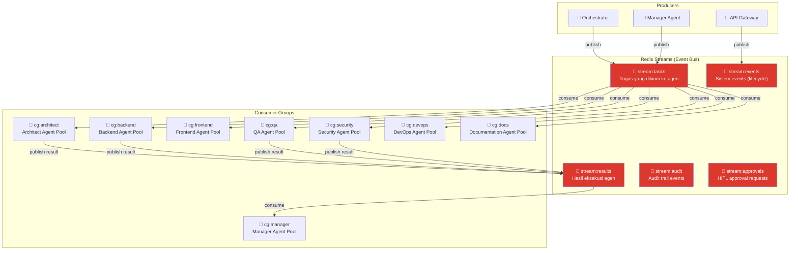
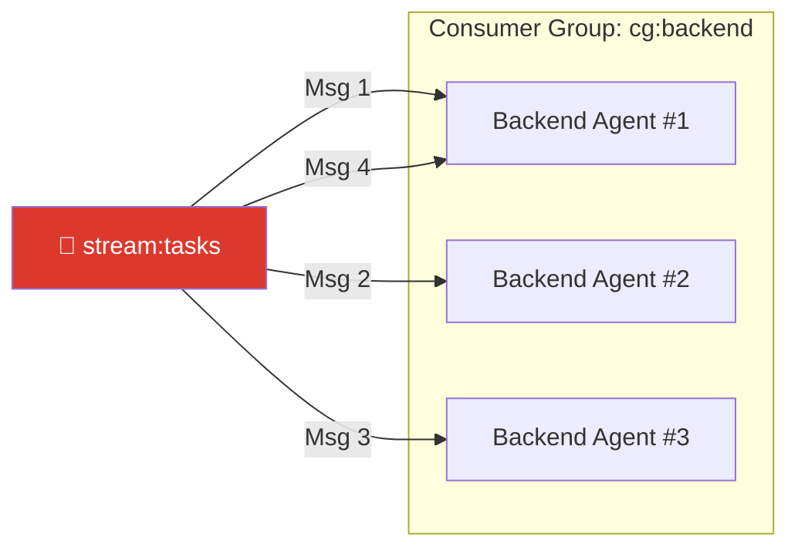
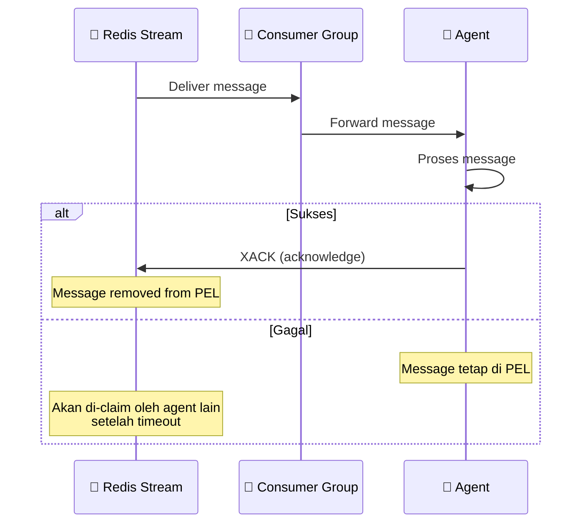
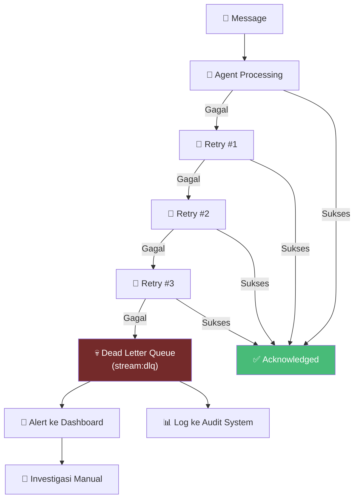
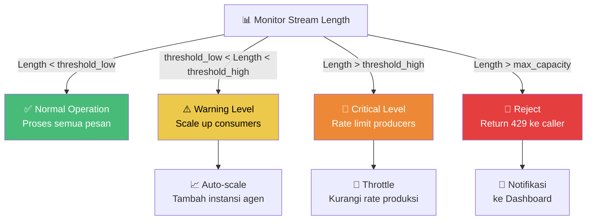

# 02.3 — Arsitektur Event-Driven

> Dokumen ini mendeskripsikan arsitektur komunikasi asinkron AetherOS menggunakan Redis Streams, termasuk Consumer Groups, event catalog, Dead Letter Queue, dan backpressure management.

---

## 2.3.1 Mengapa Event-Driven?

AetherOS menolak pendekatan komunikasi sinkron (request-response) antar agen karena beberapa alasan fundamental:

| Pendekatan Sinkron | Pendekatan Event-Driven (AetherOS) |
|---|---|
| Agen harus tahu lokasi agen lain | Agen hanya mengirim event ke bus, tidak perlu tahu penerima |
| Kegagalan satu agen memblokir seluruh chain | Kegagalan satu agen tidak mempengaruhi agen lain |
| Sulit di-scale (coupling ketat) | Mudah di-scale (decoupled sepenuhnya) |
| Observabilitas rendah | Setiap event tercatat dan dapat di-trace |
| Sulit menambah agen baru | Cukup tambahkan consumer baru ke stream |

---

## 2.3.2 Redis Streams sebagai Event Bus

Redis Streams dipilih sebagai backbone Event Bus karena menyediakan:
- **Persistent messaging** — pesan tidak hilang setelah dikonsumsi
- **Consumer Groups** — distribusi beban otomatis antar instansi agen
- **Message acknowledgment** — jaminan pesan diproses
- **Stream trimming** — pengelolaan memori otomatis

### Topologi Event Bus

---

## 2.3.3 Event Catalog

Setiap event yang mengalir melalui Event Bus memiliki skema yang ketat dan terdokumentasi.

### Event Types — stream:tasks

| Event Type | Producer | Consumer | Deskripsi |
|------------|----------|----------|-----------|
| `TASK_ASSIGNED` | Manager | Worker Agents | Tugas baru dikirim ke agen |
| `TASK_REASSIGNED` | Manager | Worker Agents | Tugas dialihkan ke agen lain (failover) |
| `TASK_CANCELLED` | Manager | Worker Agents | Tugas dibatalkan |
| `TASK_PRIORITY_CHANGED` | Manager | Worker Agents | Prioritas tugas diubah |

### Event Types — stream:results

| Event Type | Producer | Consumer | Deskripsi |
|------------|----------|----------|-----------|
| `TASK_COMPLETED` | Worker Agents | Manager | Tugas selesai dengan sukses |
| `TASK_FAILED` | Worker Agents | Manager | Tugas gagal dengan error |
| `TASK_PROGRESS` | Worker Agents | Manager, Dashboard | Update progress tugas |
| `VALIDATION_PASSED` | QA/Security | Manager | Validasi lulus |
| `VALIDATION_FAILED` | QA/Security | Manager | Validasi gagal |

### Event Types — stream:events

| Event Type | Producer | Consumer | Deskripsi |
|------------|----------|----------|-----------|
| `AGENT_STARTED` | Agent Runtime | Monitoring | Agen mulai beroperasi |
| `AGENT_STOPPED` | Agent Runtime | Monitoring | Agen berhenti |
| `AGENT_HEALTH_CHECK` | Agent Runtime | Monitoring | Health check berkala |
| `SYSTEM_ERROR` | Any | Monitoring | Error sistem |
| `STATE_TRANSITION` | State Machine | Monitoring, Audit | Transisi state |

### Event Types — stream:approvals

| Event Type | Producer | Consumer | Deskripsi |
|------------|----------|----------|-----------|
| `APPROVAL_REQUESTED` | Manager | Dashboard | Permintaan persetujuan HITL |
| `APPROVAL_GRANTED` | Dashboard | Manager | Persetujuan diberikan |
| `APPROVAL_DENIED` | Dashboard | Manager | Persetujuan ditolak |

### Skema Event Standar

Setiap event mengikuti format envelope yang konsisten:

| Field | Tipe | Deskripsi |
|-------|------|-----------|
| `event_id` | UUID | Identifier unik event |
| `event_type` | String | Tipe event (dari catalog) |
| `trace_id` | String | OpenTelemetry TraceID |
| `timestamp` | ISO 8601 | Waktu event dihasilkan |
| `producer` | String | Identitas pengirim |
| `version` | String | Versi skema event |
| `payload` | JSON Object | Data spesifik event |
| `metadata` | JSON Object | Informasi tambahan (priority, tags, dll.) |

---

## 2.3.4 Consumer Groups

### Konsep

Consumer Groups memungkinkan multiple instances dari satu tipe agen untuk berbagi beban pemrosesan. Redis Streams menjamin bahwa setiap pesan hanya diproses oleh satu consumer dalam satu group.

### Konfigurasi Consumer Group

| Parameter | Nilai | Deskripsi |
|-----------|-------|-----------|
| `group_name` | `cg:{role}` | Nama group berdasarkan peran agen |
| `consumer_name` | `{role}-{instance_id}` | Identifier unik per instansi |
| `start_id` | `>` | Hanya baca pesan baru |
| `block` | `5000ms` | Waktu blocking saat menunggu pesan baru |
| `count` | `1` | Jumlah pesan per batch (1 untuk sequential processing) |

### Message Acknowledgment

### Pending Entry List (PEL) dan Claim

Jika sebuah agen gagal memproses pesan (crash, timeout), pesan tetap ada di Pending Entry List (PEL). Mekanisme auto-claim memastikan pesan tersebut diambil alih oleh instansi agen lain:

| Parameter | Nilai | Deskripsi |
|-----------|-------|-----------|
| `claim_idle_time` | 30 detik | Waktu idle sebelum pesan dapat di-claim |
| `max_claims` | 3 | Jumlah maksimal claim sebelum dikirim ke DLQ |
| `check_interval` | 10 detik | Interval pengecekan PEL |

---

## 2.3.5 Dead Letter Queue (DLQ)

Pesan yang gagal diproses setelah jumlah maksimal percobaan dikirim ke Dead Letter Queue untuk investigasi manual.

### DLQ Entry Format

| Field | Deskripsi |
|-------|-----------|
| `original_stream` | Stream asal pesan |
| `original_event_id` | ID event asli |
| `failure_count` | Jumlah percobaan gagal |
| `last_error` | Error message terakhir |
| `failed_consumers` | Daftar consumer yang gagal memproses |
| `first_failure_at` | Waktu kegagalan pertama |
| `last_failure_at` | Waktu kegagalan terakhir |
| `original_payload` | Payload asli yang gagal diproses |

---

## 2.3.6 Backpressure Management

### Strategi Backpressure

Ketika jumlah pesan di stream melebihi kapasitas pemrosesan agen, AetherOS menerapkan beberapa mekanisme backpressure:

### Threshold Configuration

| Parameter | Nilai Default | Deskripsi |
|-----------|--------------|-----------|
| `threshold_low` | 100 messages | Batas normal |
| `threshold_high` | 500 messages | Batas peringatan, mulai scale up |
| `max_capacity` | 1000 messages | Batas maksimal, reject produksi baru |
| `stream_maxlen` | 10000 | Panjang maksimal stream (auto-trim) |
| `trim_strategy` | `MINID` | Strategi trim berdasarkan ID minimum |

---

## 2.3.7 Monitoring dan Observabilitas Event Bus

| Metrik | Deskripsi | Alert Threshold |
|--------|-----------|-----------------|
| `stream_length` | Jumlah pesan di stream | > 500: Warning, > 1000: Critical |
| `consumer_lag` | Lag antara pesan terbaru dan terakhir diproses | > 30s: Warning |
| `pending_count` | Jumlah pesan di PEL | > 10: Warning |
| `dlq_count` | Jumlah pesan di Dead Letter Queue | > 0: Alert |
| `throughput` | Pesan per detik yang diproses | < 1/s sustained: Warning |
| `processing_time_p95` | P95 waktu pemrosesan per pesan | > 30s: Warning |

---

🔗 **Selanjutnya:** [Orkestrasi State Machine →](state-machine-orchestration.md)

🔗 **Kembali:** [Execution Loop ←](execution-loop.md)
