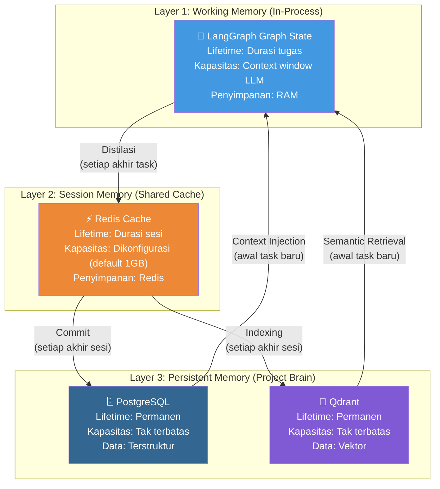
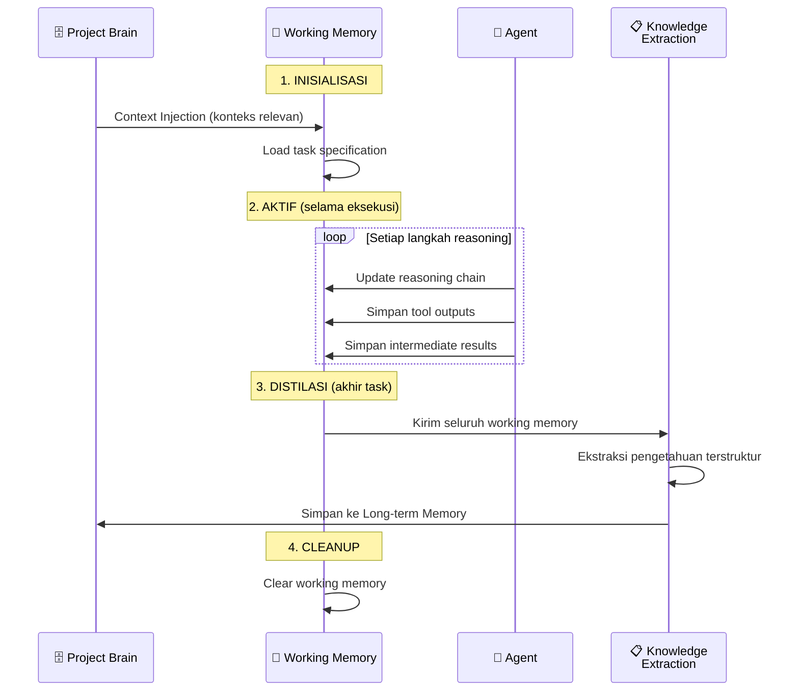
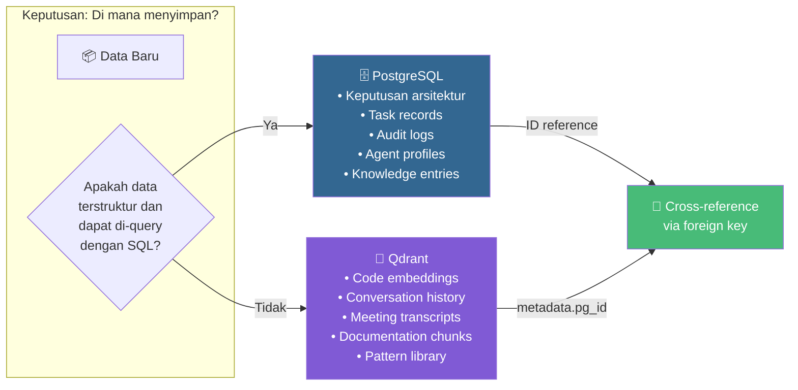
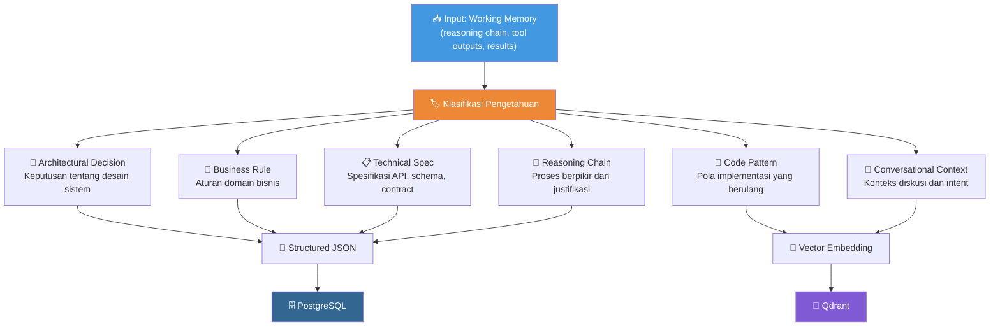
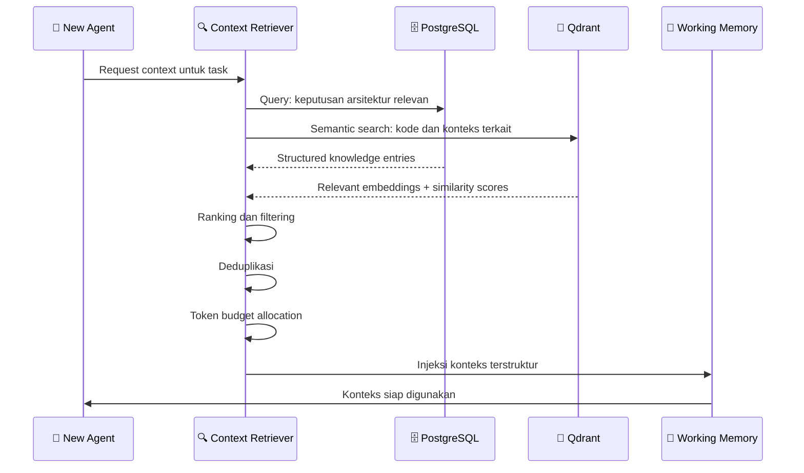
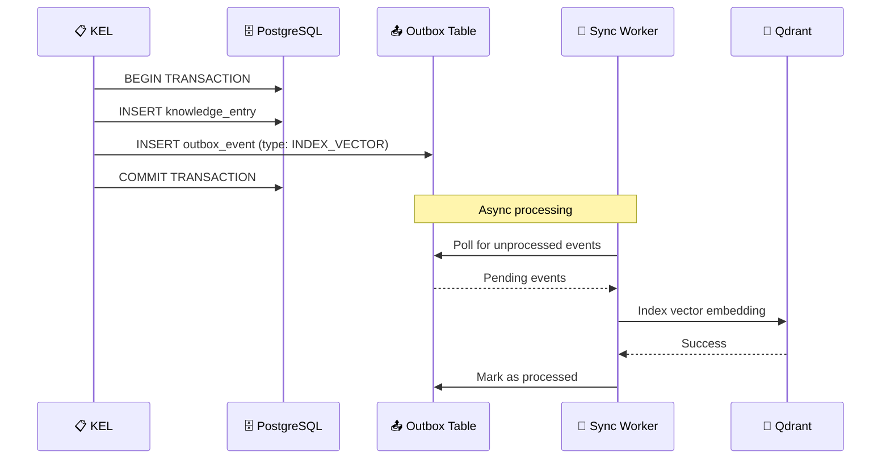

# 03.1 — Arsitektur Memori

> Dokumen ini mendeskripsikan desain memori AetherOS, termasuk pembagian Short-term dan Long-term memory, proses distilasi pengetahuan, dan mekanisme sinkronisasi.

---

## 3.1.1 Filosofi Memori AetherOS

Memori dalam AetherOS dirancang berdasarkan analogi memori manusia:

| Memori Manusia | AetherOS | Karakteristik |
|----------------|----------|---------------|
| **Working Memory** | Graph State (LangGraph) | Kapasitas terbatas, aktif selama tugas berjalan, cepat diakses |
| **Short-term Memory** | Redis Cache | Kapasitas sedang, bertahan selama sesi, akses cepat |
| **Long-term Memory** | Project Brain (PG + Qdrant) | Kapasitas tak terbatas, permanen, akses terindeks |
| **Episodic Memory** | Meeting Memory (Qdrant) | Rekaman interaksi dan konteks percakapan |
| **Semantic Memory** | Knowledge Base (PG + Qdrant) | Fakta, aturan, dan pola yang terabstraksi |

---

## 3.1.2 Arsitektur Tiga Lapis

---

## 3.1.3 Working Memory — LangGraph Graph State

### Fungsi
Menyimpan konteks aktif selama satu tugas sedang dieksekusi oleh agen. Ini adalah memori "sadar" — informasi yang langsung relevan dengan tugas yang sedang dikerjakan.

### Isi Working Memory

| Data | Deskripsi | Sumber |
|------|-----------|--------|
| Task specification | Definisi tugas yang sedang dikerjakan | State Machine |
| Injected context | Konteks relevan dari Project Brain | Knowledge Retrieval |
| Current code state | Status kode di workspace saat ini | Workspace Git |
| Reasoning chain | Langkah-langkah berpikir agen sejauh ini | Agent runtime |
| Tool outputs | Hasil eksekusi tool (file read, command output) | OpenHands |
| Intermediate results | Hasil sementara dari langkah-langkah sebelumnya | Agent runtime |

### Lifecycle

### Batasan dan Manajemen

| Constraint | Strategi |
|------------|----------|
| Context window terbatas | Sliding window: hanya pertahankan konteks paling relevan |
| Token budget | Alokasikan token: 30% konteks, 50% reasoning, 20% output |
| Memory overflow | Evict konteks lama, pertahankan yang paling baru dan relevan |

---

## 3.1.4 Session Memory — Redis Cache

### Fungsi
Menyimpan data yang perlu dibagikan antar agen selama satu sesi kerja, tetapi tidak perlu disimpan secara permanen.

### Data yang Disimpan

| Key Pattern | Data | TTL |
|-------------|------|-----|
| `session:{id}:context` | Konteks sesi yang dibagikan | 24 jam |
| `session:{id}:agent:{role}:state` | State terakhir agen | 24 jam |
| `task:{id}:cache` | Cache hasil intermediari | 1 jam |
| `lock:{resource}` | Distributed locks | 5 menit |
| `rate:{provider}:{agent}` | Rate limiting counters | 1 menit |

---

## 3.1.5 Long-term Memory — Project Brain

### Dual Storage Strategy

🔗 Detail PostgreSQL: [Skema PostgreSQL →](postgresql-schema.md)

🔗 Detail Qdrant: [Desain Vektor Qdrant →](qdrant-vector-design.md)

---

## 3.1.6 Proses Distilasi Pengetahuan

### Knowledge Extraction Layer (KEL)

Proses distilasi adalah mekanisme inti yang memastikan pengetahuan tidak hilang saat sesi berakhir. KEL berjalan di akhir setiap siklus tugas.

### Format Output Distilasi

Setiap entry pengetahuan yang dihasilkan KEL mengikuti format standar:

| Field | Tipe | Deskripsi |
|-------|------|-----------|
| `knowledge_id` | UUID | Identifier unik |
| `project_id` | UUID | Proyek yang menghasilkan |
| `category` | Enum | Kategori pengetahuan |
| `title` | String | Judul ringkas |
| `content` | JSON | Konten terstruktur |
| `source_task_id` | UUID | Task yang menghasilkan pengetahuan ini |
| `source_agent` | String | Agen yang menghasilkan |
| `confidence` | Float | Tingkat kepercayaan (0.0 - 1.0) |
| `tags` | List | Tag untuk pencarian |
| `created_at` | Timestamp | Waktu pembuatan |
| `supersedes` | UUID | Jika ini menggantikan entry lama |

---

## 3.1.7 Context Injection — Retrieval untuk Agen Baru

### Skenario

Ketika agen baru memulai tugas, ia memerlukan konteks dari riwayat proyek. Context Injection mengambil pengetahuan relevan dari Project Brain dan menyuntikkannya ke Working Memory.

### Alur Context Injection

### Strategi Retrieval

| Strategi | Deskripsi |
|----------|-----------|
| **Keyword matching** | Cocokkan kata kunci dari task description dengan knowledge entries |
| **Semantic search** | Cari embedding terdekat di Qdrant menggunakan cosine similarity |
| **Recency bias** | Berikan bobot lebih tinggi pada pengetahuan terbaru |
| **Relevance filtering** | Filter berdasarkan project_id, kategori, dan tags |
| **Token budgeting** | Batasi total konteks agar tidak melebihi alokasi token |

---

## 3.1.8 Sinkronisasi Memori

### Outbox Pattern

Untuk menjamin konsistensi antara PostgreSQL dan Qdrant, AetherOS menggunakan Outbox Pattern:

### Conflict Resolution

| Konflik | Strategi |
|---------|----------|
| Duplicate knowledge entry | Merge berdasarkan timestamp terbaru |
| Contradicting entries | Simpan keduanya, tandai sebagai "conflicting", escalate ke Manager |
| Stale context injection | TTL-based invalidation, verifikasi terhadap state terkini |
| Storage failure | Retry dengan exponential backoff, fallback ke queue |

---

🔗 **Selanjutnya:** [Skema PostgreSQL →](postgresql-schema.md)

🔗 **Kembali:** [Orkestrasi State Machine ←](../02-architecture/state-machine-orchestration.md)
