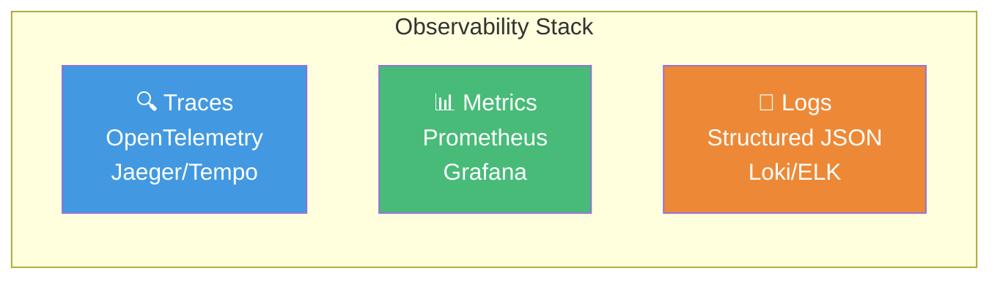
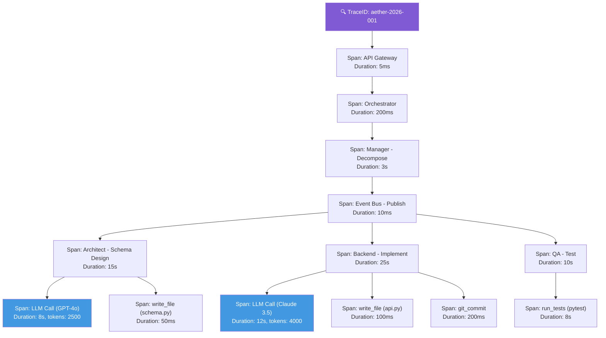

# 08.1 — Observabilitas

> Dokumen ini mendeskripsikan implementasi observabilitas AetherOS menggunakan OpenTelemetry, termasuk agentic traces, metrics, dan alerting.

---

## 8.1.1 Tiga Pilar Observabilitas

---

## 8.1.2 Agentic Traces

### Konsep

Setiap instruksi dari manusia menghasilkan **satu TraceID** yang mengalir melalui seluruh sistem — dari Dashboard hingga ke perubahan file di workspace. Ini memungkinkan developer melacak tepat bagaimana sebuah instruksi diterjemahkan menjadi kode.

### Trace Structure

### Span Attributes

| Attribute | Tipe | Deskripsi |
|-----------|------|-----------|
| `aetheros.agent.role` | string | Peran agen (manager, backend, dll.) |
| `aetheros.agent.id` | string | Identifier agen |
| `aetheros.task.id` | string | Task ID |
| `aetheros.task.type` | string | Tipe task |
| `aetheros.llm.provider` | string | Provider LLM yang digunakan |
| `aetheros.llm.model` | string | Model LLM yang digunakan |
| `aetheros.llm.input_tokens` | int | Token input |
| `aetheros.llm.output_tokens` | int | Token output |
| `aetheros.llm.cost_usd` | float | Biaya dalam USD |
| `aetheros.tool.name` | string | Nama tool yang digunakan |
| `aetheros.tool.target` | string | Target tool (file path, command) |
| `aetheros.validation.result` | string | Hasil validasi (pass/fail) |

---

## 8.1.3 Metrics

### Key Metrics

| Metrik | Tipe | Deskripsi |
|--------|------|-----------|
| `aetheros_tasks_total` | Counter | Total tasks yang diproses |
| `aetheros_tasks_duration_seconds` | Histogram | Durasi eksekusi task |
| `aetheros_tasks_failed_total` | Counter | Total tasks yang gagal |
| `aetheros_llm_requests_total` | Counter | Total request ke LLM |
| `aetheros_llm_tokens_total` | Counter | Total tokens yang digunakan |
| `aetheros_llm_cost_usd_total` | Counter | Total biaya LLM |
| `aetheros_llm_latency_seconds` | Histogram | Latensi LLM |
| `aetheros_event_bus_messages_total` | Counter | Total messages di Event Bus |
| `aetheros_event_bus_lag` | Gauge | Consumer lag |
| `aetheros_agent_active` | Gauge | Jumlah agen aktif |
| `aetheros_brain_queries_total` | Counter | Total queries ke Project Brain |
| `aetheros_brain_latency_seconds` | Histogram | Latensi Project Brain |
| `aetheros_approvals_pending` | Gauge | HITL approvals yang pending |

---

## 8.1.4 Alerting Rules

| Alert | Kondisi | Severity | Aksi |
|-------|---------|----------|------|
| High Failure Rate | Task failure rate > 20% (5 min window) | Critical | Notify, investigate |
| LLM Latency High | P95 latency > 30s | Warning | Check provider status |
| Consumer Lag | Event bus lag > 60s | Warning | Scale up consumers |
| DLQ Non-empty | Dead letter queue > 0 | Alert | Manual investigation |
| Budget Near Limit | > 90% budget consumed | Warning | Notify, downgrade tier |
| Agent Down | Agent heartbeat missing > 60s | Critical | Restart agent |
| Security Finding | Critical vulnerability detected | Critical | Block merge, notify |
| Brain Query Slow | P95 > 5s | Warning | Check indexes, optimize |

---

🔗 **Selanjutnya:** [CI/CD Pipeline →](ci-cd-pipeline.md)

🔗 **Kembali:** [Audit & Kepatuhan ←](../07-security/audit-and-compliance.md)
