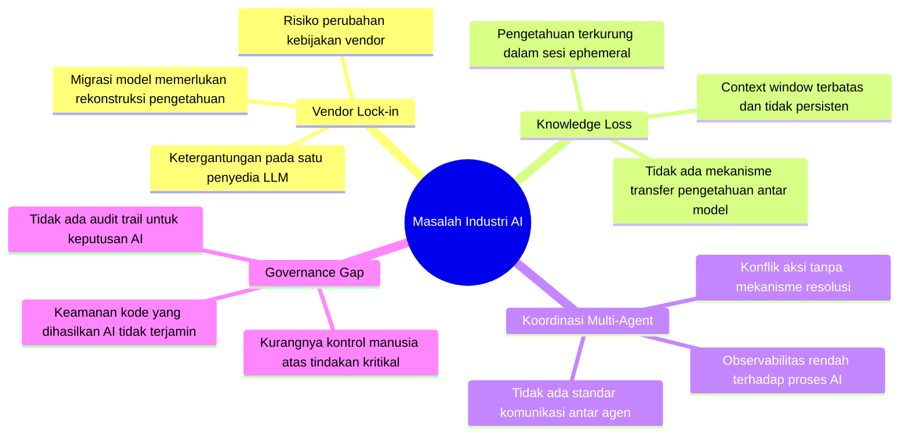
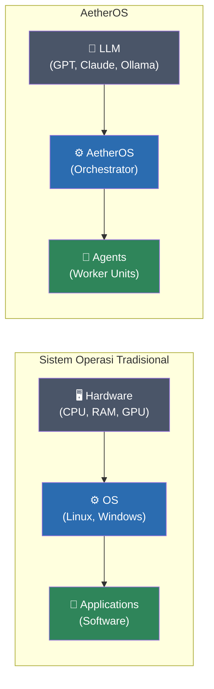
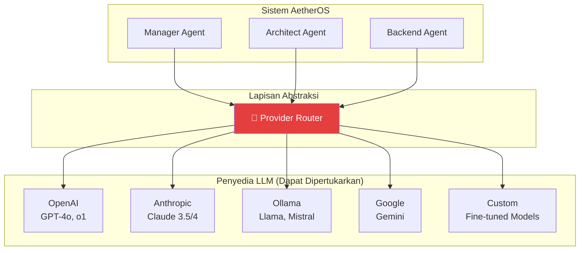
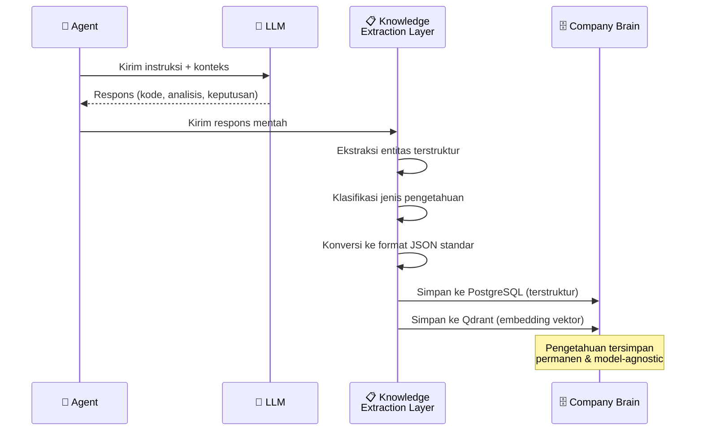
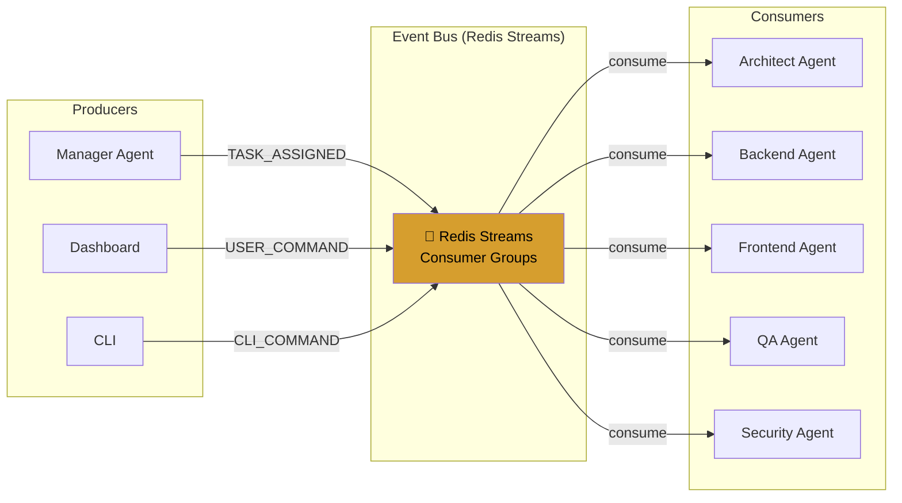
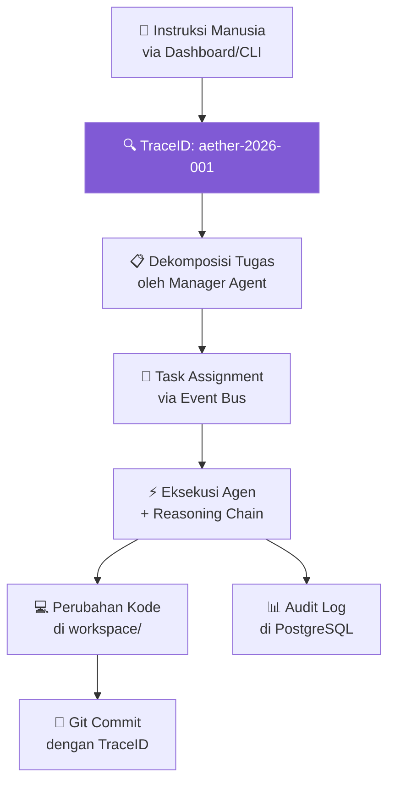

# 01 — Visi, Filosofi, dan Prinsip Desain

> *"The Open Agent Operating System. Build Organizations, not Agents."*

---

## 1.1 Latar Belakang dan Konteks Industri

Industri AI saat ini menghadapi paradoks fundamental: semakin canggih model LLM yang digunakan, semakin besar pula ketergantungan organisasi terhadap vendor tunggal. Ketika sebuah perusahaan membangun seluruh alur kerja di atas satu model — misalnya GPT-4 atau Claude — pengetahuan yang dihasilkan selama proses pengembangan tersimpan dalam format yang terikat pada konteks sesi model tersebut. Jika model diganti, diperbarui, atau penyedia mengubah kebijakan, organisasi kehilangan akses ke pengetahuan tersebut.

AetherOS lahir dari pemahaman bahwa **pengetahuan organisasi harus menjadi entitas mandiri** — terpisah dari mesin komputasi yang memprosesnya. Sama seperti sistem operasi tradisional yang mengabstraksi hardware dari software, AetherOS mengabstraksi model LLM dari aset intelektual yang dihasilkannya.

### Masalah yang Diselesaikan

---

## 1.2 Visi

**AetherOS adalah "The Open Agent Operating System" — sebuah platform open-source revolusioner yang menjadi fondasi generik bagi berbagai bentuk organisasi otonom (AI Organizations) dengan kedaulatan pengetahuan penuh.**

Sebagai OS Generik, AetherOS tidak terbatas pada perusahaan software. Kernel inti AetherOS dapat menjalankan berbagai *Distribution Packs* seperti:
- **Software Company Pack**
- **Cyber Security Pack**
- **Marketing Agency Pack**
- **Research Laboratory Pack**
- **Legal Assistant Pack**

Visi ini mengandung tiga elemen kunci:

| Elemen | Deskripsi |
|--------|-----------|
| **Open-Source** | Seluruh kode sumber tersedia secara terbuka, memastikan transparansi, auditabilitas, dan kontribusi komunitas global. Tidak ada komponen proprietary yang menyebabkan lock-in. |
| **Multi-Agent Orchestration** | Bukan satu agen monolitik, melainkan organisasi dari agen-agen spesialis yang bekerja secara kolaboratif — masing-masing dengan peran, kemampuan, dan batasan akses yang jelas. |
| **Kedaulatan Pengetahuan** | Pengetahuan yang dihasilkan selama proses kerja sepenuhnya dimiliki oleh organisasi, tersimpan dalam format terstruktur yang tidak bergantung pada model LLM manapun. |

### Analogi Sistem Operasi

Sama seperti OS mengabstraksi hardware sehingga aplikasi tidak perlu tahu detail CPU yang digunakan, AetherOS mengabstraksi LLM sehingga agen tidak perlu tahu model mana yang memproses instruksinya.

---

## 1.3 Misi

**Mencapai Model Agnosticism total melalui Company Brain — sebuah sumber kebenaran permanen dan kecerdasan kolektif yang memastikan pengetahuan organisasi tetap utuh dan berkembang, meskipun model LLM atau agen di bawahnya berganti.**

### Misi Operasional

1. **Memisahkan Pengetahuan dari Komputasi** — Setiap wawasan yang dihasilkan oleh LLM diekstraksi, distrukturisasi, dan disimpan dalam Company Brain sebelum sesi berakhir.
2. **Menstandarisasi Kolaborasi Multi-Agent** — Menyediakan protokol komunikasi, validasi, dan serah terima tugas yang konsisten antar agen.
3. **Menjamin Tata Kelola AI** — Setiap tindakan agen memiliki jejak audit, dan tindakan kritikal memerlukan persetujuan manusia.
4. **Mengdemokratisasi Akses** — Sebagai platform open-source, AetherOS memastikan bahwa organisasi kecil maupun besar dapat membangun perusahaan AI yang mandiri.

---

## 1.4 Prinsip Desain Inti — Empat Pilar Arsitektural

AetherOS beroperasi pada empat pilar arsitektural yang tidak dapat dikompromikan. Setiap keputusan teknis dalam sistem harus lulus uji terhadap keempat pilar ini.

### Pilar 1: LLM Agnostic

**Definisi:** LLM diperlakukan sebagai *mesin komputasi sementara* — sebuah resource yang dapat diganti kapan saja tanpa mempengaruhi fungsionalitas sistem.

**Implikasi Arsitektural:**
- Tidak ada kode yang memanggil API LLM secara langsung. Semua panggilan melewati Provider Router.
- Output LLM divalidasi oleh PydanticAI sebelum diterima sistem, sehingga format respons tidak bergantung pada kekhasan model tertentu.
- Automatic Fallback memastikan kegagalan satu provider tidak menghentikan operasi.

**Mengapa Ini Penting:**
- Menghilangkan vendor lock-in
- Memungkinkan optimasi biaya (model murah untuk tugas sederhana, model canggih untuk tugas kompleks)
- Melindungi dari risiko discontinuation atau perubahan kebijakan vendor

---

### Pilar 2: Persistence First

**Definisi:** Pengetahuan tidak boleh terkurung dalam konteks sesi LLM yang *ephemeral*. AetherOS menerapkan **Knowledge Extraction Layer** yang secara aktif mengekstraksi wawasan terstruktur dari setiap respons LLM sebelum dikomit ke dalam Company Brain.

**Mekanisme:**

**Jenis Pengetahuan yang Diekstraksi:**

| Kategori | Contoh | Penyimpanan |
|----------|--------|-------------|
| Keputusan Arsitektur | "Menggunakan event sourcing untuk audit trail" | PostgreSQL |
| Aturan Bisnis | "Diskon hanya berlaku untuk pembelian > 100 unit" | PostgreSQL |
| Pola Kode | Implementasi pattern, boilerplate | Qdrant |
| Konteks Percakapan | Riwayat diskusi teknis | Qdrant |
| Spesifikasi Teknis | Schema API, definisi tipe | PostgreSQL |
| Reasoning Chain | Langkah-langkah berpikir agen | PostgreSQL |

---

### Pilar 3: Reactive & Event-Driven

**Definisi:** Seluruh komunikasi antar komponen menggunakan pola asinkron untuk menjamin skalabilitas dan ketahanan sistem terhadap kegagalan komponen individu.

**Arsitektur Event-Driven:**

**Keuntungan:**
- **Decoupled:** Agen tidak perlu mengetahui lokasi atau status agen lain
- **Resilient:** Jika satu agen gagal, pesan tetap ada di stream untuk diproses ulang
- **Scalable:** Menambah instansi agen baru hanya memerlukan pendaftaran consumer baru
- **Observable:** Setiap event tercatat dan dapat di-trace

---

### Pilar 4: Traceability

**Definisi:** Setiap perubahan pada state sistem atau kode sumber harus memiliki jejak audit yang jelas, menghubungkan keputusan agen dengan Reasoning Chain yang menyebabkannya.

**Rantai Pelacakan:**

**Komponen Traceability:**

| Komponen | Fungsi | Penyimpanan |
|----------|--------|-------------|
| TraceID | Identifier unik per instruksi | OpenTelemetry |
| Reasoning Chain | Dokumentasi langkah berpikir agen | PostgreSQL |
| Audit Log | Catatan setiap aksi sistem | PostgreSQL |
| Git History | Riwayat perubahan kode | Git Repository |
| Event Stream | Log komunikasi antar agen | Redis Streams |

---

## 1.5 Value Proposition

### Untuk Berbagai Industri (Distributions)
- **Software Company:** Otomatisasi siklus hidup SDLC, code review, dan testing.
- **Cyber Security:** Orkestrasi agen pentester, analis malware, dan tim respons insiden.
- **Research Lab:** Sintesis literatur massal, ekstraksi data eksperimen, dan penulisan paper.

### Untuk Startup & Organisasi
- Memulai dengan tim AI yang terstruktur tanpa perlu merekrut banyak pekerja manual.
- Mengurangi biaya operasional melalui multi-provider routing dan cost analytics.
- Memastikan DNA dan pengetahuan organisasi terus berkembang secara otonom (Organizational Intelligence).

### Untuk Enterprise
- Audit trail lengkap untuk setiap keputusan AI — memenuhi compliance requirement
- Human-in-the-loop workflow untuk tindakan kritikal
- Skalabilitas horizontal untuk menangani proyek skala besar

### Untuk Komunitas Open-Source
- Platform yang sepenuhnya transparan dan auditable
- Plugin marketplace untuk kontribusi dan distribusi kemampuan baru
- Standar terbuka untuk interoperabilitas agen AI

---

## 1.6 Differentiator vs Solusi Existing

| Aspek | AetherOS | AutoGPT / CrewAI | LangChain Agents | Custom Solutions |
|-------|----------|-------------------|------------------|-----------------|
| Model Agnosticism | ✅ Total | ⚠️ Parsial | ⚠️ Parsial | ❌ Biasanya single-model |
| Persistent Knowledge | ✅ Company Brain | ❌ Session-based | ❌ Session-based | ⚠️ Ad-hoc |
| Event-Driven Comms | ✅ Redis Streams | ❌ Sequential | ❌ Sequential | ⚠️ Varies |
| Full Audit Trail | ✅ OpenTelemetry | ❌ Minimal | ⚠️ Basic logging | ❌ Biasanya tidak ada |
| HITL Workflow | ✅ Checkpoint Gates | ❌ Tidak ada | ⚠️ Basic | ⚠️ Custom |
| Agent RBAC | ✅ Fine-grained | ❌ Tidak ada | ❌ Tidak ada | ⚠️ Custom |
| Cost Analytics | ✅ Per-agent, per-project | ❌ Tidak ada | ⚠️ Basic | ❌ Biasanya tidak ada |

---

## 1.7 Filosofi Pengembangan

### "Pengetahuan di Atas Segalanya"

Setiap keputusan arsitektur dalam AetherOS harus menjawab pertanyaan: **"Apakah ini melindungi dan memperkaya pengetahuan organisasi?"**

Jika jawabannya tidak, keputusan tersebut perlu dipertimbangkan ulang.

### "Manusia sebagai Pengarah, AI sebagai Pelaksana"

AetherOS tidak bertujuan menggantikan manusia. Sistem ini dirancang agar manusia tetap memegang kendali strategis — menentukan tujuan, menyetujui tindakan kritikal, dan mengaudit hasil — sementara agen AI menangani eksekusi teknis.

### "Transparansi Radikal"

Setiap proses berpikir AI harus dapat ditelusuri. Tidak ada "black box" dalam AetherOS. Reasoning Chain memastikan bahwa manusia dapat memahami mengapa sebuah keputusan dibuat, bukan hanya apa keputusannya.

---

🔗 **Selanjutnya:** [Gambaran Umum Arsitektur Sistem →](../02-architecture/system-overview.md)
