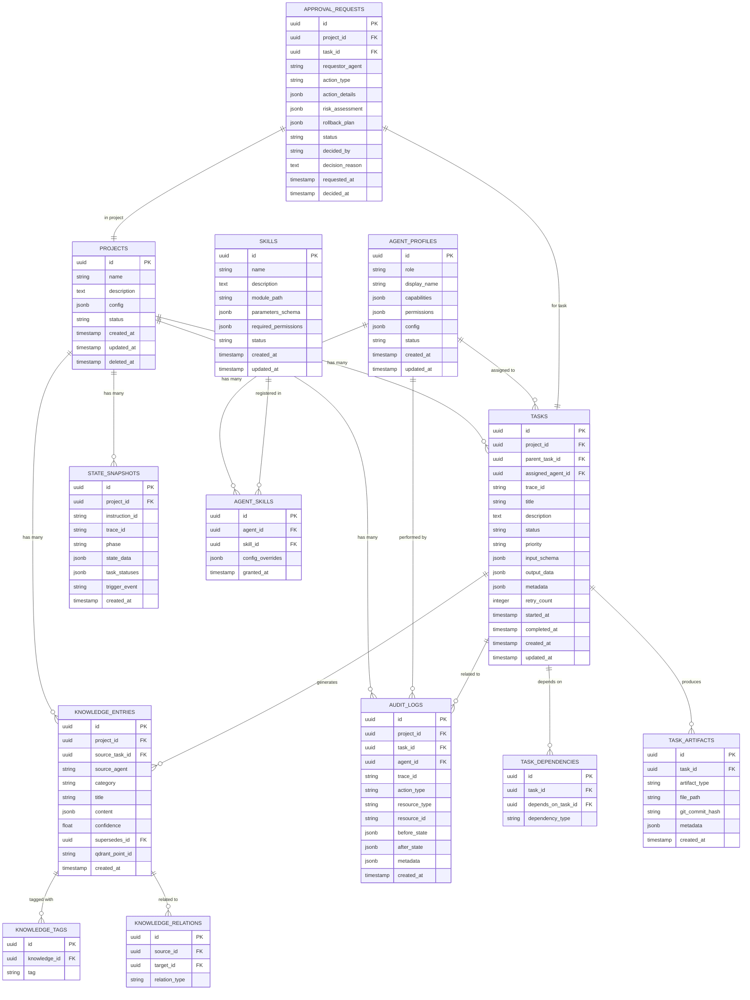

# 03.2 — Skema PostgreSQL (Immutable Ledger)

> Dokumen ini mendeskripsikan skema database relasional PostgreSQL yang berfungsi sebagai Structured Ledger untuk integritas data tingkat tinggi.

---

## 3.2.1 Prinsip Desain Database

| Prinsip | Implementasi |
|---------|-------------|
| **Immutability** | Audit logs dan knowledge entries bersifat append-only |
| **Referential Integrity** | Foreign keys yang ketat di seluruh tabel |
| **Temporal Tracking** | Setiap record memiliki `created_at` dan `updated_at` |
| **Soft Delete** | Data tidak pernah dihapus secara fisik, hanya ditandai `deleted_at` |
| **JSONB Flexibility** | Kolom JSONB untuk data semi-terstruktur yang fleksibel |
| **Indexing Strategy** | Index berdasarkan pola query yang paling sering digunakan |

---

## 3.2.2 Entity Relationship Diagram



---

## 3.2.3 Detail Tabel

### projects

Menyimpan informasi proyek yang dikelola oleh AetherOS.

| Kolom | Tipe | Constraint | Deskripsi |
|-------|------|------------|-----------|
| `id` | UUID | PK, DEFAULT gen_random_uuid() | Identifier unik |
| `name` | VARCHAR(255) | NOT NULL, UNIQUE | Nama proyek |
| `description` | TEXT | | Deskripsi proyek |
| `config` | JSONB | DEFAULT '{}' | Konfigurasi proyek (HITL levels, cost limits, dll.) |
| `status` | VARCHAR(50) | NOT NULL, DEFAULT 'active' | Status: active, archived, suspended |
| `created_at` | TIMESTAMPTZ | NOT NULL, DEFAULT NOW() | Waktu pembuatan |
| `updated_at` | TIMESTAMPTZ | NOT NULL, DEFAULT NOW() | Waktu pembaruan terakhir |
| `deleted_at` | TIMESTAMPTZ | | Soft delete timestamp |

**Indexes:**
- `idx_projects_status` ON (status) WHERE deleted_at IS NULL
- `idx_projects_name` ON (name)

---

### agent_profiles

Definisi RBAC dan konfigurasi untuk setiap agen.

| Kolom | Tipe | Constraint | Deskripsi |
|-------|------|------------|-----------|
| `id` | UUID | PK | Identifier unik |
| `role` | VARCHAR(50) | NOT NULL | Peran: manager, architect, backend, frontend, qa, security, devops, docs |
| `display_name` | VARCHAR(255) | NOT NULL | Nama tampilan |
| `capabilities` | JSONB | NOT NULL | Daftar kemampuan agen |
| `permissions` | JSONB | NOT NULL | Matrix permission (directories, tools, actions) |
| `config` | JSONB | DEFAULT '{}' | Konfigurasi runtime (model preference, token limits) |
| `status` | VARCHAR(50) | NOT NULL, DEFAULT 'active' | Status: active, inactive, maintenance |
| `created_at` | TIMESTAMPTZ | NOT NULL, DEFAULT NOW() | |
| `updated_at` | TIMESTAMPTZ | NOT NULL, DEFAULT NOW() | |

**Indexes:**
- `idx_agent_profiles_role` ON (role)
- `idx_agent_profiles_status` ON (status)

---

### tasks

Antrean atomik untuk semua tugas yang dikelola sistem.

| Kolom | Tipe | Constraint | Deskripsi |
|-------|------|------------|-----------|
| `id` | UUID | PK | Identifier unik |
| `project_id` | UUID | FK → projects.id, NOT NULL | Proyek pemilik |
| `parent_task_id` | UUID | FK → tasks.id | Parent task (untuk sub-tasks) |
| `assigned_agent_id` | UUID | FK → agent_profiles.id | Agen yang ditugaskan |
| `trace_id` | VARCHAR(128) | NOT NULL | OpenTelemetry TraceID |
| `title` | VARCHAR(500) | NOT NULL | Judul tugas |
| `description` | TEXT | | Deskripsi detail |
| `status` | VARCHAR(50) | NOT NULL, DEFAULT 'pending' | pending, assigned, running, validating, completed, failed, cancelled |
| `priority` | VARCHAR(20) | NOT NULL, DEFAULT 'normal' | critical, high, normal, low |
| `input_schema` | JSONB | | Input data untuk agen |
| `output_data` | JSONB | | Hasil output agen |
| `metadata` | JSONB | DEFAULT '{}' | Data tambahan (token usage, execution time, dll.) |
| `retry_count` | INTEGER | DEFAULT 0 | Jumlah retry yang telah dilakukan |
| `started_at` | TIMESTAMPTZ | | Waktu mulai eksekusi |
| `completed_at` | TIMESTAMPTZ | | Waktu selesai |
| `created_at` | TIMESTAMPTZ | NOT NULL, DEFAULT NOW() | |
| `updated_at` | TIMESTAMPTZ | NOT NULL, DEFAULT NOW() | |

**Indexes:**
- `idx_tasks_project_status` ON (project_id, status)
- `idx_tasks_agent_status` ON (assigned_agent_id, status)
- `idx_tasks_trace_id` ON (trace_id)
- `idx_tasks_priority_status` ON (priority, status) WHERE status IN ('pending', 'assigned')
- `idx_tasks_created_at` ON (created_at DESC)

---

### audit_logs

Catatan transaksional append-only untuk setiap aksi sistem.

| Kolom | Tipe | Constraint | Deskripsi |
|-------|------|------------|-----------|
| `id` | UUID | PK | Identifier unik |
| `project_id` | UUID | FK → projects.id | Proyek terkait |
| `task_id` | UUID | FK → tasks.id | Task terkait (jika ada) |
| `agent_id` | UUID | FK → agent_profiles.id | Agen pelaku |
| `trace_id` | VARCHAR(128) | | OpenTelemetry TraceID |
| `action_type` | VARCHAR(100) | NOT NULL | Tipe aksi: file_write, file_read, command_exec, api_call, git_commit, state_change |
| `resource_type` | VARCHAR(100) | | Tipe resource yang diakses |
| `resource_id` | VARCHAR(500) | | Identifier resource |
| `before_state` | JSONB | | State sebelum aksi (jika relevan) |
| `after_state` | JSONB | | State setelah aksi |
| `metadata` | JSONB | DEFAULT '{}' | Data tambahan |
| `created_at` | TIMESTAMPTZ | NOT NULL, DEFAULT NOW() | Waktu aksi |

**Indexes:**
- `idx_audit_project_time` ON (project_id, created_at DESC)
- `idx_audit_agent_time` ON (agent_id, created_at DESC)
- `idx_audit_trace_id` ON (trace_id)
- `idx_audit_action_type` ON (action_type, created_at DESC)
- `idx_audit_task_id` ON (task_id) WHERE task_id IS NOT NULL

**Constraint:**
- Tabel ini TIDAK memiliki operasi UPDATE atau DELETE. Hanya INSERT yang diizinkan.

---

### knowledge_entries

Basis pengetahuan terstruktur yang diekstraksi dari proses kerja agen.

| Kolom | Tipe | Constraint | Deskripsi |
|-------|------|------------|-----------|
| `id` | UUID | PK | Identifier unik |
| `project_id` | UUID | FK → projects.id, NOT NULL | Proyek pemilik |
| `source_task_id` | UUID | FK → tasks.id | Task yang menghasilkan entry ini |
| `source_agent` | VARCHAR(50) | NOT NULL | Agen yang menghasilkan |
| `category` | VARCHAR(50) | NOT NULL | architectural_decision, business_rule, technical_spec, reasoning_chain, code_pattern |
| `title` | VARCHAR(500) | NOT NULL | Judul pengetahuan |
| `content` | JSONB | NOT NULL | Konten terstruktur |
| `confidence` | FLOAT | DEFAULT 1.0 | Tingkat kepercayaan (0.0 - 1.0) |
| `supersedes_id` | UUID | FK → knowledge_entries.id | Entry yang digantikan oleh ini |
| `qdrant_point_id` | VARCHAR(128) | | ID vektor di Qdrant (cross-reference) |
| `created_at` | TIMESTAMPTZ | NOT NULL, DEFAULT NOW() | |

**Indexes:**
- `idx_knowledge_project_category` ON (project_id, category)
- `idx_knowledge_source_task` ON (source_task_id)
- `idx_knowledge_supersedes` ON (supersedes_id) WHERE supersedes_id IS NOT NULL
- GIN index: `idx_knowledge_content` ON content USING GIN

---

### state_snapshots

Snapshot state machine untuk checkpoint dan recovery.

| Kolom | Tipe | Constraint | Deskripsi |
|-------|------|------------|-----------|
| `id` | UUID | PK | Identifier unik |
| `project_id` | UUID | FK → projects.id, NOT NULL | |
| `instruction_id` | VARCHAR(128) | NOT NULL | ID instruksi yang diproses |
| `trace_id` | VARCHAR(128) | NOT NULL | |
| `phase` | VARCHAR(50) | NOT NULL | Fase state machine saat snapshot |
| `state_data` | JSONB | NOT NULL | Snapshot lengkap state |
| `task_statuses` | JSONB | NOT NULL | Status semua tugas pada saat snapshot |
| `trigger_event` | VARCHAR(100) | NOT NULL | Event yang memicu snapshot |
| `created_at` | TIMESTAMPTZ | NOT NULL, DEFAULT NOW() | |

**Indexes:**
- `idx_snapshots_project_instruction` ON (project_id, instruction_id, created_at DESC)
- `idx_snapshots_trace_id` ON (trace_id)

---

## 3.2.4 Migration Strategy

### Alembic sebagai Migration Tool

| Aturan | Deskripsi |
|--------|-----------|
| Forward-only migrations | Rollback dilakukan dengan migration baru, bukan dengan downgrade |
| Data-preserving | Tidak ada migration yang menghapus data |
| Backward compatible | Schema changes harus kompatibel ke belakang selama satu versi |
| Tested migrations | Setiap migration diuji pada database copy sebelum produksi |
| HITL Gate | Migration produksi memerlukan HITL approval (Level 3) |

### Naming Convention

```
{timestamp}_{description}.py
```

Contoh: `20260706_001_create_initial_schema.py`

---

## 3.2.5 Query Optimization

### Pola Query Utama dan Indexing

| Query Pattern | Frekuensi | Index yang Digunakan |
|---------------|-----------|---------------------|
| Ambil tugas pending per agen | Sangat sering | `idx_tasks_agent_status` |
| Audit trail per proyek | Sering | `idx_audit_project_time` |
| Knowledge retrieval per kategori | Sering | `idx_knowledge_project_category` |
| State recovery per instruksi | Jarang (crash only) | `idx_snapshots_project_instruction` |
| Trace lookup | Sering (debugging) | `idx_tasks_trace_id`, `idx_audit_trace_id` |
| Full-text search pada knowledge | Sedang | `idx_knowledge_content` (GIN) |

### Partitioning Strategy

| Tabel | Strategi Partisi | Key |
|-------|-----------------|-----|
| `audit_logs` | Range partitioning by month | `created_at` |
| `tasks` | Range partitioning by month | `created_at` |
| `state_snapshots` | Range partitioning by month | `created_at` |
| `knowledge_entries` | Tidak dipartisi (volume moderat) | - |

---

🔗 **Selanjutnya:** [Desain Vektor Qdrant →](qdrant-vector-design.md)

🔗 **Kembali:** [Arsitektur Memori ←](memory-architecture.md)
