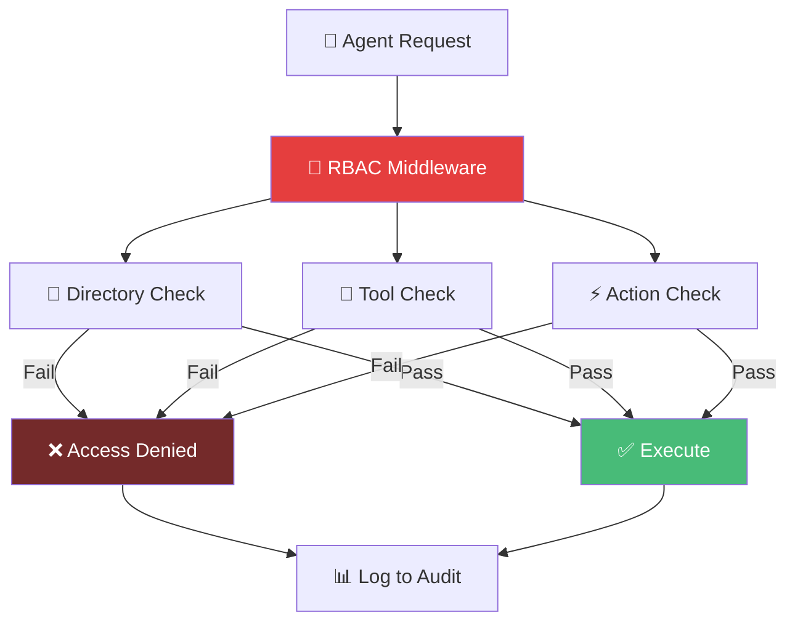
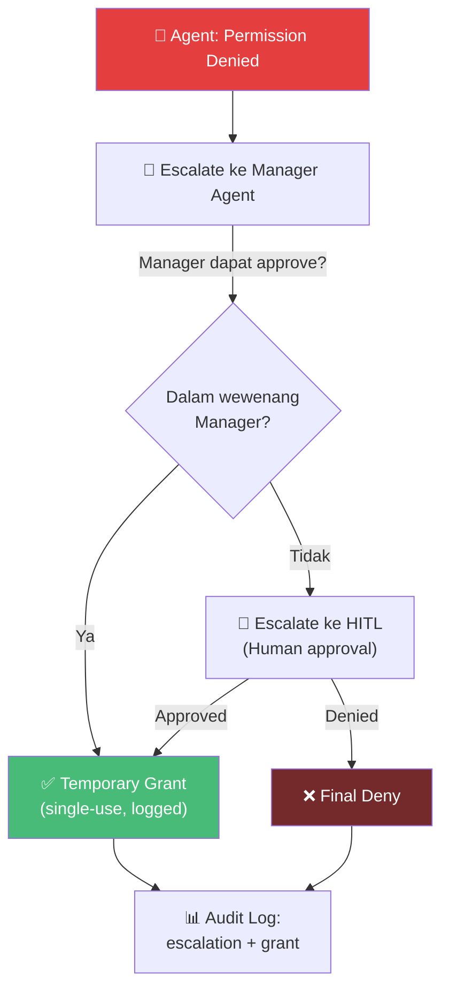

# 04.4 — RBAC & Permissions

> Dokumen ini mendeskripsikan Role-Based Access Control (RBAC) untuk agen AetherOS, termasuk permission matrix, directory access, tool restrictions, dan eskalasi.

---

## 4.4.1 Prinsip RBAC

| Prinsip | Implementasi |
|---------|-------------|
| **Least Privilege** | Setiap agen hanya memiliki akses minimal yang diperlukan untuk perannya |
| **Separation of Duties** | Tidak ada agen tunggal yang memiliki akses penuh ke semua operasi |
| **Defense in Depth** | Multiple layers of access control (role → directory → tool → action) |
| **Audit Trail** | Setiap akses dicatat di audit log |
| **No Privilege Escalation** | Agen tidak dapat meningkatkan akses sendiri |

---

## 4.4.2 Permission Matrix — Directory Access

| Direktori | Manager | Architect | Backend | Frontend | QA | Security | DevOps | Docs |
|-----------|---------|-----------|---------|----------|-----|----------|--------|------|
| `core/` | R | R | R | R | R | R | R | R |
| `agents/` | R | R | R | R | R | R | R | R |
| `schemas/` | R | RW | R | R | R | R | R | R |
| `specs/` | R | RW | R | R | R | R | R | R |
| `migrations/` | R | RW | R | — | R | R | R | R |
| `src/` | R | R | RW | — | R | R | R | R |
| `api/` | R | R | RW | R | R | R | R | R |
| `dashboard/` | R | R | — | RW | R | R | R | R |
| `frontend/` | R | R | — | RW | R | R | R | R |
| `tests/` | R | R | RW | RW | RW | R | R | R |
| `docs/` | R | R | R | R | R | R | R | RW |
| `docker/` | R | R | R | R | R | R | RW | R |
| `.github/` | R | R | — | — | R | R | RW | R |
| `infra/` | R | R | — | — | — | R | RW | R |
| `workspace/` | R | R | RW | RW | R | R | R | R |
| `plugins/` | R | R | R | R | R | R | R | R |

> **R** = Read, **RW** = Read/Write, **—** = No Access

---

## 4.4.3 Permission Matrix — Tool Access

| Tool | Manager | Architect | Backend | Frontend | QA | Security | DevOps | Docs |
|------|---------|-----------|---------|----------|-----|----------|--------|------|
| `read_file` | ✅ | ✅ | ✅ | ✅ | ✅ | ✅ | ✅ | ✅ |
| `write_file` | ❌ | ⚠️ | ✅ | ✅ | ⚠️ | ❌ | ⚠️ | ⚠️ |
| `run_command` | ❌ | ❌ | ✅ | ✅ | ✅ | ⚠️ | ✅ | ❌ |
| `git_commit` | ❌ | ✅ | ✅ | ✅ | ✅ | ❌ | ✅ | ✅ |
| `git_merge` | ✅ | ❌ | ❌ | ❌ | ❌ | ❌ | ❌ | ❌ |
| `git_diff` | ✅ | ✅ | ✅ | ✅ | ✅ | ✅ | ✅ | ✅ |
| `search_code` | ✅ | ✅ | ✅ | ✅ | ✅ | ✅ | ✅ | ✅ |
| `query_brain` | ✅ | ✅ | ✅ | ✅ | ✅ | ✅ | ✅ | ✅ |
| `run_tests` | ❌ | ❌ | ❌ | ❌ | ✅ | ❌ | ❌ | ❌ |
| `security_scan` | ❌ | ❌ | ❌ | ❌ | ❌ | ✅ | ❌ | ❌ |
| `deploy` | ❌ | ❌ | ❌ | ❌ | ❌ | ❌ | ✅* | ❌ |

> ✅ = Penuh, ⚠️ = Terbatas (lihat directory access), ❌ = Tidak diizinkan
> \* = HITL Level 3 required

---

## 4.4.4 Permission Matrix — Action Access

| Aksi | Manager | Architect | Backend | Frontend | QA | Security | DevOps | Docs |
|------|---------|-----------|---------|----------|-----|----------|--------|------|
| Buat task assignment | ✅ | ❌ | ❌ | ❌ | ❌ | ❌ | ❌ | ❌ |
| Ubah prioritas task | ✅ | ❌ | ❌ | ❌ | ❌ | ❌ | ❌ | ❌ |
| Approve merge to main | ✅ | ❌ | ❌ | ❌ | ❌ | ❌ | ❌ | ❌ |
| Definisi schema baru | ❌ | ✅ | ❌ | ❌ | ❌ | ❌ | ❌ | ❌ |
| Modifikasi database schema | ❌ | ✅* | ❌ | ❌ | ❌ | ❌ | ❌ | ❌ |
| Install dependency baru | ❌ | ❌ | ✅ | ✅ | ❌ | ❌ | ✅ | ❌ |
| Block merge (security) | ❌ | ❌ | ❌ | ❌ | ❌ | ✅ | ❌ | ❌ |
| Deploy to production | ❌ | ❌ | ❌ | ❌ | ❌ | ❌ | ✅* | ❌ |
| Modify infra config | ❌ | ❌ | ❌ | ❌ | ❌ | ❌ | ✅* | ❌ |

> \* = Memerlukan HITL checkpoint approval

---

## 4.4.5 Enforcement Architecture

---

## 4.4.6 Eskalasi

### Path Eskalasi

### Aturan Eskalasi

| Aturan | Deskripsi |
|--------|-----------|
| Temporary grants bersifat single-use | Izin eskalasi hanya berlaku untuk satu operasi |
| Semua eskalasi di-log | Catatan lengkap disimpan di audit_logs |
| Cooldown period | Setelah eskalasi ditolak, agen harus menunggu 5 menit sebelum mencoba lagi |
| Manager tidak dapat self-escalate | Manager tidak dapat meningkatkan izinnya sendiri |
| Security veto | Security Agent dapat memblokir eskalasi jika terdeteksi risiko |

---

🔗 **Selanjutnya:** [Provider Router & LLM Fallback →](../05-provider-router/llm-router-and-fallback.md)

🔗 **Kembali:** [Komunikasi Agen ←](agent-communication.md)
