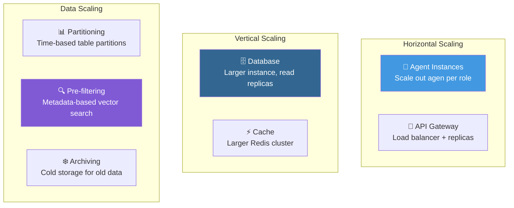
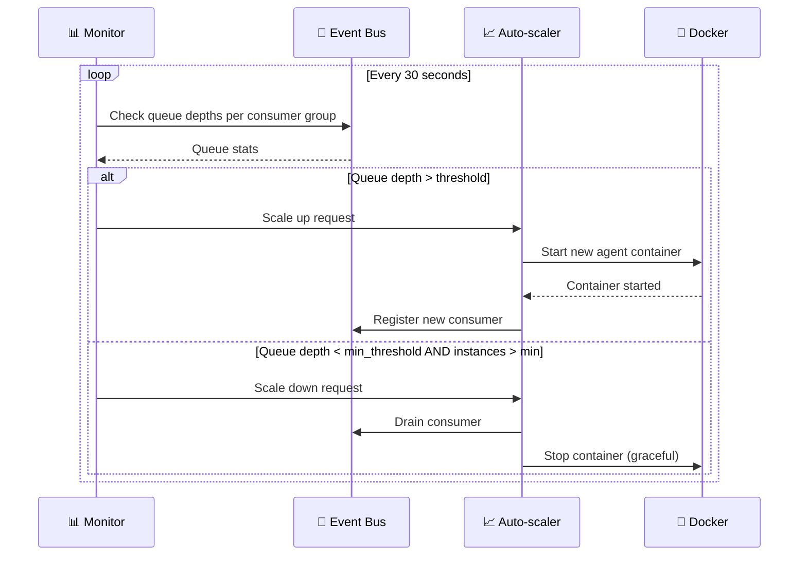

# 08.3 — Strategi Skalabilitas

> Dokumen ini mendeskripsikan strategi skalabilitas AetherOS, termasuk horizontal scaling, metadata pre-filtering, dan performance optimization.

---

## 8.3.1 Scaling Dimensions

---

## 8.3.2 Agent Scaling

### Auto-scaling Rules

| Role | Min Instances | Max Instances | Scale Trigger |
|------|---------------|---------------|---------------|
| Manager | 1 | 1 | Tidak di-scale (singleton) |
| Architect | 1 | 2 | Queue depth > 3 tasks |
| Backend | 1 | 5 | Queue depth > 5 tasks |
| Frontend | 1 | 3 | Queue depth > 3 tasks |
| QA | 1 | 3 | Queue depth > 5 tasks |
| Security | 1 | 2 | Queue depth > 3 tasks |
| DevOps | 1 | 2 | Queue depth > 2 tasks |
| Documentation | 1 | 2 | Queue depth > 5 tasks |

### Scaling Flow

---

## 8.3.3 Database Scaling

### PostgreSQL

| Strategi | Implementasi | Kapan |
|----------|-------------|-------|
| **Read Replicas** | Streaming replication | Query volume > 1000/s |
| **Table Partitioning** | Monthly partitions untuk audit_logs, tasks | Data > 10M rows |
| **Connection Pooling** | PgBouncer | Concurrent connections > 100 |
| **Index Optimization** | Partial indexes, covering indexes | Query P95 > 100ms |

### Qdrant

| Strategi | Implementasi | Kapan |
|----------|-------------|-------|
| **On-disk Vectors** | Memindahkan HNSW graph ke disk | RAM usage > 80% |
| **Metadata Pre-filtering** | Filter sebelum similarity search | Collection > 1M vectors |
| **Sharding** | Distribusi collection ke multiple nodes | Collection > 10M vectors |
| **Collection Segmentation** | Split ke multiple collections | Cross-project query performance |

---

## 8.3.4 Performance Targets

| Metrik | Target | Acceptable | Degraded |
|--------|--------|------------|----------|
| API response time (P95) | < 200ms | < 500ms | > 1s |
| Task throughput | > 10 tasks/min | > 5 tasks/min | < 2 tasks/min |
| LLM request latency (P95) | < 15s | < 30s | > 45s |
| Event Bus throughput | > 100 msg/s | > 50 msg/s | < 20 msg/s |
| Brain query latency (P95) | < 500ms | < 1s | > 2s |
| Vector search latency (P95) | < 100ms | < 200ms | > 500ms |

---

🔗 **Selanjutnya:** [Spesifikasi API →](../09-interfaces/api-specification.md)

🔗 **Kembali:** [CI/CD Pipeline ←](ci-cd-pipeline.md)
