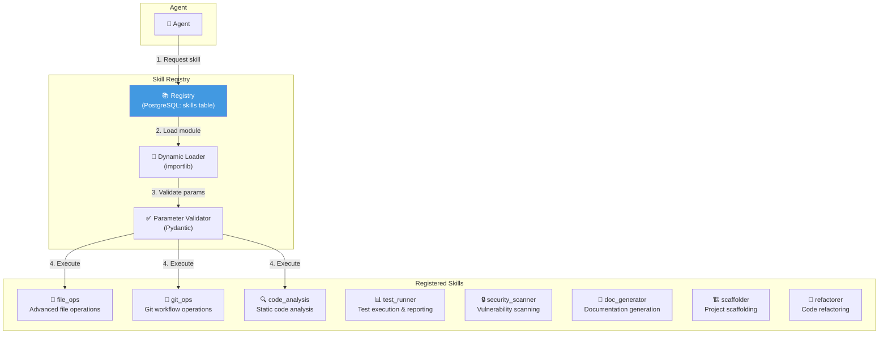

# 06.1 — Skill Library

> Dokumen ini mendeskripsikan Skill Registry AetherOS — perpustakaan fungsi yang dapat dipanggil oleh agen sebagai kemampuan tambahan.

---

## 6.1.1 Konsep Skill

Skill adalah unit fungsionalitas atomik yang dapat dipanggil oleh agen untuk melakukan operasi spesifik. Skill berbeda dari tool:

| Aspek | Tool | Skill |
|-------|------|-------|
| Scope | Operasi dasar (read file, run command) | Logika bisnis yang lebih kompleks |
| Reusability | Built-in, selalu tersedia | Dapat ditambah/dihapus dari registry |
| Complexity | Sederhana, single-action | Dapat melibatkan multiple steps |
| Registration | Hardcoded dalam runtime | Dinamis via Skill Registry |
| Access Control | RBAC per-role | RBAC per-role + per-skill |

---

## 6.1.2 Skill Registry Architecture

---

## 6.1.3 Katalog Skill Bawaan

### File Operations (`file_ops`)

| Method | Deskripsi | Parameters |
|--------|-----------|------------|
| `read_directory_tree` | Baca struktur direktori secara rekursif | path, max_depth, exclude_patterns |
| `find_files` | Cari file berdasarkan pattern | path, pattern, file_type |
| `batch_rename` | Rename multiple files | path, pattern, replacement |
| `merge_files` | Gabungkan multiple files | file_paths, output_path, separator |
| `diff_files` | Bandingkan dua file | file_a, file_b, context_lines |

### Git Operations (`git_ops`)

| Method | Deskripsi | Parameters |
|--------|-----------|------------|
| `create_branch` | Buat feature branch baru | branch_name, from_branch |
| `atomic_commit` | Commit dengan TraceID | files, message, trace_id |
| `create_pr` | Buat pull request | title, description, reviewers |
| `get_diff` | Ambil diff antar branch/commit | from_ref, to_ref, file_filter |
| `get_blame` | Git blame untuk file tertentu | file_path, line_range |
| `get_history` | Riwayat commit untuk file/path | path, limit, since |

### Code Analysis (`code_analysis`)

| Method | Deskripsi | Parameters |
|--------|-----------|------------|
| `analyze_complexity` | Hitung cyclomatic complexity | file_path |
| `find_duplicates` | Temukan kode duplikat | path, min_lines |
| `dependency_graph` | Bangun graph dependensi | path, language |
| `dead_code_detection` | Temukan kode yang tidak digunakan | path |
| `import_analysis` | Analisis import dan dependensi | file_path |

### Test Runner (`test_runner`)

| Method | Deskripsi | Parameters |
|--------|-----------|------------|
| `run_suite` | Jalankan test suite | path, markers, parallel |
| `run_single` | Jalankan test tunggal | test_path |
| `coverage_report` | Generate laporan coverage | path, threshold |
| `mutation_testing` | Jalankan mutation testing | path, operators |

### Security Scanner (`security_scanner`)

| Method | Deskripsi | Parameters |
|--------|-----------|------------|
| `scan_secrets` | Pindai secrets/credentials | path, custom_patterns |
| `scan_vulnerabilities` | Pindai CVE pada dependencies | manifest_path |
| `scan_code_patterns` | Pindai pola kode berbahaya | path, rules |
| `check_permissions` | Periksa file permissions | path |

### Documentation Generator (`doc_generator`)

| Method | Deskripsi | Parameters |
|--------|-----------|------------|
| `generate_api_docs` | Generate dari OpenAPI spec | spec_path, output_format |
| `generate_readme` | Generate README dari kode | path, template |
| `generate_changelog` | Generate dari git history | from_tag, to_tag, format |
| `update_docstrings` | Update docstrings dari kode | file_path |

### Project Scaffolder (`scaffolder`)

| Method | Deskripsi | Parameters |
|--------|-----------|------------|
| `scaffold_module` | Generate boilerplate module | module_name, template |
| `scaffold_api` | Generate API endpoints | spec, framework |
| `scaffold_tests` | Generate test skeletons | source_path |
| `scaffold_migration` | Generate migration file | table_name, changes |

### Code Refactorer (`refactorer`)

| Method | Deskripsi | Parameters |
|--------|-----------|------------|
| `rename_symbol` | Rename variable/function/class secara aman | old_name, new_name, scope |
| `extract_function` | Extract kode menjadi function baru | file_path, line_range, function_name |
| `inline_function` | Inline function call | file_path, function_name |
| `move_to_module` | Pindahkan definisi ke module lain | symbol, target_module |

---

## 6.1.4 Extensibility — Custom Skills

### Registrasi Skill Baru

Skill baru dapat didaftarkan melalui:

1. **Plugin system** — Skill dari marketplace
2. **Manual registration** — Definisi langsung di database
3. **Auto-discovery** — Scan direktori skills/ untuk module baru

### Skill Definition Format

Setiap skill didefinisikan dengan:

| Field | Tipe | Deskripsi |
|-------|------|-----------|
| `name` | string | Nama unik skill |
| `description` | string | Deskripsi fungsionalitas |
| `module_path` | string | Python module path |
| `parameters_schema` | JSON Schema | Schema parameter input |
| `return_schema` | JSON Schema | Schema return value |
| `required_permissions` | list | Permission yang diperlukan |
| `allowed_roles` | list | Role agen yang diizinkan |
| `timeout` | integer | Timeout eksekusi (detik) |
| `idempotent` | bool | Apakah skill idempotent |

---

🔗 **Selanjutnya:** [Integrasi OpenHands →](openhands-integration.md)

🔗 **Kembali:** [Provider Router ←](../05-provider-router/llm-router-and-fallback.md)
