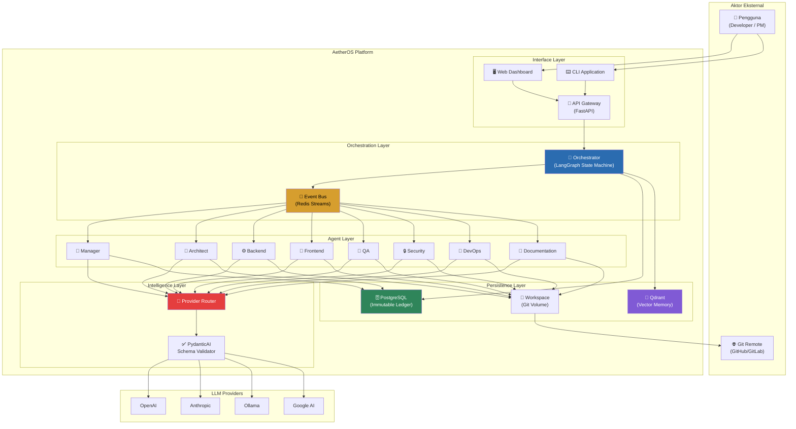
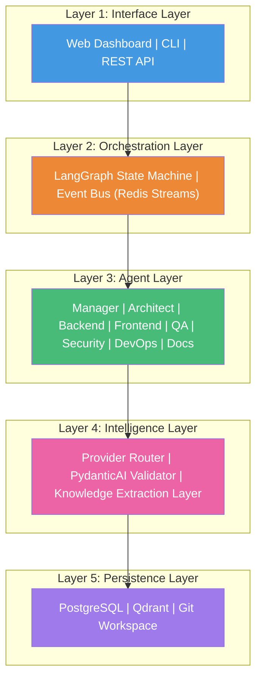
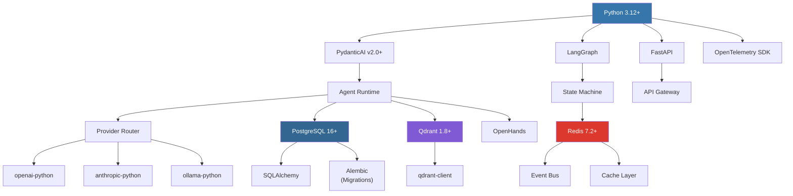
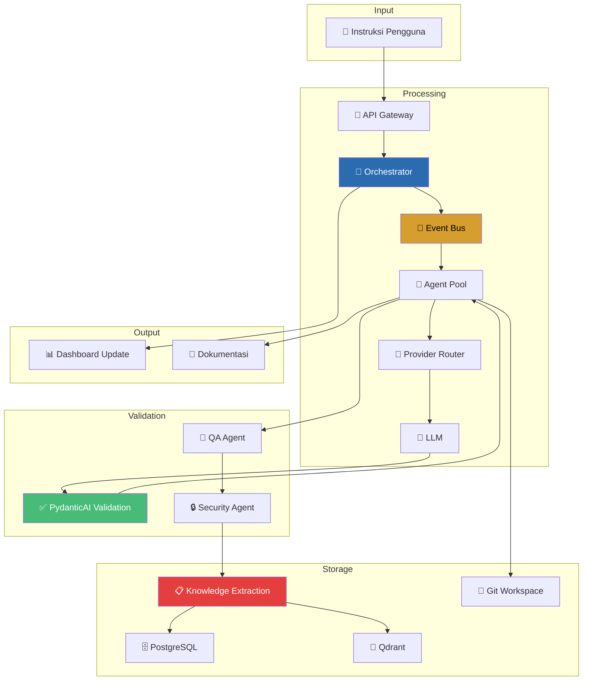

# 02.1 — Gambaran Umum Arsitektur Sistem

> Dokumen ini mendeskripsikan arsitektur global AetherOS, termasuk technology stack, dependency graph, dan diagram arsitektural.

---

## 2.1.1 Arsitektur Tingkat Tinggi (C4 — Context Level)

AetherOS beroperasi sebagai lapisan orkestrator antara manusia (pengguna) dan penyedia LLM, dengan Project Brain sebagai fondasi pengetahuan persisten.



---

## 2.1.2 Arsitektur Berlapis (Layered Architecture)

AetherOS terdiri dari 5 lapisan utama yang saling berkomunikasi secara hierarkis:



### Deskripsi Setiap Lapisan

| Layer | Nama | Tanggung Jawab |
|-------|------|----------------|
| **1** | Interface Layer | Menerima instruksi dari pengguna melalui berbagai antarmuka (Dashboard, CLI, API). Menerjemahkan input manusia menjadi format yang dapat diproses oleh orchestrator. |
| **2** | Orchestration Layer | Mengelola siklus hidup tugas melalui state machine. Mendistribusikan tugas ke agen melalui event bus. Mengimplementasikan checkpoint gates untuk HITL. |
| **3** | Agent Layer | Eksekusi tugas spesifik berdasarkan peran. Setiap agen memiliki kemampuan, batasan akses, dan skill set yang terdefinisi. |
| **4** | Intelligence Layer | Mengabstraksi penyedia LLM, memvalidasi output, dan mengekstraksi pengetahuan dari respons LLM sebelum disimpan. |
| **5** | Persistence Layer | Menyimpan semua data secara permanen. PostgreSQL untuk data terstruktur, Qdrant untuk embedding vektor, Git untuk kode sumber. |

---

## 2.1.3 Technology Stack

### Stack Utama

| Komponen | Teknologi | Versi | Justifikasi Pemilihan |
|----------|-----------|-------|----------------------|
| **Runtime Language** | Python | 3.12+ | Ekosistem AI/ML terlengkap, type hinting matang, async native |
| **Orchestration** | LangGraph | Latest | State machine bawaan, checkpoint support, graph-based workflow |
| **Agent Runtime** | PydanticAI | v2.0+ | Strict schema enforcement, mencegah halusinasi merusak state |
| **Message Broker** | Redis | 7.2+ | Streams untuk event bus, pub/sub, consumer groups, low-latency |
| **Vector DB** | Qdrant | 1.8+ | Metadata filtering, payload indexing, horizontal scaling |
| **Relational DB** | PostgreSQL | 16+ | ACID compliance, JSONB support, mature ecosystem |
| **API Framework** | FastAPI | Latest | Async-first, OpenAPI auto-generation, dependency injection |
| **Containerization** | Docker | Latest | Isolasi agen, reproducibility, orchestration |
| **Observability** | OpenTelemetry | Latest | Vendor-neutral tracing, metrics, dan logging |
| **Tool Execution** | OpenHands | Latest | Sandboxed file operations dan terminal execution |

### Dependency Graph



---

## 2.1.4 Struktur Direktori Proyek

```
aetheros/
├── core/              # Logic inti sistem
│   ├── engine.py      # Runtime engine utama
│   ├── config.py      # Konfigurasi global
│   ├── events.py      # Event definitions dan handlers
│   └── router.py      # Provider router utama
│
├── agents/            # Definisi dan logika agen
│   ├── base.py        # Base agent class (PydanticAI)
│   ├── manager.py     # Manager agent
│   ├── architect.py   # Architect agent
│   ├── backend.py     # Backend agent
│   ├── frontend.py    # Frontend agent
│   ├── qa.py          # QA agent
│   ├── security.py    # Security agent
│   ├── devops.py      # DevOps agent
│   └── docs.py        # Documentation agent
│
├── providers/         # Abstraksi penyedia LLM
│   ├── base.py        # Base provider interface
│   ├── openai.py      # OpenAI adapter
│   ├── anthropic.py   # Anthropic adapter
│   ├── ollama.py      # Ollama adapter
│   └── fallback.py    # Fallback logic
│
├── memory/            # Manajemen memori
│   ├── short_term.py  # LangGraph state (in-session)
│   ├── long_term.py   # Project Brain interface
│   └── distiller.py   # Knowledge extraction pipeline
│
├── brain/             # Integrasi database
│   ├── postgres/      # Schema, queries, migrations
│   ├── qdrant/        # Collections, indexing, search
│   └── sync.py        # Sinkronisasi antar storage
│
├── skills/            # Reusable toolset
│   ├── registry.py    # Skill registry
│   ├── file_ops.py    # File operations
│   ├── git_ops.py     # Git operations
│   └── code_ops.py    # Code analysis
│
├── tools/             # Integrasi eksekutor
│   ├── openhands.py   # OpenHands integration
│   └── sandbox.py     # Sandbox environment
│
├── api/               # FastAPI endpoints
│   ├── main.py        # Application entry point
│   ├── routes/        # Route definitions
│   ├── middleware/     # Auth, CORS, rate limiting
│   └── schemas/       # Request/Response schemas
│
├── dashboard/         # Web dashboard
│   ├── src/           # Frontend source
│   └── public/        # Static assets
│
├── workspace/         # Shared Git volume
│   └── .git/          # Git repository
│
├── plugins/           # Extension system
│   ├── loader.py      # Plugin loader
│   └── marketplace/   # Marketplace integration
│
├── docs/              # Dokumentasi
│   ├── id/            # Bahasa Indonesia
│   └── en/            # English
│
├── tests/             # Test suite
│   ├── unit/          # Unit tests
│   ├── integration/   # Integration tests
│   └── e2e/           # End-to-end tests
│
├── docker/            # Docker configurations
│   ├── Dockerfile     # Main Dockerfile
│   └── compose.yml    # Docker Compose
│
├── pyproject.toml     # Project configuration
└── README.md          # Project README
```

---

## 2.1.5 Data Flow Overview



---

## 2.1.6 Prinsip Arsitektural

| Prinsip | Implementasi |
|---------|-------------|
| **Separation of Concerns** | Setiap layer memiliki tanggung jawab tunggal yang jelas |
| **Single Source of Truth** | Project Brain (PostgreSQL + Qdrant) adalah satu-satunya sumber kebenaran |
| **Fail-Safe Design** | Automatic fallback, dead letter queues, retry mechanisms |
| **Horizontal Scalability** | Setiap komponen dapat di-scale secara independen |
| **Security by Default** | RBAC, sandboxed execution, automated security review |
| **Observable by Design** | OpenTelemetry tracing di setiap komponen |

---

🔗 **Selanjutnya:** [Execution Loop →](execution-loop.md)

🔗 **Kembali:** [Visi & Filosofi ←](../01-vision/philosophy-and-principles.md)
