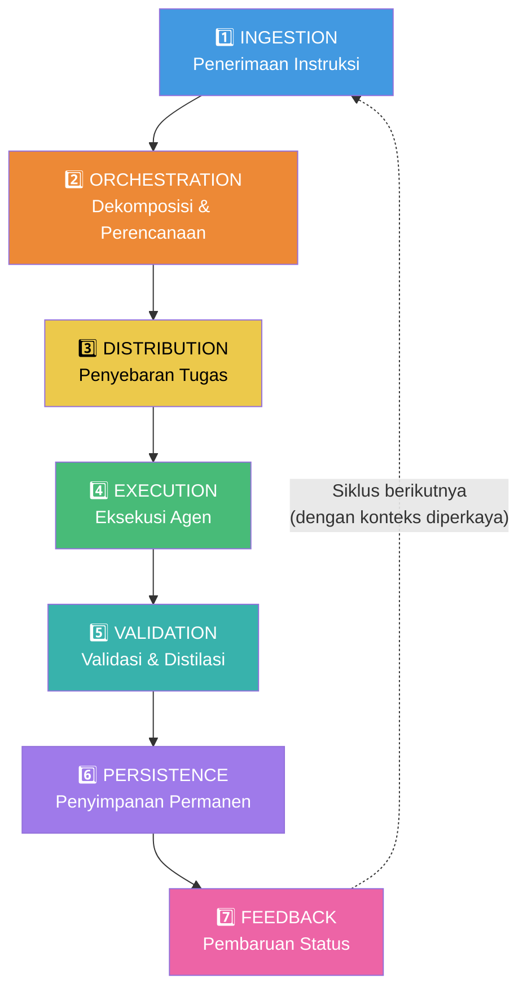
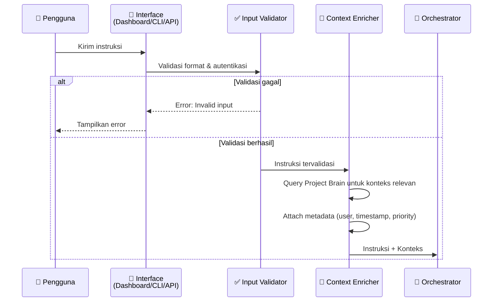
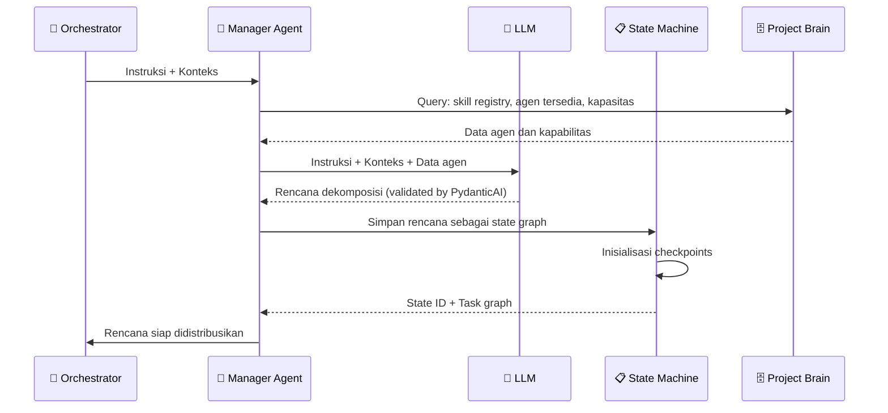
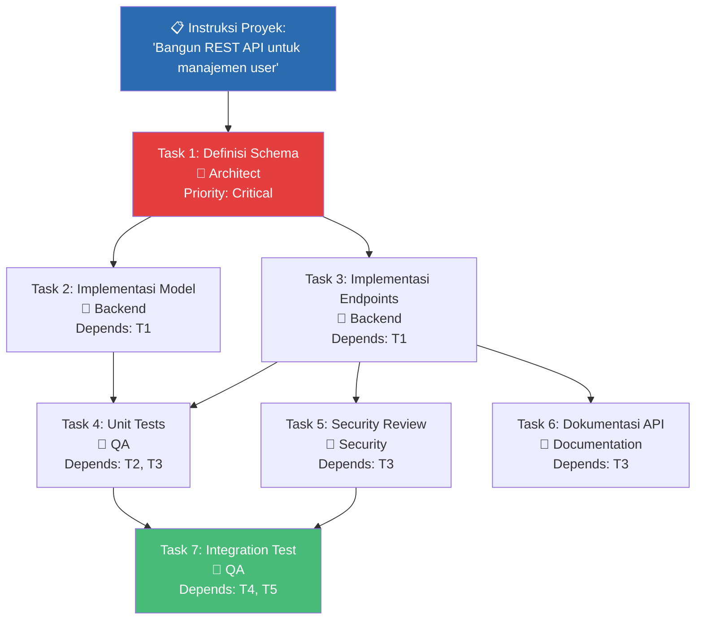
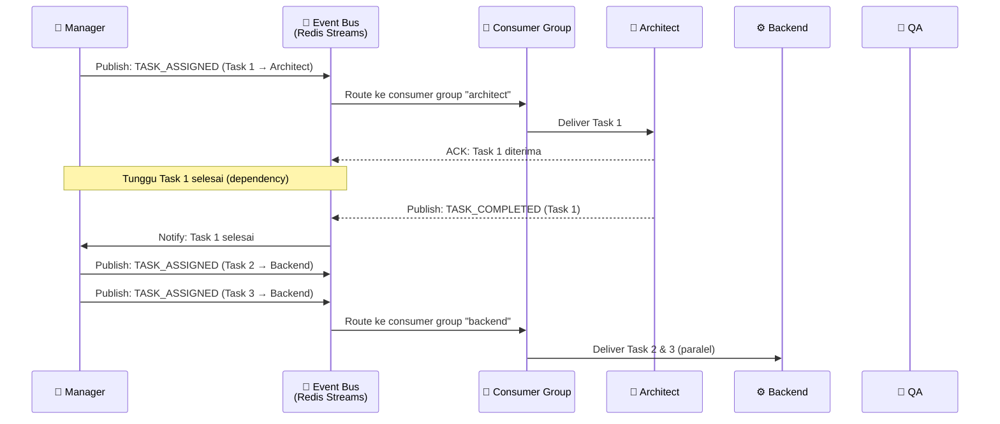
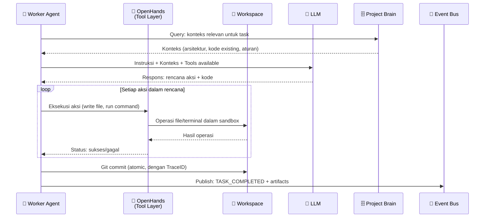
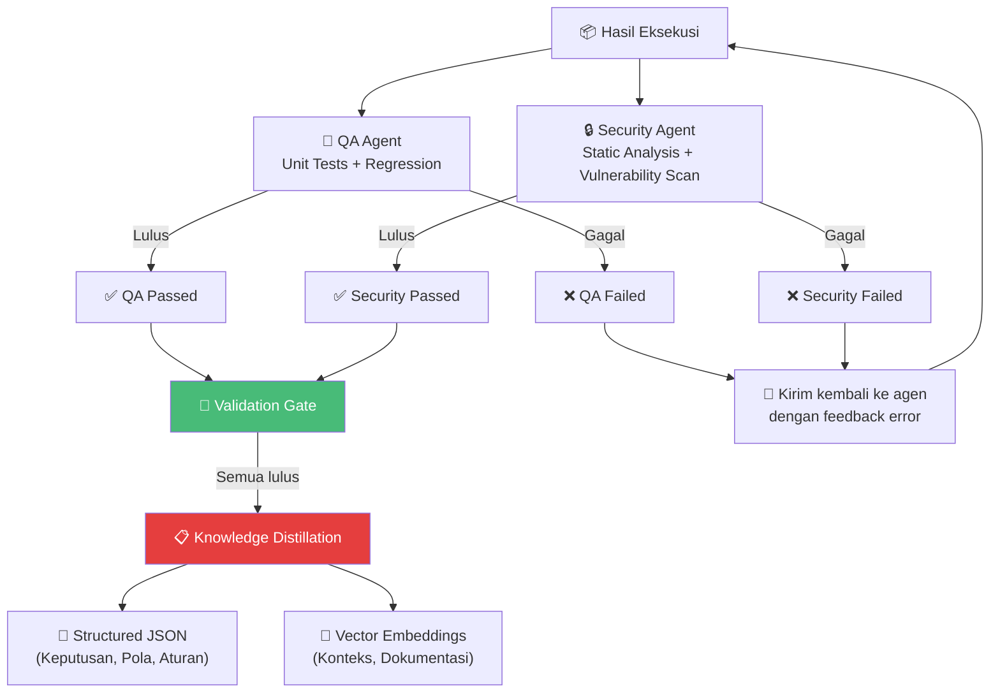
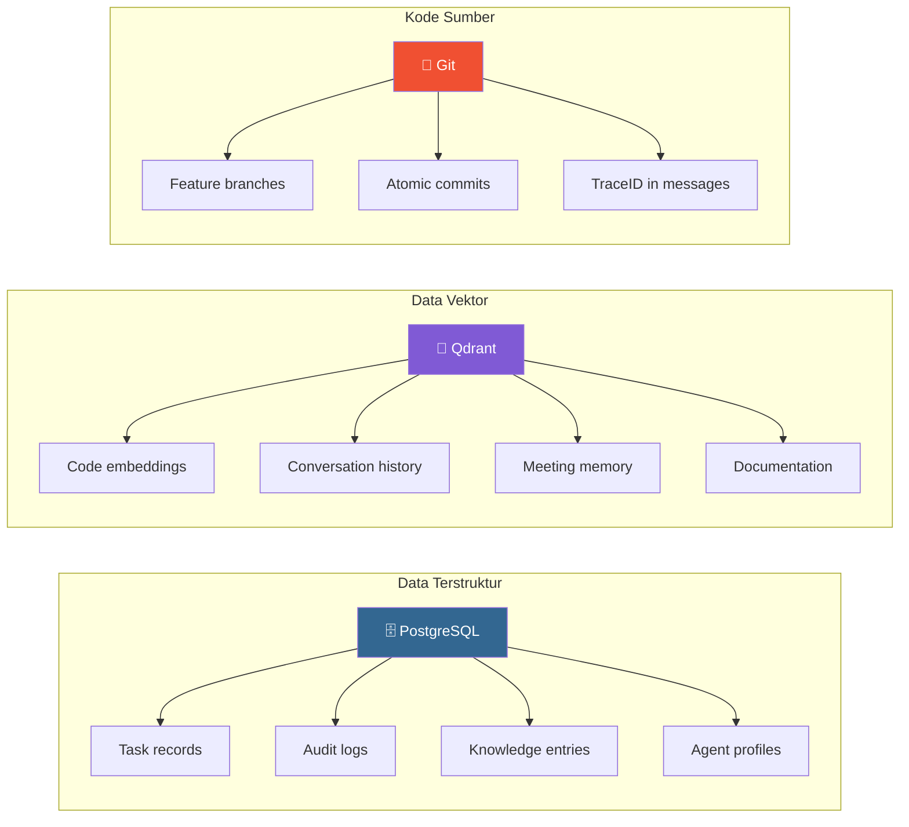
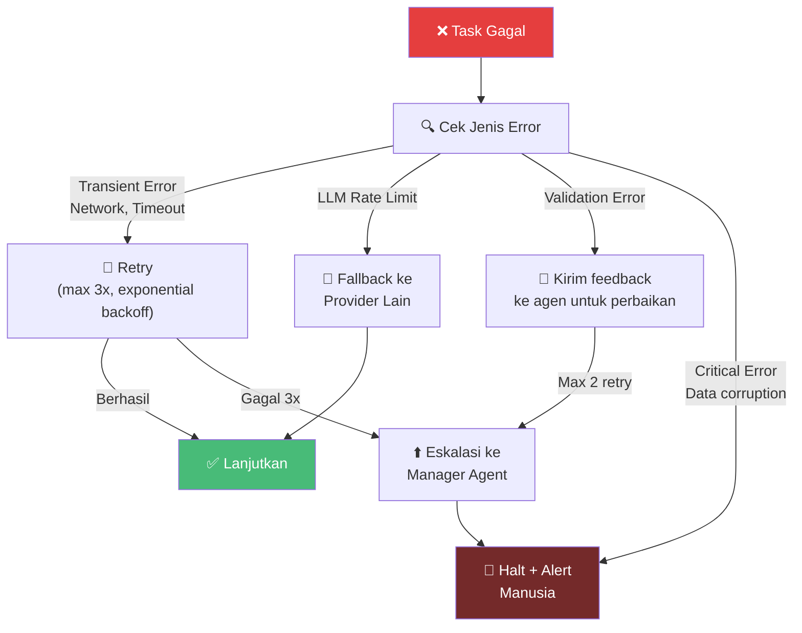
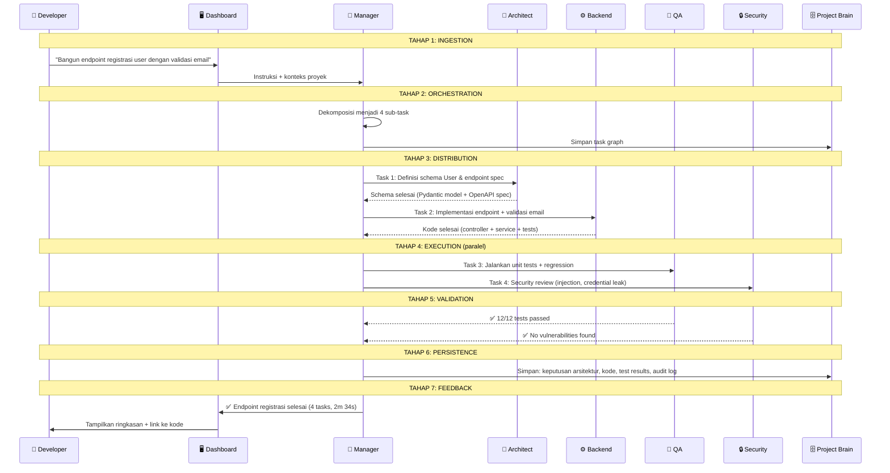

# 02.2 — Execution Loop (Siklus Eksekusi)

> Dokumen ini mendeskripsikan 7 tahap siklus eksekusi AetherOS secara detail, termasuk error handling, retry policies, dan contoh skenario end-to-end.

---

## 2.2.1 Gambaran Umum

Berbeda dengan sistem linier yang memproses instruksi secara sekuensial, AetherOS beroperasi dalam **feedback loop berkelanjutan**. Setiap instruksi melewati 7 tahap yang saling terhubung, di mana output dari satu siklus menjadi input untuk siklus berikutnya melalui enrichment dari Project Brain.

---

## 2.2.2 Tahap 1: INGESTION — Penerimaan Instruksi

### Deskripsi
Instruksi masuk ke sistem melalui salah satu antarmuka yang tersedia: Web Dashboard, CLI, atau REST API. Pada tahap ini, instruksi mentah divalidasi, diperkaya dengan konteks, dan dikonversi ke format internal.

### Alur Detail

### Komponen yang Terlibat

| Komponen | Fungsi |
|----------|--------|
| **Input Validator** | Memvalidasi format instruksi, autentikasi pengguna, dan otorisasi akses |
| **Context Enricher** | Mengambil konteks relevan dari Project Brain (riwayat tugas terkait, keputusan arsitektur, dll.) |
| **Metadata Injector** | Menambahkan informasi meta: TraceID, timestamp, user identity, priority level |

### Error Handling

| Error | Aksi |
|-------|------|
| Format instruksi tidak valid | Return error 400 dengan panduan format yang benar |
| Autentikasi gagal | Return error 401, log upaya akses |
| Context Enricher timeout | Lanjutkan tanpa konteks tambahan, tandai sebagai "low-context" |
| Project Brain tidak tersedia | Lanjutkan dengan konteks minimal, alert ke monitoring |

---

## 2.2.3 Tahap 2: ORCHESTRATION — Dekomposisi dan Perencanaan

### Deskripsi
Manager Agent menerima instruksi yang telah diperkaya konteks, lalu mendekomposisinya menjadi rencana kerja terstruktur. Rencana ini disimpan sebagai state dalam LangGraph State Machine.

### Alur Detail

### Proses Dekomposisi

Manager Agent memecah instruksi menjadi task graph — sebuah DAG (Directed Acyclic Graph) yang mendefinisikan urutan dan dependensi antar tugas:

### State Machine Transitions

| State | Kondisi Transisi | State Berikutnya |
|-------|-----------------|------------------|
| `PLANNING` | Rencana dekomposisi selesai dan valid | `DISTRIBUTING` |
| `DISTRIBUTING` | Semua tugas telah di-assign | `EXECUTING` |
| `EXECUTING` | Semua tugas selesai | `VALIDATING` |
| `VALIDATING` | Semua validasi lulus | `PERSISTING` |
| `PERSISTING` | Data tersimpan | `COMPLETED` |
| Any State | Error kritis | `FAILED` |
| Any State | Memerlukan persetujuan manusia | `AWAITING_APPROVAL` |

---

## 2.2.4 Tahap 3: DISTRIBUTION — Penyebaran Tugas

### Deskripsi
Tugas-tugas yang telah didekomposisi disebarkan melalui Event Bus (Redis Streams) ke agen pekerja yang sesuai. Distribusi mempertimbangkan dependensi antar tugas, kapasitas agen, dan prioritas.

### Alur Detail

### Strategi Distribusi

| Strategi | Deskripsi |
|----------|-----------|
| **Dependency-Aware** | Tugas hanya dikirim setelah semua dependensinya selesai |
| **Priority-Based** | Tugas dengan prioritas tinggi didistribusikan lebih dulu |
| **Load-Balanced** | Jika ada multiple instances dari satu peran, tugas dibagi rata |
| **Retry-Enabled** | Jika agen gagal memproses, tugas dikirim ulang ke instansi lain |

---

## 2.2.5 Tahap 4: EXECUTION — Eksekusi Agen

### Deskripsi
Worker Agents mengeksekusi tugas di dalam Shared Workspace menggunakan OpenHands sebagai Tool Execution Layer. Setiap agen bekerja dalam sandbox yang terisolasi dengan akses terbatas sesuai RBAC.

### Alur Detail

### Sandbox Environment

Setiap agen beroperasi dalam lingkungan yang terisolasi:

| Batasan | Deskripsi |
|---------|-----------|
| **File System** | Akses hanya ke direktori yang diizinkan oleh RBAC |
| **Network** | Dibatasi ke internal services saja (kecuali DevOps) |
| **Execution Time** | Timeout per-task untuk mencegah infinite loops |
| **Resource Limits** | CPU dan memory limits per agen |
| **Git Access** | Hanya dapat commit ke feature branch, bukan main |

---

## 2.2.6 Tahap 5: VALIDATION & DISTILLATION — Validasi dan Distilasi

### Deskripsi
Setelah eksekusi selesai, hasil kerja melewati dua proses: (1) Validasi oleh agen QA dan Security, (2) Distilasi pengetahuan teknis untuk disimpan ke Project Brain.

### Alur Validasi

### Proses Distilasi

Knowledge Extraction Layer memproses output agen dan mengekstraksi:

| Output Distilasi | Format | Penyimpanan |
|-----------------|--------|-------------|
| Keputusan arsitektur | Structured JSON | PostgreSQL |
| Pattern yang digunakan | Structured JSON | PostgreSQL |
| Kode dan implementasi | Vector embedding | Qdrant |
| Reasoning chain | Structured JSON | PostgreSQL |
| Dokumentasi | Vector embedding | Qdrant |

---

## 2.2.7 Tahap 6: PERSISTENCE — Penyimpanan Permanen

### Deskripsi
Data yang telah divalidasi dan didistilasi disimpan secara permanen di Project Brain. PostgreSQL menyimpan data terstruktur (relasional), Qdrant menyimpan embedding vektor, dan Git menyimpan kode sumber.

### Strategi Penyimpanan

### Konsistensi Data

| Mekanisme | Deskripsi |
|-----------|-----------|
| **Transactional Writes** | PostgreSQL menggunakan transaksi ACID untuk menjamin konsistensi |
| **Write-Ahead Logging** | Perubahan dicatat sebelum dieksekusi untuk crash recovery |
| **Dual-Write Prevention** | Menggunakan outbox pattern untuk menghindari inkonsistensi antara PG dan Qdrant |
| **Immutable Records** | Audit logs bersifat append-only, tidak dapat dihapus atau dimodifikasi |

---

## 2.2.8 Tahap 7: FEEDBACK — Pembaruan Status

### Deskripsi
Status terbaru diperbarui ke Dashboard untuk visibilitas manusia. Jika diperlukan intervensi (misalnya HITL checkpoint), sistem menunggu sinyal persetujuan sebelum melanjutkan.

### Jenis Feedback

| Jenis | Target | Aksi |
|-------|--------|------|
| **Progress Update** | Dashboard | Memperbarui progress bar dan task status |
| **Completion Report** | Dashboard + CLI | Menampilkan ringkasan hasil kerja |
| **Approval Request** | Dashboard (HITL) | Membekukan state, menunggu persetujuan manusia |
| **Error Notification** | Dashboard + Alerting | Mengirim alert jika terjadi kegagalan |
| **Cost Report** | Dashboard | Memperbarui konsumsi token dan biaya |

---

## 2.2.9 Retry dan Recovery Policies

### Retry Configuration

| Parameter | Nilai Default | Deskripsi |
|-----------|--------------|-----------|
| `max_retries` | 3 | Jumlah maksimal percobaan ulang |
| `initial_backoff` | 1 detik | Waktu tunggu awal sebelum retry |
| `backoff_multiplier` | 2 | Pengali waktu tunggu (exponential) |
| `max_backoff` | 60 detik | Waktu tunggu maksimal |
| `feedback_max_retries` | 2 | Maksimal percobaan perbaikan oleh agen |
| `task_timeout` | 300 detik | Timeout per-task sebelum dianggap gagal |

---

## 2.2.10 Contoh Skenario End-to-End

### Skenario: "Bangun endpoint registrasi user dengan validasi email"

---

🔗 **Selanjutnya:** [Arsitektur Event-Driven →](event-driven-architecture.md)

🔗 **Kembali:** [Gambaran Umum Sistem ←](system-overview.md)
