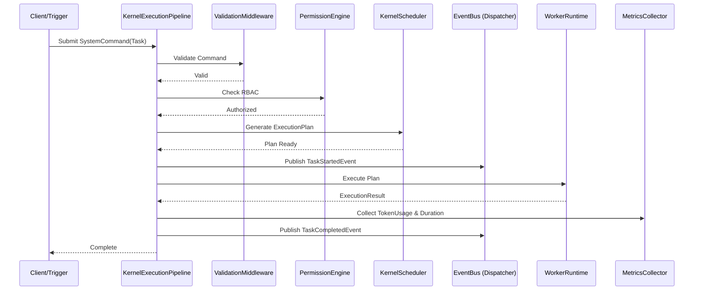

# Kernel Subsystem Specification (Blueprint)

Dokumen ini adalah **blueprint implementasi Kernel**. Segala pengembangan Kernel pada Milestone 1 dan seterusnya harus berpedoman pada spesifikasi ini.

## 1. Tanggung Jawab Subsystem

| Subsystem | Tanggung Jawab Utama |
|---|---|
| `configuration` | Memuat pengaturan fitur Kernel (Enable Metrics, Enable Supervisor, dll). |
| `dependency_injection` | Menyediakan IoC murni (container, scope, provider, resolver) tanpa library eksternal. |
| `diagnostics` | Menyajikan informasi kesehatan sistem, versi, dan layanan yang termuat. |
| `state` | Tempat sentral dan terisolasi untuk seluruh state yang mutable (Kernel, Worker, Task). |
| `metrics` | Memiliki Collector, Aggregator, dan Exporter (NullExporter) untuk telemetri. |
| `dispatcher` | Bus kejadian (EventBus) pola Pub/Sub. Hanya meneruskan pesan, tidak menyimpan/mengantri. |
| `permissions` | RBAC Engine untuk validasi akses operasi sistem. |
| `registry` | Terdiri atas spesifik Registry (Worker, Tool, Provider, Extension) yang dirangkum oleh `CompositeRegistry`. |
| `lifecycle` | Memvalidasi dan mengeksekusi transisi state Worker. |
| `scheduler` | Generator *ExecutionPlan* (bukan pengeksekusi) berdasarkan urutan prioritas/antrian. |
| `supervisor` | Loop pemantau (Health, Heartbeat, Incident). Memiliki *Policy* untuk menangani error dari Dispatcher. |
| `pipeline` | Rantai eksekusi terorkestrasi (Middleware): Validation ➔ AuthZ ➔ Scheduling ➔ Dispatch ➔ Execution ➔ Metrics ➔ Completion. |
| `runtime` | Executor spesifik yang menangani *context* Worker (WorkerRuntime). |
| `bootstrap` | Orkestrator inisialisasi menggunakan pola Builder (`KernelBuilder`). |

## 2. Aturan Dependensi (Allowed & Forbidden)
- **Allowed**: `core/contracts/*`, Python Standard Library.
- **Forbidden**: LLM SDK, API Clients, Database ORM, Web Frameworks, *Singleton Global*, *Service Locator*.

## 3. Lifecycle Kernel
1. **Bootstrapping**: `KernelBuilder` membangun `ServiceContainer` dan menyuntikkan dependensi ke semua subsystem.
2. **Ready**: Semua registry termuat, konfigurasi tervalidasi.
3. **Running**: `KernelSupervisor` dan `EventBus` aktif. Runtime bersiap menerima sinyal.
4. **Shutdown**: Secara berurutan mematikan Supervisor, Dispatcher, lalu melepaskan semua *resource* di State Manager.

## 4. Public Interface (Contoh Kontrak)
*Semua subsystem diakses melalui antarmuka protocol.*
- `KernelExecutionPipeline.process(context, command)`
- `CompositeRegistry.register(kind, instance)`
- `EventBus.publish(event)`
- `StateManager.update_task_state(task_id, new_status)`

## 5. Extension Point Masa Depan
Arsitektur ini didesain agar mudah diganti (*swappable*):
- `InMemoryDispatcher` ➔ `RedisDispatcher` / `KafkaDispatcher`
- `NullExporter` ➔ `OpenTelemetryExporter`
- `CompositeRegistry` ➔ `DistributedPostgreSQLRegistry`

## 6. Sequence Diagram (Task Execution via Pipeline)

