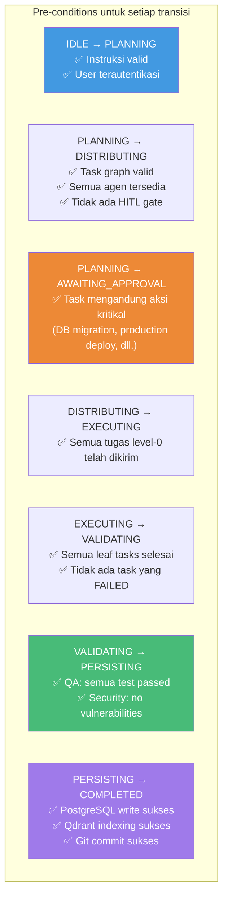
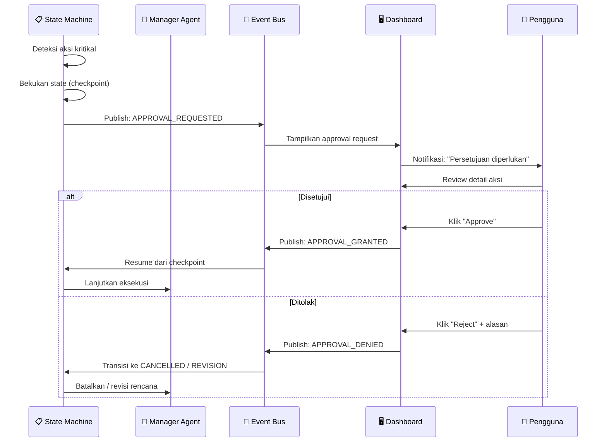
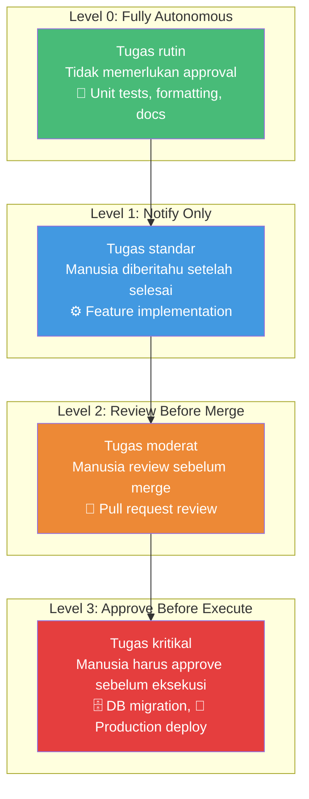
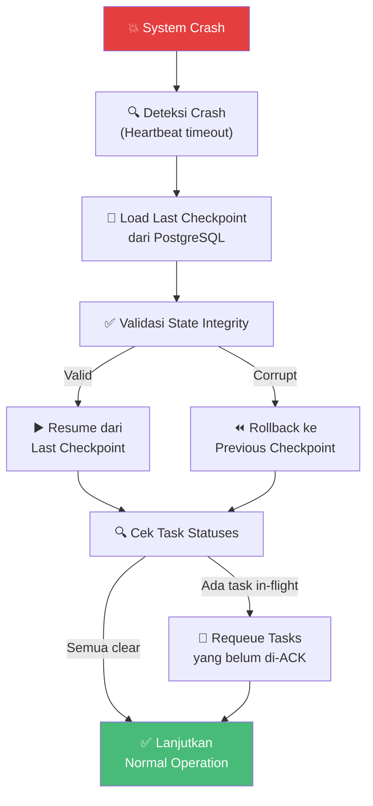
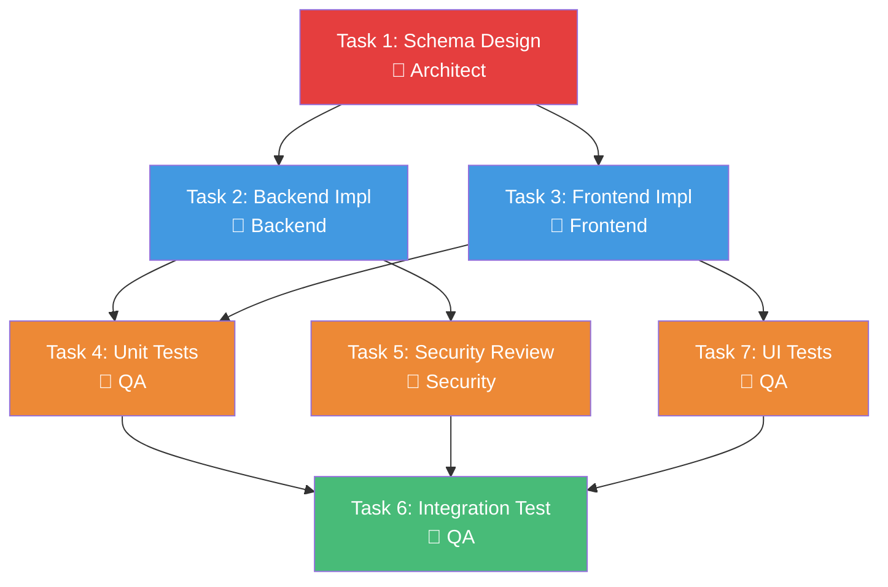

# 02.4 — Orkestrasi State Machine

> Dokumen ini mendeskripsikan implementasi LangGraph State Machine untuk mengelola alur kerja bisnis, transisi state, Checkpoint Gates, dan Human-in-the-Loop workflow.

---

## 2.4.1 Mengapa State Machine?

Alur kerja multi-agent bersifat non-linear dan penuh dengan kondisionalitas. State Machine menjamin bahwa:
- Transisi antar tahap hanya terjadi jika syarat terpenuhi
- State dapat di-*checkpoint* dan di-*resume* kapan saja
- Kegagalan tidak menyebabkan *state* yang tidak konsisten
- Manusia dapat mengintervensi pada titik-titik strategis

---

## 2.4.2 State Machine Architecture

### LangGraph sebagai Engine

LangGraph menyediakan graph-based state machine yang ideal untuk orkestrasi agen:

```mermaid
statediagram-v2
    [*] --> IDLE
    IDLE --> PLANNING : Instruksi diterima
    PLANNING --> DISTRIBUTING : Rencana disetujui
    PLANNING --> AWAITING_APPROVAL : Memerlukan persetujuan manusia
    AWAITING_APPROVAL --> PLANNING : Disetujui
    AWAITING_APPROVAL --> CANCELLED : Ditolak
    DISTRIBUTING --> EXECUTING : Semua tugas didistribusikan
    EXECUTING --> VALIDATING : Semua tugas selesai
    EXECUTING --> EXECUTING : Sub-task selesai, lanjut ke dependen
    EXECUTING --> FAILED : Error kritis
    VALIDATING --> PERSISTING : Semua validasi lulus
    VALIDATING --> EXECUTING : Validasi gagal, retry
    PERSISTING --> COMPLETED : Data tersimpan
    PERSISTING --> FAILED : Persistence error
    COMPLETED --> [*]
    FAILED --> IDLE : Reset manual
    CANCELLED --> [*]
```

---

## 2.4.3 Definisi State

### State Fields

| Field | Tipe | Deskripsi |
|-------|------|-----------|
| `project_id` | UUID | Identifier proyek |
| `instruction_id` | UUID | Identifier instruksi yang sedang diproses |
| `trace_id` | String | OpenTelemetry TraceID |
| `current_phase` | Enum | Fase saat ini (PLANNING, EXECUTING, dll.) |
| `task_graph` | DAG | Directed Acyclic Graph dari tugas-tugas |
| `task_statuses` | Map | Status setiap task (pending, running, done, failed) |
| `agent_assignments` | Map | Mapping task → agen yang bertanggung jawab |
| `validation_results` | List | Hasil validasi QA dan Security |
| `knowledge_distilled` | List | Pengetahuan yang telah diekstraksi |
| `error_log` | List | Log error selama eksekusi |
| `checkpoint_history` | List | Riwayat checkpoint states |
| `human_decisions` | List | Keputusan manusia dari HITL gates |
| `metadata` | Object | Informasi tambahan (timestamp, metrics, dll.) |

### State Transitions



---

## 2.4.4 Checkpoint Gates

### Konsep

Checkpoint Gates adalah titik-titik dalam alur kerja di mana state machine **membekukan eksekusi** dan menunggu input manusia. Ini adalah implementasi inti dari prinsip "Manusia sebagai Pengarah, AI sebagai Pelaksana."

### Kapan Checkpoint Gate Aktif

| Trigger | Deskripsi | Severity |
|---------|-----------|----------|
| Database Schema Migration | Perubahan pada skema database produksi | 🔴 Critical |
| Production Deployment | Deploy ke lingkungan produksi | 🔴 Critical |
| API Contract Change | Perubahan yang memutus backward compatibility | 🟠 High |
| Security Policy Override | Agen mencoba melewati batasan keamanan | 🔴 Critical |
| Cost Threshold Exceeded | Biaya token melebihi batas yang ditentukan | 🟡 Medium |
| Merge to Main Branch | Penggabungan kode ke branch utama | 🟠 High |
| External API Integration | Integrasi dengan service pihak ketiga | 🟡 Medium |

### Alur Checkpoint Gate



### Checkpoint Data yang Disimpan

| Data | Deskripsi |
|------|-----------|
| `state_snapshot` | Snapshot lengkap state machine saat checkpoint |
| `pending_action` | Aksi yang memerlukan persetujuan |
| `risk_assessment` | Penilaian risiko otomatis |
| `affected_resources` | Sumber daya yang terpengaruh |
| `rollback_plan` | Rencana pembatalan jika terjadi masalah |
| `requested_at` | Waktu permintaan persetujuan |
| `requestor_agent` | Agen yang memicu checkpoint |

---

## 2.4.5 Human-in-the-Loop (HITL) Workflow

### Levels of Human Involvement



### Konfigurasi HITL per Task Type

| Tipe Task | HITL Level | Auto-timeout | Default Action |
|-----------|------------|-------------|----------------|
| Code formatting | Level 0 | N/A | Auto-execute |
| Unit test generation | Level 0 | N/A | Auto-execute |
| Feature implementation | Level 1 | N/A | Execute, notify |
| API endpoint creation | Level 1 | N/A | Execute, notify |
| Pull request creation | Level 2 | 24 jam | Hold for review |
| Database migration | Level 3 | 72 jam | Hold for approval |
| Production deployment | Level 3 | 72 jam | Hold for approval |
| Security policy change | Level 3 | Tidak ada | Hold indefinitely |

---

## 2.4.6 State Persistence dan Recovery

### Persistence Strategy

State machine state disimpan di PostgreSQL pada setiap transisi untuk memungkinkan recovery dari crash:

| Event | Aksi Persistence |
|-------|-----------------|
| State transition | Snapshot state disimpan ke `state_snapshots` table |
| Checkpoint created | Full state + context disimpan |
| Task completed | State diperbarui incrementally |
| Error occurred | State + error context disimpan |

### Recovery Protocol



---

## 2.4.7 Concurrency Control

### Parallel Task Execution

LangGraph mendukung eksekusi paralel untuk tugas-tugas yang tidak memiliki dependensi:



Dalam diagram di atas:
- **Task 2 dan Task 3** dieksekusi secara **paralel** karena keduanya hanya bergantung pada Task 1
- **Task 4, Task 5, dan Task 7** dieksekusi secara **paralel** setelah dependensi masing-masing selesai
- **Task 6** menunggu sampai **Task 4, Task 5, dan Task 7** selesai

### Conflict Resolution

| Situasi | Strategi |
|---------|----------|
| Dua agen memodifikasi file yang sama | Lock file pada level workspace, antrian berbasis timestamp |
| Hasil agen bertentangan | Escalate ke Manager untuk keputusan |
| Resource contention (DB, API) | Backoff eksponensial dengan jitter |
| Deadlock potensial | Timeout detection + automatic rollback |

---

🔗 **Selanjutnya:** [Arsitektur Memori →](../03-project-brain/memory-architecture.md)

🔗 **Kembali:** [Arsitektur Event-Driven ←](event-driven-architecture.md)
