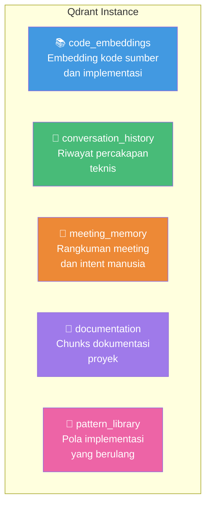
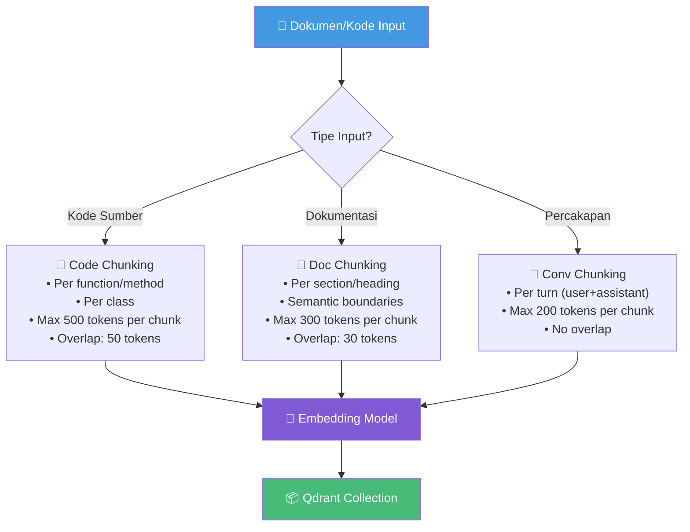
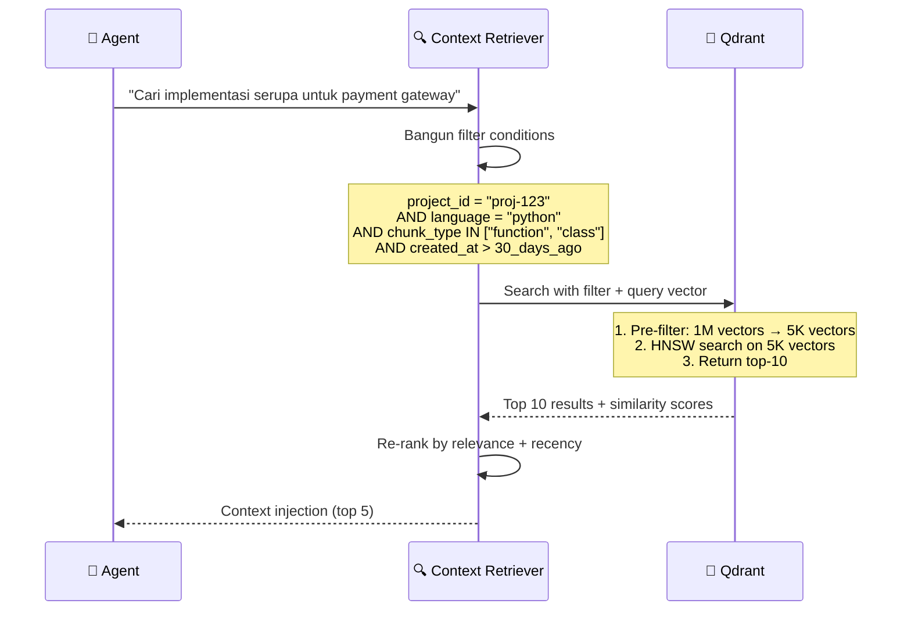
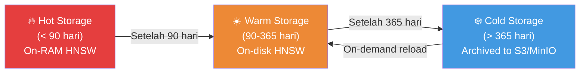

# 03.3 — Desain Vektor Qdrant

> Dokumen ini mendeskripsikan arsitektur database vektor Qdrant untuk Long-term Memory dan Semantic Retrieval dalam AetherOS.

---

## 3.3.1 Peran Qdrant dalam AetherOS

Qdrant berfungsi sebagai **memori semantik** — menyimpan representasi vektor dari pengetahuan yang tidak mudah distrukturisasi dalam tabel relasional. Ini memungkinkan agen melakukan **pencarian berdasarkan makna**, bukan hanya kata kunci.

### Kapan Menggunakan Qdrant vs PostgreSQL

| Skenario | Penyimpanan | Alasan |
|----------|-------------|--------|
| "Cari keputusan arsitektur tentang autentikasi" | PostgreSQL | Terstruktur, bisa di-query dengan SQL |
| "Cari kode yang mirip dengan implementasi ini" | Qdrant | Memerlukan semantic similarity |
| "Ambil semua tugas yang ditugaskan ke agen X" | PostgreSQL | Query relasional |
| "Cari diskusi terdahulu yang relevan dengan masalah ini" | Qdrant | Konteks percakapan, semantic matching |
| "Hitung total biaya token bulan ini" | PostgreSQL | Agregasi numerik |
| "Temukan pattern implementasi yang serupa" | Qdrant | Pattern matching berbasis semantik |

---

## 3.3.2 Arsitektur Collections

---

## 3.3.3 Detail Collections

### Collection: code_embeddings

Menyimpan embedding dari kode sumber, implementasi, dan snippet yang dihasilkan oleh agen.

| Parameter | Nilai |
|-----------|-------|
| **Vector Size** | 1536 (OpenAI ada-002) atau 768 (all-MiniLM-L6-v2) |
| **Distance Metric** | Cosine |
| **On-disk** | true (untuk dataset besar) |
| **HNSW Config** | m=16, ef_construct=100 |

**Payload Schema:**

| Field | Tipe | Indexed | Deskripsi |
|-------|------|---------|-----------|
| `project_id` | keyword | ✅ | Filter per proyek |
| `file_path` | keyword | ✅ | Path file sumber |
| `language` | keyword | ✅ | Bahasa pemrograman |
| `chunk_type` | keyword | ✅ | function, class, module, snippet |
| `agent_role` | keyword | ✅ | Agen yang menghasilkan |
| `task_id` | keyword | ✅ | Task yang menghasilkan |
| `pg_knowledge_id` | keyword | ✅ | Cross-reference ke PostgreSQL |
| `content_text` | text | ❌ | Teks asli (untuk display) |
| `created_at` | integer | ✅ | Unix timestamp |
| `quality_score` | float | ✅ | Skor kualitas kode |

---

### Collection: conversation_history

Menyimpan riwayat percakapan teknis antar agen dan antara agen dengan manusia.

| Parameter | Nilai |
|-----------|-------|
| **Vector Size** | 1536 |
| **Distance Metric** | Cosine |
| **On-disk** | true |

**Payload Schema:**

| Field | Tipe | Indexed | Deskripsi |
|-------|------|---------|-----------|
| `project_id` | keyword | ✅ | Filter per proyek |
| `session_id` | keyword | ✅ | ID sesi percakapan |
| `speaker` | keyword | ✅ | Identitas pembicara (agen/manusia) |
| `message_role` | keyword | ✅ | user, assistant, system |
| `topic_tags` | keyword[] | ✅ | Tag topik |
| `content_text` | text | ❌ | Teks percakapan |
| `created_at` | integer | ✅ | Unix timestamp |

---

### Collection: meeting_memory

Aliran khusus untuk merekonsiliasi niat manusia dengan eksekusi agen.

| Parameter | Nilai |
|-----------|-------|
| **Vector Size** | 1536 |
| **Distance Metric** | Cosine |

**Payload Schema:**

| Field | Tipe | Indexed | Deskripsi |
|-------|------|---------|-----------|
| `project_id` | keyword | ✅ | Filter per proyek |
| `meeting_id` | keyword | ✅ | ID meeting |
| `summary_type` | keyword | ✅ | decision, action_item, context, requirement |
| `participants` | keyword[] | ✅ | Peserta meeting |
| `priority` | keyword | ✅ | Prioritas item |
| `content_text` | text | ❌ | Rangkuman |
| `actionable` | bool | ✅ | Apakah ini actionable item |
| `created_at` | integer | ✅ | Unix timestamp |

---

### Collection: documentation

Chunks dari dokumentasi proyek untuk semantic retrieval.

| Parameter | Nilai |
|-----------|-------|
| **Vector Size** | 1536 |
| **Distance Metric** | Cosine |

**Payload Schema:**

| Field | Tipe | Indexed | Deskripsi |
|-------|------|---------|-----------|
| `project_id` | keyword | ✅ | Filter per proyek |
| `doc_type` | keyword | ✅ | api_doc, readme, architecture, guide |
| `section_title` | keyword | ✅ | Judul seksi |
| `file_path` | keyword | ✅ | Path file dokumentasi |
| `content_text` | text | ❌ | Teks dokumentasi |
| `version` | keyword | ✅ | Versi dokumentasi |
| `created_at` | integer | ✅ | Unix timestamp |

---

### Collection: pattern_library

Pola implementasi yang telah terbukti dan dapat digunakan kembali.

| Parameter | Nilai |
|-----------|-------|
| **Vector Size** | 1536 |
| **Distance Metric** | Cosine |

**Payload Schema:**

| Field | Tipe | Indexed | Deskripsi |
|-------|------|---------|-----------|
| `project_id` | keyword | ✅ | Filter per proyek (atau "global") |
| `pattern_name` | keyword | ✅ | Nama pattern |
| `pattern_category` | keyword | ✅ | design_pattern, error_handling, optimization, security |
| `language` | keyword | ✅ | Bahasa pemrograman |
| `usage_count` | integer | ✅ | Berapa kali pattern digunakan |
| `content_text` | text | ❌ | Deskripsi dan contoh pattern |
| `effectiveness_score` | float | ✅ | Skor efektivitas berdasarkan penggunaan |
| `created_at` | integer | ✅ | Unix timestamp |

---

## 3.3.4 Embedding Strategy

### Model Selection

| Model | Dimensi | Kecepatan | Kualitas | Use Case |
|-------|---------|-----------|----------|----------|
| OpenAI text-embedding-ada-002 | 1536 | Sedang | Tinggi | Default untuk semua collection |
| all-MiniLM-L6-v2 | 384 | Cepat | Sedang | Fallback offline (Ollama) |
| CodeBERT | 768 | Sedang | Tinggi (kode) | Khusus code_embeddings |

### Chunking Strategy

---

## 3.3.5 Metadata Pre-filtering Strategy

### Masalah Skalabilitas

Saat Project Brain tumbuh menjadi jutaan vektor, pencarian brute-force menjadi lambat. AetherOS mengatasi ini dengan **metadata pre-filtering** — mempersempit ruang pencarian sebelum melakukan similarity search.

### Alur Pre-filtering

### Filter Optimization

| Filter | Cardinality | Index Type | Impact |
|--------|-------------|------------|--------|
| `project_id` | Rendah (10-100) | Keyword | Eliminasi 90%+ vektor |
| `language` | Sangat rendah (5-10) | Keyword | Eliminasi moderat |
| `chunk_type` | Sangat rendah (4-5) | Keyword | Eliminasi moderat |
| `created_at` | Tinggi | Integer range | Time-scoped queries |
| `agent_role` | Sangat rendah (8) | Keyword | Agent-specific retrieval |

---

## 3.3.6 Archiving dan Cold Storage

### Lifecycle Management

### Archiving Rules

| Kondisi | Aksi | Reversible |
|---------|------|------------|
| Vektor > 90 hari, akses < 5x/bulan | Pindahkan ke on-disk | Ya, otomatis |
| Vektor > 365 hari, akses = 0 | Arsipkan ke cold storage | Ya, manual reload |
| Project archived | Semua vektor ke cold storage | Ya, project reactivation |
| Collection size > threshold | Trim oldest, low-quality vectors | Tidak |

---

## 3.3.7 Monitoring Qdrant

| Metrik | Deskripsi | Alert |
|--------|-----------|-------|
| `collection_points_count` | Jumlah vektor per collection | > 5M: Warning |
| `search_latency_p95` | P95 latensi pencarian | > 200ms: Warning |
| `indexing_lag` | Lag antara insert dan searchable | > 5s: Warning |
| `disk_usage` | Penggunaan disk | > 80%: Warning |
| `ram_usage` | Penggunaan RAM (HNSW graph) | > 80%: Critical |

---

🔗 **Selanjutnya:** [Framework Agen →](../04-agents/agent-framework.md)

🔗 **Kembali:** [Skema PostgreSQL ←](postgresql-schema.md)
