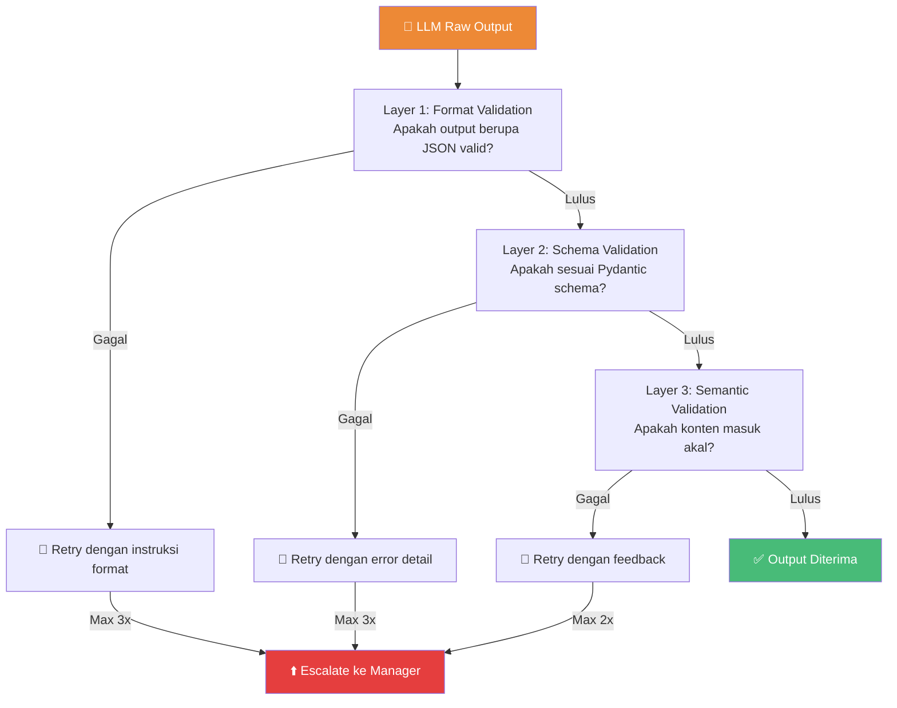
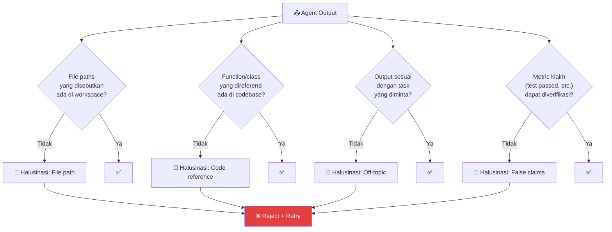
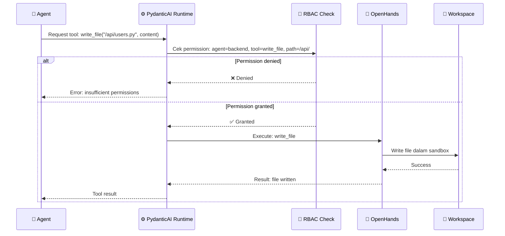

# 04.1 — Framework Agen

> Dokumen ini mendeskripsikan framework agen AetherOS berbasis PydanticAI, termasuk runtime lifecycle, schema validation, error handling, dan pencegahan halusinasi.

---

## 4.1.1 PydanticAI sebagai Agent Runtime

PydanticAI dipilih sebagai runtime agen karena kemampuannya memberlakukan **strict type-checking** pada input dan output LLM. Ini adalah pertahanan utama terhadap halusinasi model yang dapat merusak state sistem.

### Mengapa PydanticAI?

| Kebutuhan | Solusi PydanticAI |
|-----------|-------------------|
| Output LLM harus terstruktur | Pydantic schema enforcement pada setiap respons |
| Mencegah format yang tidak diharapkan | Validasi otomatis, reject jika tidak sesuai schema |
| Multi-model support | Built-in support untuk OpenAI, Anthropic, Ollama |
| Tool calling | Structured tool definitions dengan parameter validation |
| Retry on failure | Built-in retry logic untuk respons yang gagal validasi |

---

## 4.1.2 Agent Lifecycle

```mermaid
statediagram-v2
    [*] --> INITIALIZING
    INITIALIZING --> LOADING_CONTEXT : Load from Project Brain
    LOADING_CONTEXT --> READY : Context loaded
    READY --> EXECUTING : Task received
    EXECUTING --> REASONING : LLM processing
    REASONING --> TOOL_CALLING : Tool action needed
    TOOL_CALLING --> REASONING : Tool result received
    REASONING --> VALIDATING : Response generated
    VALIDATING --> EXECUTING : Validation failed (retry)
    VALIDATING --> DISTILLING : Validation passed
    DISTILLING --> REPORTING : Knowledge extracted
    REPORTING --> READY : Task completed
    REPORTING --> TERMINATED : Shutdown signal
    EXECUTING --> ERROR_HANDLING : Error occurred
    ERROR_HANDLING --> EXECUTING : Recoverable, retry
    ERROR_HANDLING --> TERMINATED : Unrecoverable
    TERMINATED --> [*]
```

### Detail Setiap Fase

| Fase | Durasi | Aksi |
|------|--------|------|
| **INITIALIZING** | ~100ms | Inisialisasi runtime, load konfigurasi, register ke Event Bus |
| **LOADING_CONTEXT** | ~500ms-2s | Query Project Brain untuk konteks relevan, build system prompt |
| **READY** | Idle | Menunggu task dari Event Bus, health check berkala |
| **EXECUTING** | Varies | Memproses task, memanggil LLM, menggunakan tools |
| **REASONING** | ~1-30s | LLM memproses instruksi dan menghasilkan respons |
| **TOOL_CALLING** | ~100ms-5s | Eksekusi tool (file ops, git ops, dll.) via OpenHands |
| **VALIDATING** | ~50ms | PydanticAI memvalidasi output terhadap schema |
| **DISTILLING** | ~1-5s | Knowledge Extraction Layer memproses output |
| **REPORTING** | ~100ms | Publish hasil ke Event Bus, update state machine |
| **ERROR_HANDLING** | ~100ms-10s | Evaluasi error, keputusan retry atau escalate |
| **TERMINATED** | ~100ms | Cleanup resources, deregister dari Event Bus |

---

## 4.1.3 Schema Validation

### Input Schema

Setiap agen menerima input yang divalidasi terhadap schema Pydantic:

| Field | Tipe | Required | Deskripsi |
|-------|------|----------|-----------|
| `task_id` | UUID | ✅ | Identifier tugas |
| `project_id` | UUID | ✅ | Identifier proyek |
| `trace_id` | str | ✅ | OpenTelemetry TraceID |
| `instruction` | str | ✅ | Instruksi spesifik untuk agen |
| `context` | TaskContext | ✅ | Konteks dari Project Brain |
| `constraints` | TaskConstraints | ❌ | Batasan (timeout, token budget, dll.) |
| `dependencies_output` | dict | ❌ | Output dari task dependen |

### Output Schema

Output agen juga divalidasi sebelum diterima sistem:

| Field | Tipe | Required | Deskripsi |
|-------|------|----------|-----------|
| `task_id` | UUID | ✅ | Identifier tugas |
| `status` | Enum | ✅ | completed, failed, needs_review |
| `result` | TaskResult | ✅ | Hasil eksekusi |
| `artifacts` | list[Artifact] | ❌ | File yang dihasilkan/dimodifikasi |
| `reasoning_chain` | list[ReasoningStep] | ✅ | Langkah-langkah berpikir |
| `knowledge_extracted` | list[KnowledgeEntry] | ❌ | Pengetahuan yang diekstraksi |
| `metrics` | ExecutionMetrics | ✅ | Token usage, execution time |

### Validasi Multi-layer



---

## 4.1.4 Pencegahan Halusinasi

### Strategi Anti-Halusinasi

| Strategi | Implementasi |
|----------|-------------|
| **Schema Enforcement** | PydanticAI memvalidasi setiap field output |
| **Grounded Context** | Agen hanya menerima konteks faktual dari Project Brain |
| **Tool Verification** | Output tool (file existence, test results) diverifikasi oleh runtime |
| **Confidence Scoring** | Agen melaporkan confidence score, low-confidence di-flag |
| **Cross-Agent Verification** | Hasil agen satu diverifikasi oleh agen lain (QA, Security) |
| **Deterministic Tools** | Operasi file dan Git bersifat deterministik, verifiable |

### Mekanisme Deteksi Halusinasi



---

## 4.1.5 Tool Integration

### Tool Definition

Setiap agen memiliki akses ke set tools yang terdefinisi dan dibatasi oleh RBAC:

| Tool | Fungsi | Agen yang Diizinkan |
|------|--------|---------------------|
| `read_file` | Baca file di workspace | Semua |
| `write_file` | Tulis/modifikasi file | Backend, Frontend, DevOps, Docs |
| `run_command` | Eksekusi terminal command | Backend, QA, DevOps |
| `git_commit` | Commit ke feature branch | Semua (kecuali Manager) |
| `git_diff` | Lihat perubahan | Semua |
| `search_code` | Pencarian di codebase | Semua |
| `query_brain` | Query Project Brain | Semua |
| `run_tests` | Jalankan test suite | QA |
| `security_scan` | Jalankan security scanner | Security |
| `deploy` | Deploy ke environment | DevOps (Level 3 HITL) |

### Tool Execution Flow



---

## 4.1.6 Agent Configuration

### Per-Agent Configuration

| Parameter | Deskripsi | Default |
|-----------|-----------|---------|
| `model_preference` | Preferensi LLM (best, fast, cheap) | "best" |
| `max_tokens_per_request` | Batas token per request ke LLM | 4096 |
| `max_retries` | Maksimal retry pada validation failure | 3 |
| `task_timeout` | Timeout per task | 300s |
| `context_window_budget` | Alokasi token untuk konteks | 30% |
| `tools_enabled` | Daftar tools yang aktif | Per-role |
| `allowed_directories` | Direktori yang dapat diakses | Per-role |
| `temperature` | Kreativitas LLM | 0.1 (low) |

---

🔗 **Selanjutnya:** [Katalog Agen →](agent-catalog.md)

🔗 **Kembali:** [Desain Vektor Qdrant ←](../03-project-brain/qdrant-vector-design.md)
