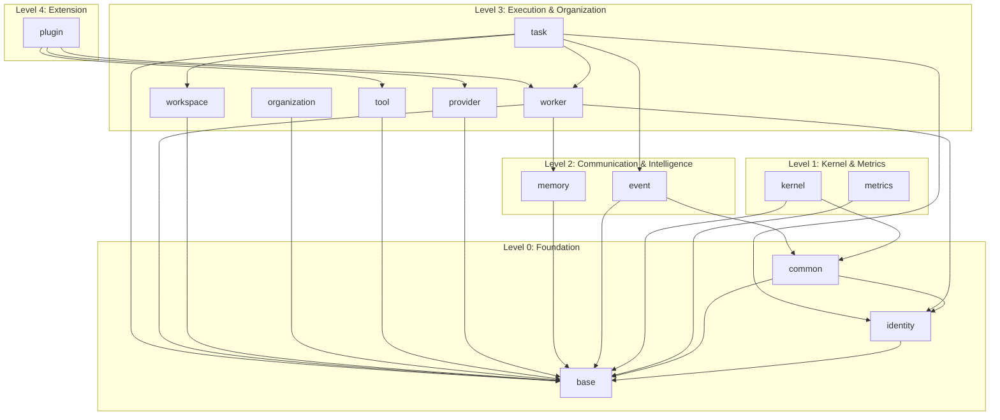

# Milestone 0: Core Contracts Architecture Report

> **Laporan Resmi Arsitektur Kontrak Inti AetherOS (Milestone 0)**

## 1. Ringkasan Eksekutif

Milestone 0 bertujuan untuk membangun fondasi data (Contracts) untuk keseluruhan The Open Agent Operating System. Dengan berpegang teguh pada prinsip **Contract-First Development**, seluruh kontrak didefinisikan menggunakan Pydantic V2 tanpa sedikit pun logika bisnis, integrasi spesifik vendor, maupun status *mutable* (kecuali sangat diperlukan).

Semua modul telah mematuhi pola desain **Domain-Driven Design (DDD)** dengan kelas dasar seperti `Entity`, `ValueObject`, `AggregateRoot`, `DomainEvent`, dan `ContractProtocol`.

## 2. Struktur Modul & Tanggung Jawab

| Package | Tanggung Jawab (Domain) | Model Utama |
|---|---|---|
| `base` | Struktur dasar (Primitives) DDD. | `Entity`, `ValueObject`, `AggregateRoot`, `DomainEvent` |
| `identity` | Representasi pengguna, agen, dan hak akses. | `Principal`, `Credential`, `PermissionRecord` |
| `common` | Objek lintas potong (Cross-cutting concerns). | `ExecutionContext`, `TraceContext` |
| `kernel` | Abstraksi infrastruktur OS (Aether Kernel). | `RuntimeProtocol`, `EventDispatcherProtocol` |
| `metrics` | Pencatatan pengukuran, latensi, dan token. | `TelemetryEvent`, `TokenUsage`, `CostRecord` |
| `event` | Pola CQRS & asinkron untuk Event Bus. | `SystemCommand`, `SystemQuery`, `Conversation` |
| `memory` | Representasi Company Brain. | `KnowledgeFact`, `LessonLearned`, `OrganizationalPolicy` |
| `worker` | Representasi Agen/Pekerja. | `Worker`, `Role`, `ReputationScore`, `Lifecycle` |
| `provider` | Abstraksi spesifikasi LLM. | `ProviderEntity`, `ProviderLimits`, `ProviderPricing` |
| `tool` | Definisi fungsi yang dapat dipanggil LLM. | `Tool`, `Action`, `Skill` |
| `task` | Unit kerja dan orkestrasi delegasi. | `Task`, `Issue`, `Approval`, `ExecutionResult` |
| `workspace`| Lingkungan eksekusi dan kode sumber. | `Workspace`, `Repository`, `PullRequest`, `Deployment` |
| `organization`| Hierarki bisnis tertinggi. | `Organization`, `Project`, `CompanyDNA` |
| `plugin` | Ekstensibilitas pihak ketiga. | `ExtensionManifest`, `Plugin`, `Extension` |

## 3. Dependency Graph

Untuk mencegah *Circular Import*, sistem menerapkan aturan layer ketergantungan (Dependency Layering) yang ketat. Modul tingkat tinggi hanya boleh mengimpor dari modul tingkat bawahnya.

## 4. Analisis Implementasi

### 4.1 Mengapa Base Classes (DDD) Dibuat?
Dengan memusatkan `frozen=True` (Immutable) dan `extra="forbid"` di `base/value_object.py` dan `base/entity.py`, kita menghemat ribuan baris kode boilerplate sekaligus menjamin *type safety* secara absolut di 14 package lainnya. ID `UUID` dan `created_at` yang di-*generate* secara otomatis dijamin konsisten di seluruh entitas AetherOS.

### 4.2 Pemisahan Identity & Common
`identity` dipisahkan agar mekanisme otorisasi (RBAC) dan kepemilikan kredensial (API Keys, OAuth) tidak bercampur dengan hal-hal teknis seperti pelacakan (OpenTelemetry Trace). Hal ini mempersiapkan jalan yang mulus untuk integrasi LDAP/SSO di masa depan tanpa menyentuh *kernel logic*.

### 4.3 Ketiadaan Konfigurasi
Sesuai arahan, konfigurasi dihapus dari Contracts karena konfigurasi bersifat *runtime implementation* dan bergantung pada *environment variables* atau file `.env`, bukan definisi kontrak data inti.

### 4.4 Kesiapan untuk Milestone 1
Pada Milestone 1, Aether Kernel dan Service Implementation cukup mengambil (import) kelas-kelas dari `core/contracts`. Ketika *Event Bus* menyiarkan pesan, tipe yang digunakan adalah `SystemEvent` atau `SystemCommand`. Ketika *Agent* bekerja, ia dievaluasi berdasarkan properti `CapabilityProfile` dan `ReputationScore`. Hal ini memastikan *Zero Vendor Lock-in*, karena kernel akan mengeksekusi abstrak Protocol (`RuntimeProtocol`, `EventDispatcherProtocol`) yang nantinya dapat di-inject dengan implementasi apa saja.
