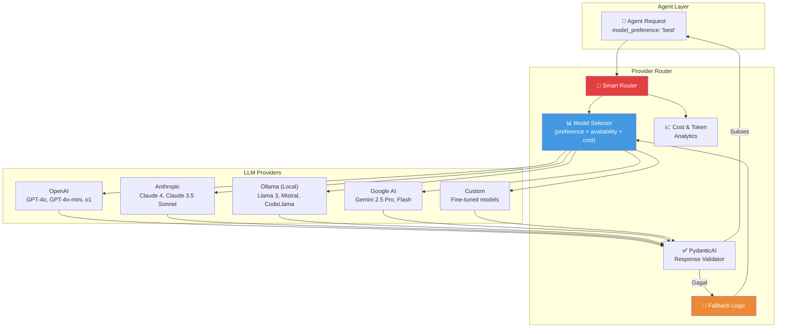
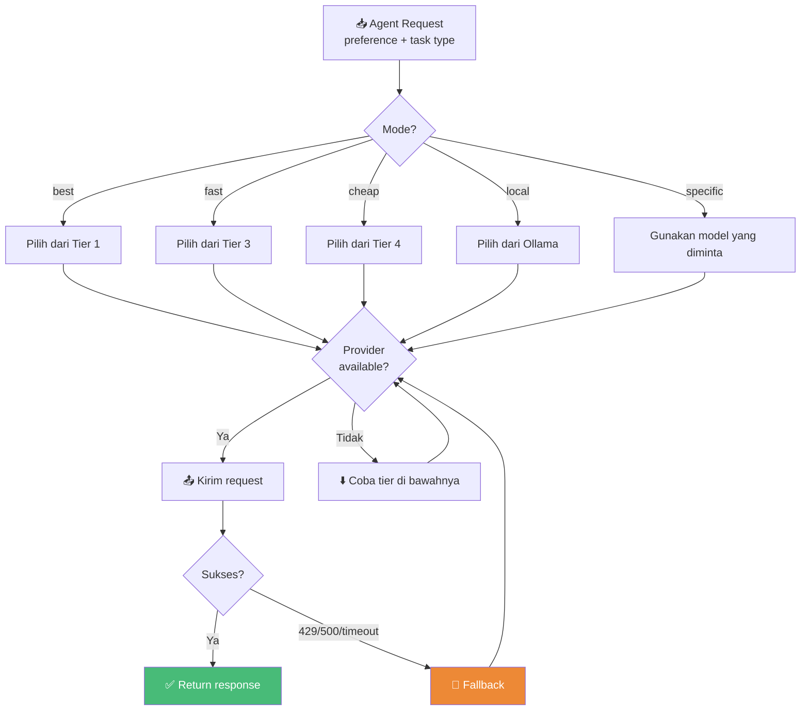
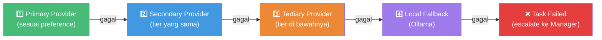
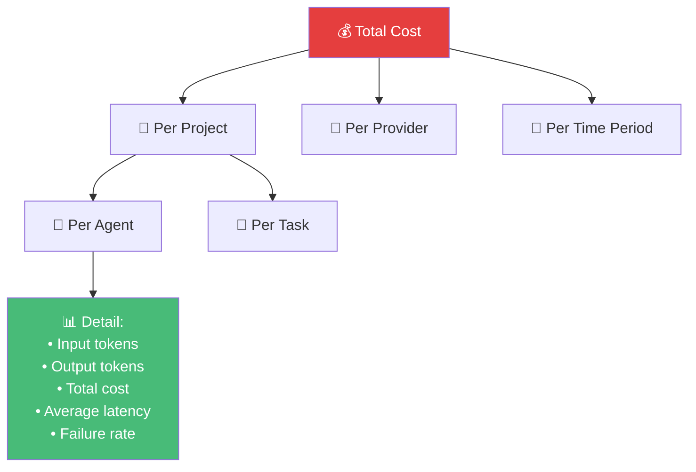
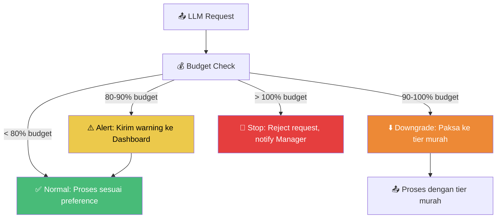

# 05 — Provider Router dan Manajemen Model

> Dokumen ini mendeskripsikan Multi-provider API Router, automatic fallback, cost & token analytics, dan strategi pemilihan model.

---

## 5.1 Arsitektur Provider Router

Provider Router adalah lapisan abstraksi yang memungkinkan AetherOS menggunakan berbagai penyedia LLM tanpa mengubah kode agen.

---

## 5.2 Model Selection Strategy

### Preference Modes

| Mode | Kriteria Utama | Use Case |
|------|---------------|----------|
| **best** | Kualitas reasoning tertinggi | Manager decisions, complex architecture, security review |
| **fast** | Latensi terendah | Boilerplate generation, formatting, documentation |
| **cheap** | Biaya per token terendah | Batch processing, simple transformations |
| **local** | Prioritas model lokal (Ollama) | Offline mode, data sensitivity |
| **specific** | Model tertentu yang diminta | Ketika task memerlukan model spesifik |

### Model Tier Mapping

| Tier | OpenAI | Anthropic | Google | Ollama |
|------|--------|-----------|--------|--------|
| **Tier 1 (Best)** | o1, GPT-4o | Claude 4 Opus | Gemini 2.5 Pro | — |
| **Tier 2 (Good)** | GPT-4o-mini | Claude 3.5 Sonnet | Gemini 2.5 Flash | Llama 3 70B |
| **Tier 3 (Fast)** | GPT-4o-mini | Claude 3.5 Haiku | Gemini Flash | Llama 3 8B |
| **Tier 4 (Cheap)** | GPT-4o-mini | Claude 3.5 Haiku | Gemini Flash | Mistral 7B |

### Selection Algorithm

---

## 5.3 Automatic Fallback

### Trigger Fallback

| Trigger | Deskripsi | Fallback Action |
|---------|-----------|-----------------|
| HTTP 429 | Rate limit exceeded | Pindah ke provider lain di tier yang sama |
| HTTP 500/502/503 | Server error | Pindah ke provider lain + retry |
| Timeout (>30s) | Request timeout | Pindah ke provider lain |
| Validation failure | Output tidak sesuai schema | Retry dengan provider yang sama (max 3x), lalu pindah |
| Provider maintenance | Scheduled downtime | Otomatis gunakan provider alternatif |
| Budget exceeded | Cost limit per proyek tercapai | Downgrade ke tier lebih murah |

### Fallback Chain

### Context Preservation selama Fallback

| Aspek | Strategi |
|-------|----------|
| System prompt | Dipertahankan identik |
| Conversation history | Dipertahankan lengkap |
| Tool definitions | Disesuaikan dengan format provider baru |
| Output schema | Tetap sama (PydanticAI mengabstraksi) |
| Reasoning chain | Dipertahankan, tambahkan note tentang fallback |

---

## 5.4 Cost & Token Analytics

### Tracking Granularity

### Metrik yang Dilacak

| Metrik | Granularity | Deskripsi |
|--------|-------------|-----------|
| `input_tokens` | Per request | Jumlah token input |
| `output_tokens` | Per request | Jumlah token output |
| `total_cost_usd` | Per request | Biaya dalam USD |
| `latency_ms` | Per request | Latensi respons |
| `success_rate` | Per provider/day | Persentase request sukses |
| `fallback_count` | Per provider/day | Jumlah fallback yang terjadi |
| `cache_hit_rate` | Per provider/day | Persentase cache hits |

### Budget Management

| Parameter | Deskripsi | Default |
|-----------|-----------|---------|
| `project_daily_budget` | Batas biaya harian per proyek | $50 |
| `project_monthly_budget` | Batas biaya bulanan per proyek | $1,000 |
| `agent_hourly_budget` | Batas biaya per jam per agen | $5 |
| `alert_threshold` | Persentase budget untuk alert | 80% |
| `auto_downgrade_threshold` | Persentase budget untuk auto-downgrade tier | 90% |
| `hard_stop_threshold` | Persentase budget untuk menghentikan request | 100% |

### Budget Enforcement Flow

---

## 5.5 Response Caching

### Cache Strategy

| Strategi | Deskripsi |
|----------|-----------|
| **Exact match cache** | Request identik (hash dari prompt + model) menggunakan cached response |
| **Semantic cache** | Request serupa (cosine similarity > 0.95) menggunakan cached response |
| **TTL-based invalidation** | Cache entry dihapus setelah TTL (default: 1 jam) |
| **Project-scoped** | Cache dipartisi per proyek untuk menghindari context leakage |

### Cache Configuration

| Parameter | Nilai Default | Deskripsi |
|-----------|--------------|-----------|
| `cache_enabled` | true | Enable/disable caching |
| `cache_ttl` | 3600s | Time-to-live untuk cache entry |
| `semantic_cache_threshold` | 0.95 | Minimum similarity untuk semantic cache hit |
| `cache_max_size` | 1000 entries | Maksimal entry dalam cache |
| `cache_backend` | Redis | Storage backend |

---

## 5.6 Provider Configuration

### Per-Provider Settings

| Setting | Deskripsi |
|---------|-----------|
| `api_key` | API key (encrypted at rest) |
| `base_url` | Base URL untuk API |
| `max_concurrent` | Maksimal request bersamaan |
| `rate_limit_rpm` | Rate limit requests per menit |
| `rate_limit_tpm` | Rate limit tokens per menit |
| `timeout` | Request timeout |
| `retry_count` | Jumlah retry sebelum fallback |
| `enabled` | Enable/disable provider |
| `priority` | Prioritas default (1 = tertinggi) |

---

🔗 **Selanjutnya:** [Skill Library →](../06-skills-and-tools/skill-library.md)

🔗 **Kembali:** [RBAC & Permissions ←](../04-agents/rbac-and-permissions.md)
