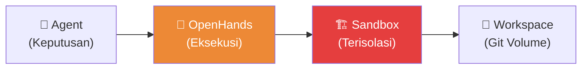
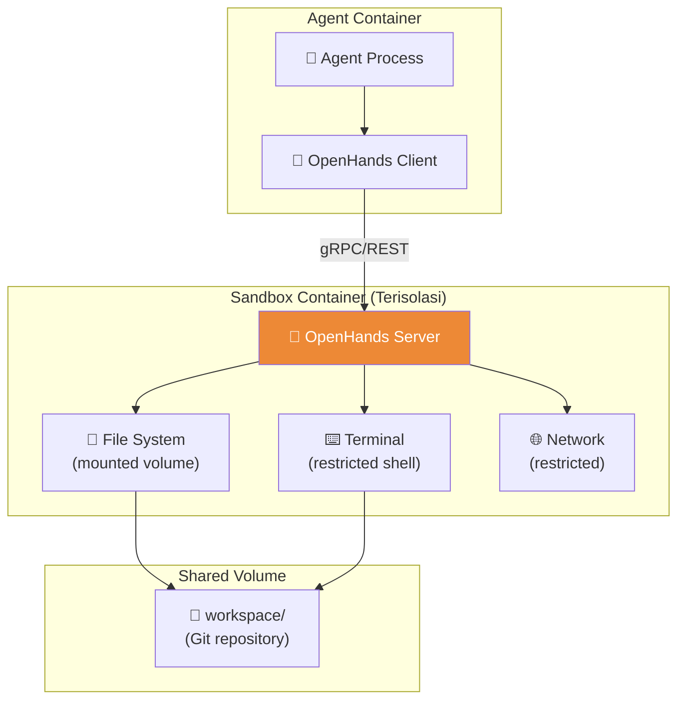
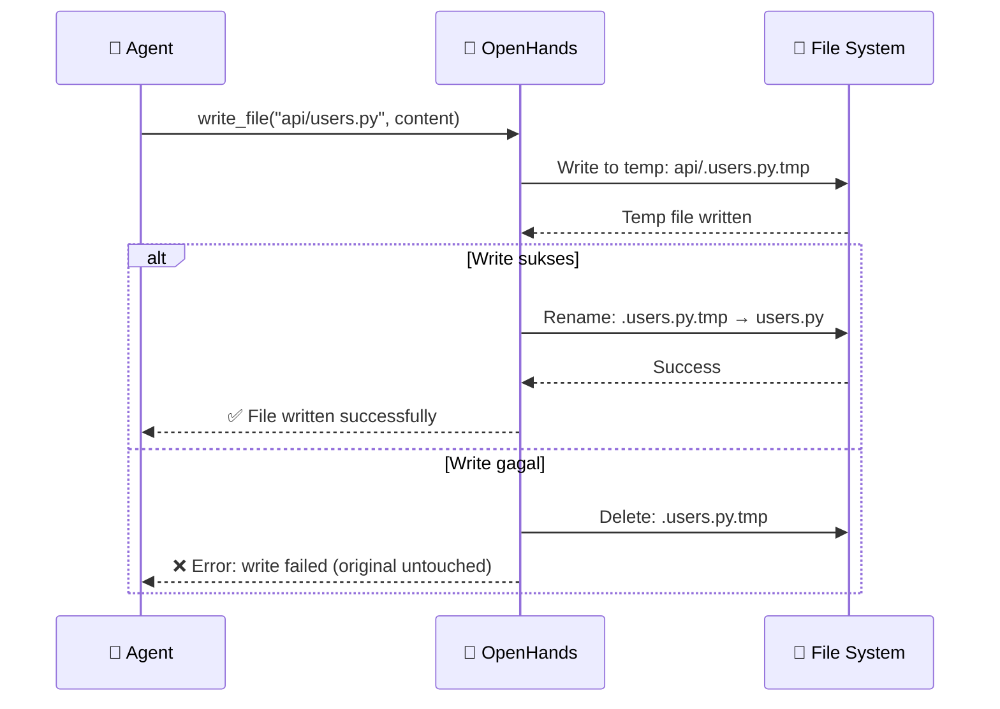

# 06.2 — Integrasi OpenHands

> Dokumen ini mendeskripsikan integrasi OpenHands sebagai Tool Execution Layer — lapisan eksekusi yang memungkinkan agen melakukan manipulasi file dan perintah terminal dalam sandbox terisolasi.

---

## 6.2.1 Peran OpenHands

OpenHands bertindak sebagai **jembatan antara keputusan LLM dan aksi nyata di workspace**. Agen tidak pernah mengeksekusi operasi file atau terminal secara langsung — semua melewati OpenHands untuk isolasi dan keamanan.

---

## 6.2.2 Arsitektur Sandbox

### Isolasi

| Aspek | Implementasi |
|-------|-------------|
| **File System** | Mount workspace/ sebagai volume, read-only untuk direktori yang tidak diizinkan |
| **Network** | Hanya akses ke internal services, blocked external (kecuali DevOps) |
| **Process** | Tidak dapat spawn proses di luar sandbox |
| **Resources** | CPU dan memory limits per agen |
| **Time** | Execution timeout per operasi |

---

## 6.2.3 Operasi yang Didukung

### File Operations

| Operasi | Deskripsi | Atomicity |
|---------|-----------|-----------|
| `read_file` | Baca konten file | Read-only, safe |
| `write_file` | Tulis konten ke file | Atomic write (write to temp, then rename) |
| `create_file` | Buat file baru | Atomic create |
| `delete_file` | Hapus file | Atomic delete (soft delete first) |
| `rename_file` | Rename/move file | Atomic rename |
| `list_directory` | Daftar isi direktori | Read-only, safe |
| `search_content` | Pencarian teks di file | Read-only, safe |

### Terminal Operations

| Operasi | Deskripsi | Restrictions |
|---------|-----------|-------------|
| `run_command` | Eksekusi command | Whitelist-based, timeout enforced |
| `run_script` | Eksekusi script file | Language-specific sandboxing |
| `install_package` | Install dependency | Requires approval, logged |

### Command Whitelist per Role

| Role | Allowed Commands |
|------|-----------------|
| Backend | `python`, `pip`, `pytest`, `alembic`, `uvicorn` |
| Frontend | `npm`, `npx`, `node`, `vite` |
| QA | `pytest`, `coverage`, `tox`, `mypy` |
| Security | `bandit`, `safety`, `semgrep`, `trivy` |
| DevOps | `docker`, `docker-compose`, `kubectl`, `terraform` |
| Docs | — (no terminal access) |

---

## 6.2.4 Atomic Operations

### Prinsip Atomicity

Setiap operasi file di AetherOS bersifat **atomik** — operasi berhasil sepenuhnya atau gagal sepenuhnya, tanpa state parsial.

### Batch Operations

Untuk operasi yang melibatkan multiple files, OpenHands menggunakan mekanisme "all-or-nothing":

| Strategi | Deskripsi |
|----------|-----------|
| **Preparation phase** | Semua file ditulis ke temp locations |
| **Validation phase** | Semua temp files divalidasi (syntax, permissions) |
| **Commit phase** | Semua temp files di-rename secara atomik |
| **Rollback** | Jika satu file gagal, semua perubahan di-rollback |

---

## 6.2.5 Logging dan Audit

Setiap operasi OpenHands dicatat secara detail:

| Data yang Dicatat | Deskripsi |
|-------------------|-----------|
| `agent_id` | Agen yang melakukan operasi |
| `operation` | Tipe operasi |
| `target` | Path file atau command |
| `before_hash` | Hash file sebelum perubahan |
| `after_hash` | Hash file setelah perubahan |
| `duration_ms` | Waktu eksekusi |
| `exit_code` | Exit code (untuk terminal ops) |
| `stdout/stderr` | Output terminal (truncated) |
| `trace_id` | OpenTelemetry TraceID |

---

🔗 **Selanjutnya:** [Model Keamanan →](../07-security/security-model.md)

🔗 **Kembali:** [Skill Library ←](skill-library.md)
