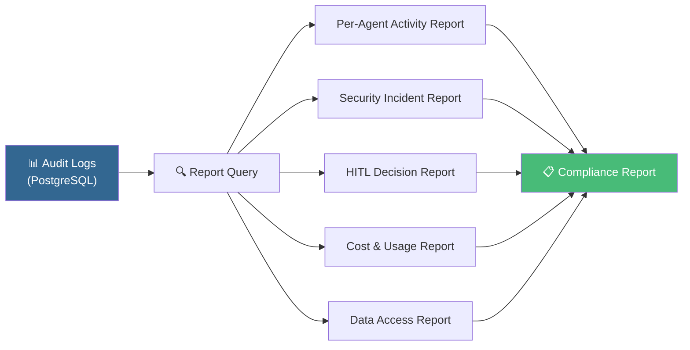
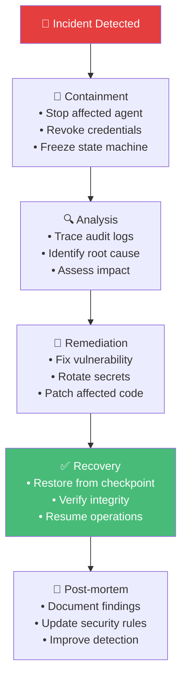

# 07.2 — Audit dan Kepatuhan

> Dokumen ini mendeskripsikan sistem audit logging, compliance requirements, dan data governance AetherOS.

---

## 7.2.1 Audit Log System

### Prinsip Audit

| Prinsip | Deskripsi |
|---------|-----------|
| **Immutability** | Log tidak dapat dimodifikasi atau dihapus setelah ditulis |
| **Completeness** | Setiap aksi sistem tercatat tanpa pengecualian |
| **Traceability** | Setiap log entry terhubung ke TraceID OpenTelemetry |
| **Non-repudiation** | Setiap aksi terikat ke identitas agen yang melakukan |
| **Timeliness** | Log ditulis secara sinkron sebelum aksi dianggap selesai |

### Jenis Event yang Di-audit

| Kategori | Event |
|----------|-------|
| **Agent Lifecycle** | Agent started, stopped, health check failed |
| **Task Management** | Task created, assigned, started, completed, failed, cancelled |
| **File Operations** | File read, write, delete, rename |
| **Git Operations** | Commit, branch create, merge, PR create |
| **LLM Interactions** | Request sent, response received, fallback triggered |
| **Security Events** | Permission denied, escalation requested, vulnerability found |
| **HITL Events** | Approval requested, granted, denied |
| **State Transitions** | State machine phase changes, checkpoint created |
| **System Events** | Configuration changed, provider added/removed |

### Retention Policy

| Tipe Data | Retention | Penyimpanan |
|-----------|-----------|-------------|
| Security events | 7 tahun | PostgreSQL (partitioned) |
| HITL decisions | 5 tahun | PostgreSQL |
| Task logs | 3 tahun | PostgreSQL → Cold storage |
| File operation logs | 1 tahun | PostgreSQL → Cold storage |
| LLM interaction logs | 6 bulan | PostgreSQL → Cold storage |
| Health checks | 30 hari | PostgreSQL (auto-pruned) |

---

## 7.2.2 Compliance Requirements

### Data Governance

| Aspek | Kebijakan |
|-------|-----------|
| **Data Classification** | Public, Internal, Confidential, Restricted |
| **Access Logging** | Semua akses ke data Confidential/Restricted di-log |
| **Data Minimization** | LLM hanya menerima data yang diperlukan untuk tugas |
| **Right to Erasure** | Prosedur penghapusan data personal (jika ada) |
| **Data Residency** | Konfigurasi per-project untuk lokasi penyimpanan |

### Audit Report Generation

---

## 7.2.3 Incident Response

### Prosedur Saat Security Incident

---

🔗 **Selanjutnya:** [Observabilitas →](../08-operations/observability.md)

🔗 **Kembali:** [Model Keamanan ←](security-model.md)
