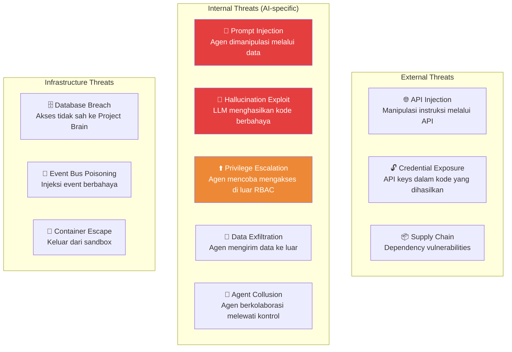
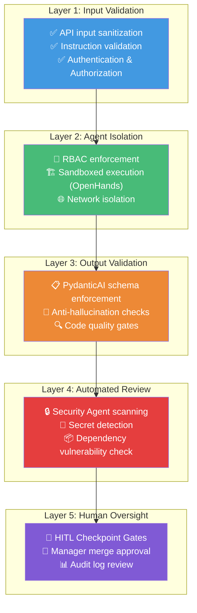
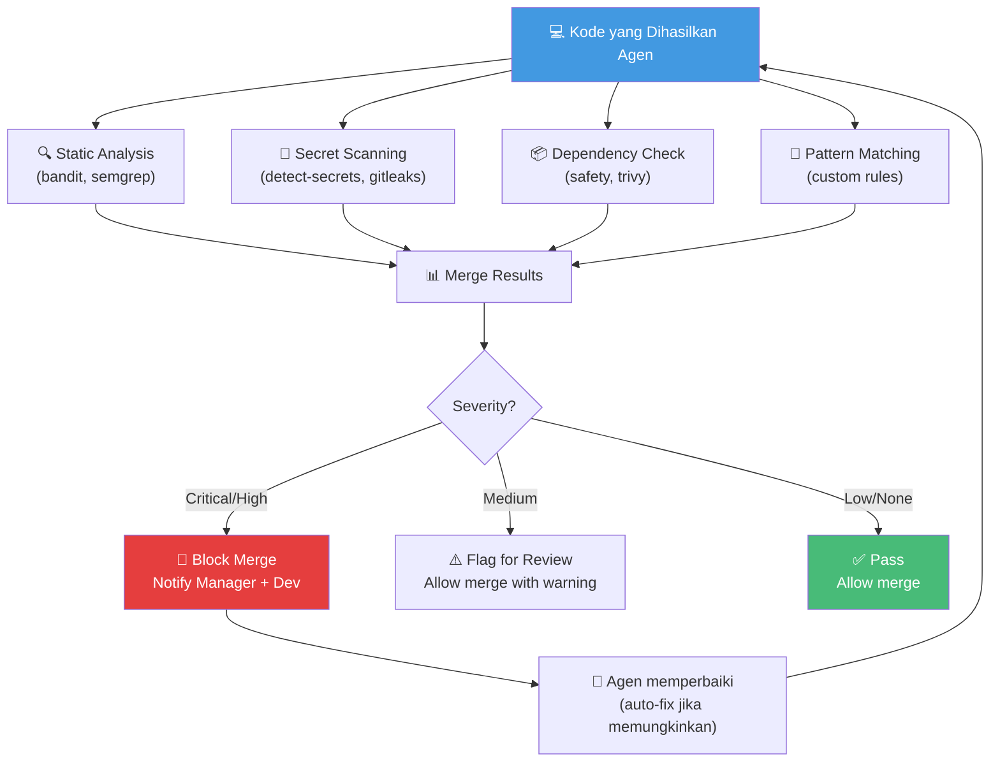

# 07.1 — Model Keamanan

> Dokumen ini mendeskripsikan model keamanan AetherOS, termasuk threat model, attack surface, mitigasi, dan security review pipeline.

---

## 7.1.1 Prinsip Keamanan

| Prinsip | Implementasi |
|---------|-------------|
| **Security by Default** | Keamanan bukan fitur opsional — terintegrasi di setiap layer |
| **Zero Trust** | Tidak ada agen yang secara implisit dipercaya |
| **Least Privilege** | Setiap agen hanya memiliki akses minimal yang diperlukan |
| **Defense in Depth** | Multiple layers keamanan: RBAC → Sandbox → Review → Audit |
| **Automated Review** | Setiap kode yang dihasilkan AI wajib melewati security review otomatis |

---

## 7.1.2 Threat Model

### Attack Surface

### Risk Assessment Matrix

| Threat | Likelihood | Impact | Risk Level | Mitigasi Utama |
|--------|-----------|--------|------------|----------------|
| Prompt Injection | Tinggi | Tinggi | 🔴 Critical | Input sanitization, PydanticAI validation |
| Credential Exposure | Tinggi | Tinggi | 🔴 Critical | Automated secret scanning |
| Hallucination Exploit | Sedang | Tinggi | 🟠 High | Schema enforcement, cross-agent validation |
| Privilege Escalation | Sedang | Tinggi | 🟠 High | RBAC enforcement at runtime |
| Supply Chain Attack | Sedang | Sedang | 🟡 Medium | Dependency scanning, lockfile enforcement |
| Data Exfiltration | Rendah | Tinggi | 🟡 Medium | Network isolation, egress monitoring |
| Container Escape | Rendah | Tinggi | 🟡 Medium | Hardened containers, seccomp profiles |
| Event Bus Poisoning | Rendah | Sedang | 🟢 Low | Message authentication, schema validation |

---

## 7.1.3 Security Layers

---

## 7.1.4 Automated Security Review Pipeline

### Pipeline Flow

### Jenis Pemindaian

| Pemindaian | Tool | Target |
|------------|------|--------|
| **SQL Injection** | semgrep, bandit | Raw SQL queries, ORM misuse |
| **XSS** | semgrep | User input rendered tanpa sanitization |
| **SSRF** | semgrep | URL dari user input tanpa validasi |
| **Hardcoded Secrets** | detect-secrets, gitleaks | API keys, passwords, tokens |
| **Insecure Deserialization** | bandit | pickle.loads, yaml.load |
| **Path Traversal** | semgrep | File ops dengan user-controlled path |
| **Dependency CVEs** | safety, trivy | Known vulnerabilities di dependencies |
| **Insecure Defaults** | Custom rules | DEBUG=True, weak crypto, etc. |

---

## 7.1.5 Secret Management

| Aspek | Implementasi |
|-------|-------------|
| **Storage** | Environment variables atau secret manager (Vault) |
| **Rotation** | Otomatis rotate API keys setiap 90 hari |
| **Access** | Agen mengakses secrets melalui runtime injection, bukan hardcode |
| **Detection** | Pre-commit hook + CI pipeline scanning |
| **Response** | Jika secret terdeteksi dalam kode: auto-revoke, alert, block merge |

---

🔗 **Selanjutnya:** [Audit & Kepatuhan →](audit-and-compliance.md)

🔗 **Kembali:** [Integrasi OpenHands ←](../06-skills-and-tools/openhands-integration.md)
