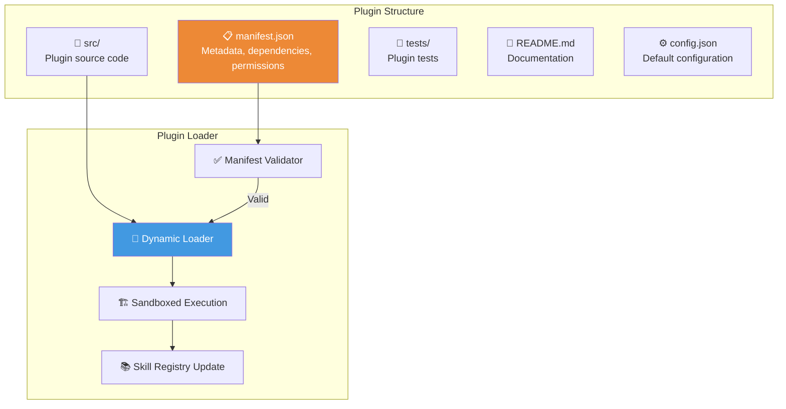

# 09.4 — Marketplace API

> Dokumen ini mendeskripsikan Marketplace API untuk ekstensi pihak ketiga — plugin system, distribusi agen, dan skill baru.

---

## 9.4.1 Konsep Marketplace

Marketplace AetherOS memungkinkan komunitas untuk:
- Mendistribusikan **custom skills** (fungsi Python callable)
- Membagikan **agent configurations** (pre-configured agents untuk domain spesifik)
- Menerbitkan **plugins** (bundel skills + configurations)
- Menyediakan **provider adapters** (dukungan LLM baru)

---

## 9.4.2 Plugin Architecture

### Plugin Manifest Schema

| Field | Tipe | Required | Deskripsi |
|-------|------|----------|-----------|
| `name` | string | ✅ | Nama unik plugin |
| `version` | semver | ✅ | Versi plugin |
| `description` | string | ✅ | Deskripsi fungsi |
| `author` | string | ✅ | Pembuat plugin |
| `license` | string | ✅ | Lisensi (MIT, Apache-2.0, dll.) |
| `aetheros_version` | semver range | ✅ | Kompatibilitas AetherOS |
| `skills` | list | ❌ | Skills yang didaftarkan |
| `agent_configs` | list | ❌ | Agent configurations |
| `dependencies` | list | ❌ | Python dependencies |
| `permissions` | list | ✅ | Permissions yang diminta |

---

## 9.4.3 Marketplace API Endpoints

### Plugin Discovery

| Method | Endpoint | Deskripsi |
|--------|----------|-----------|
| `GET` | `/api/v1/marketplace/plugins` | Daftar plugin (search, filter, sort) |
| `GET` | `/api/v1/marketplace/plugins/{name}` | Detail plugin |
| `GET` | `/api/v1/marketplace/plugins/{name}/versions` | Daftar versi |
| `GET` | `/api/v1/marketplace/categories` | Kategori plugin |
| `GET` | `/api/v1/marketplace/featured` | Plugin unggulan |

### Plugin Management

| Method | Endpoint | Deskripsi |
|--------|----------|-----------|
| `POST` | `/api/v1/plugins/install` | Install plugin |
| `DELETE` | `/api/v1/plugins/{name}` | Uninstall plugin |
| `PATCH` | `/api/v1/plugins/{name}/update` | Update plugin |
| `GET` | `/api/v1/plugins/installed` | Daftar plugin terinstal |
| `GET` | `/api/v1/plugins/{name}/config` | Konfigurasi plugin |
| `PATCH` | `/api/v1/plugins/{name}/config` | Update konfigurasi |

### Plugin Publishing

| Method | Endpoint | Deskripsi |
|--------|----------|-----------|
| `POST` | `/api/v1/marketplace/publish` | Publish plugin baru |
| `PATCH` | `/api/v1/marketplace/plugins/{name}/versions` | Publish versi baru |
| `DELETE` | `/api/v1/marketplace/plugins/{name}` | Unpublish plugin |

---

## 9.4.4 Security untuk Plugins

| Mekanisme | Deskripsi |
|-----------|-----------|
| **Permission Declaration** | Plugin harus mendeklarasikan permissions di manifest |
| **User Consent** | User menyetujui permissions saat install |
| **Sandboxed Execution** | Plugin dijalankan dalam sandbox terisolasi |
| **Code Review** | Plugin di-review sebelum masuk marketplace |
| **Vulnerability Scanning** | Otomatis scan dependencies saat publish |
| **Version Pinning** | Dependencies di-lock ke versi spesifik |

---

🔗 **Selanjutnya:** [Git Workflow →](../10-workspace/git-workflow.md)

🔗 **Kembali:** [Desain Dashboard ←](dashboard-design.md)
