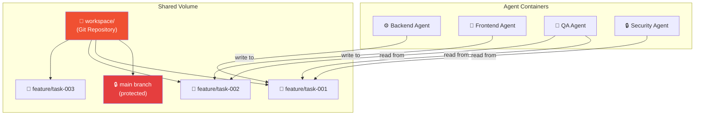
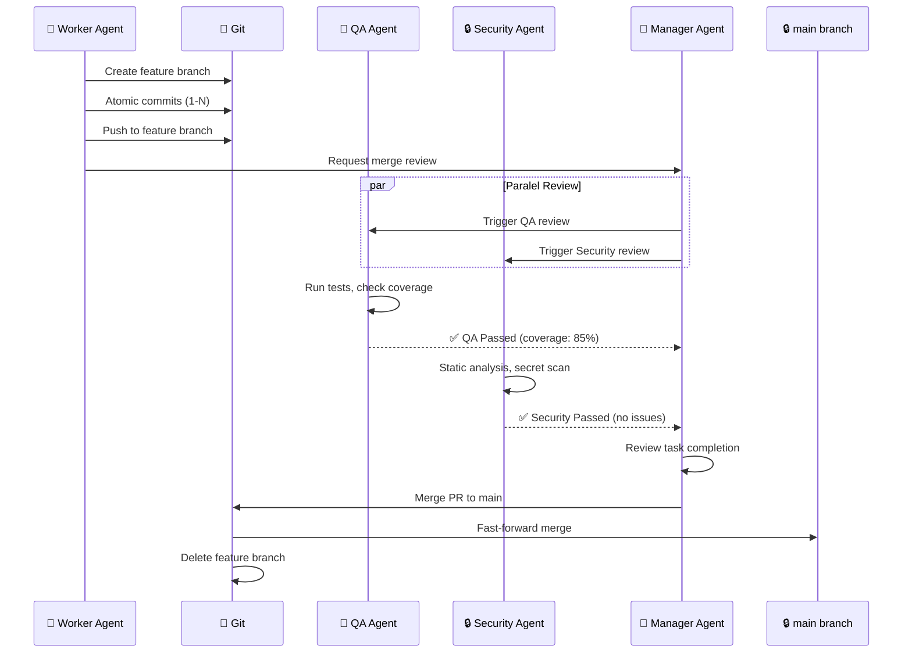
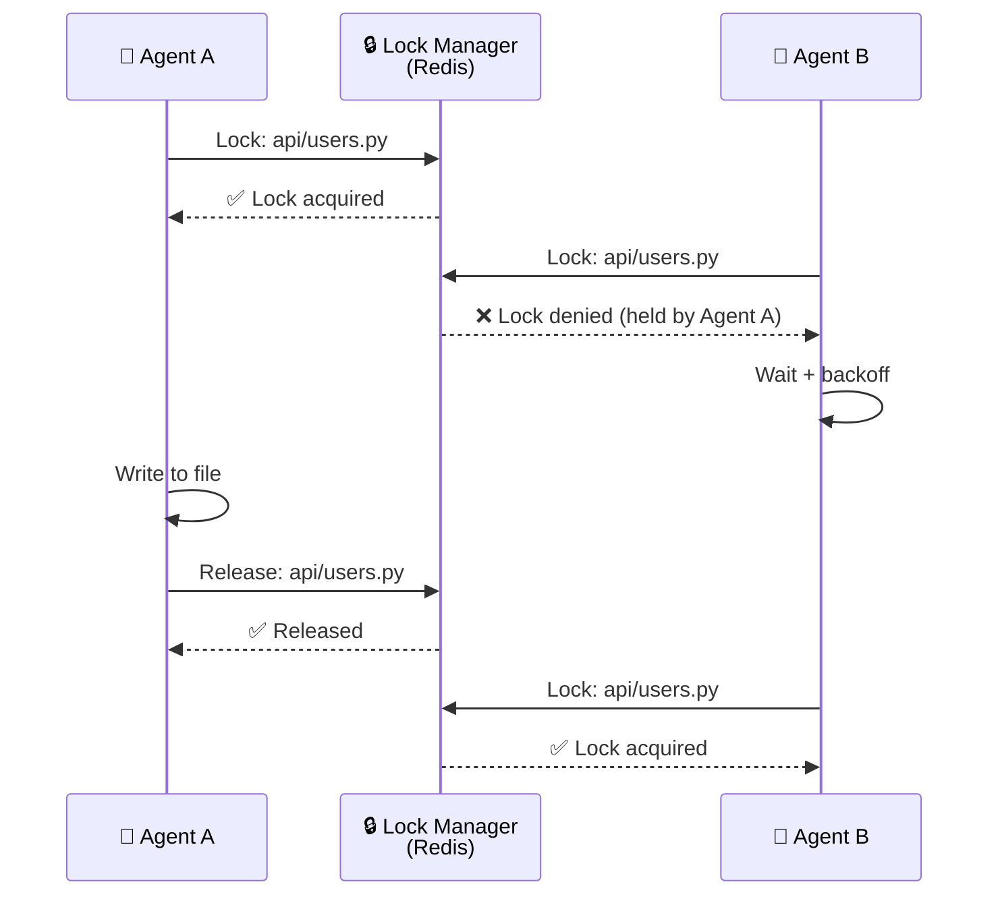

# 10 — Git Workflow

> Dokumen ini mendeskripsikan Git workflow AetherOS, termasuk branching strategy, atomic commits, workspace volume management, dan pull request validation.

---

## 10.1 Workspace Architecture

Folder `workspace/` adalah **shared volume** yang di-mount ke semua agent containers. Volume ini dikelola sebagai Git repository.



---

## 10.2 Branching Strategy

### Branch Types

| Branch | Pattern | Lifetime | Created By | Merged By |
|--------|---------|----------|------------|-----------|
| `main` | `main` | Permanen | — | Manager (setelah approval) |
| `feature` | `feature/task-{id}` | Per-task | Orchestrator | Manager |
| `hotfix` | `hotfix/{description}` | Per-fix | Manager | Manager |
| `release` | `release/v{version}` | Per-release | DevOps | DevOps (HITL) |

### Branch Rules

| Rule | Deskripsi |
|------|-----------|
| **main is protected** | Tidak ada direct push ke main |
| **Feature branches from main** | Semua feature branch dibuat dari main |
| **One branch per task** | Setiap task memiliki branch sendiri |
| **Merge via PR only** | Penggabungan hanya melalui pull request |
| **Delete after merge** | Branch dihapus setelah merge |
| **No force push** | Force push tidak diizinkan di branch manapun |

---

## 10.3 Atomic Commits

### Commit Convention

Setiap commit oleh agen mengikuti format standar:

```
[{agent_role}] {type}: {description}

TraceID: {trace_id}
TaskID: {task_id}
Agent: {agent_role}#{agent_instance}
```

### Commit Types

| Type | Deskripsi |
|------|-----------|
| `feat` | Fitur baru |
| `fix` | Bug fix |
| `refactor` | Refactoring tanpa perubahan fungsional |
| `test` | Penambahan atau modifikasi test |
| `docs` | Perubahan dokumentasi |
| `schema` | Perubahan schema atau migrasi |
| `config` | Perubahan konfigurasi |
| `security` | Perbaikan keamanan |

### Contoh

```
[backend] feat: implement user registration endpoint

TraceID: aether-2026-001
TaskID: task-abc-123
Agent: backend#1
```

---

## 10.4 Pull Request Workflow



### PR Merge Requirements

| Requirement | Deskripsi |
|-------------|-----------|
| QA Passed | Semua tests lulus, coverage >= threshold |
| Security Passed | Tidak ada vulnerability critical/high |
| Manager Approved | Manager Agent menyetujui kualitas dan kelengkapan |
| No Conflicts | Tidak ada merge conflict dengan main |
| Atomic | Setiap PR menyelesaikan satu task lengkap |

---

## 10.5 Conflict Resolution

### File Locking



### Merge Conflict Resolution

| Strategi | Kapan Digunakan |
|----------|-----------------|
| **Auto-resolve** | Non-overlapping changes (different sections of file) |
| **Agent retry** | Same section, send both versions to agent for merge |
| **Manager decision** | Complex conflicts, escalate to Manager |
| **HITL** | Critical files (config, schema), escalate to human |

---

## 10.6 Git Hooks

| Hook | Timing | Action |
|------|--------|--------|
| `pre-commit` | Sebelum commit | Validasi format, check secrets, lint |
| `commit-msg` | Saat commit | Validasi format commit message |
| `pre-push` | Sebelum push | Run quick tests, check branch rules |
| `post-merge` | Setelah merge | Notify Dashboard, update Project Brain |

---

🔗 **Selanjutnya:** [Roadmap Pengembangan →](../11-roadmap/development-phases.md)

🔗 **Kembali:** [Marketplace API ←](../09-interfaces/marketplace-api.md)
