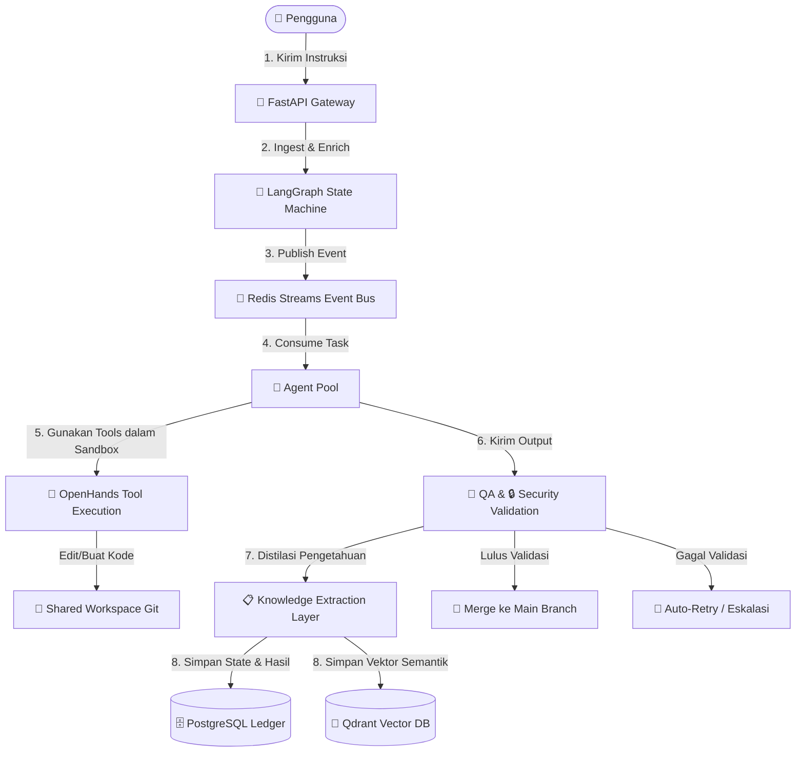

# 📚 Dokumentasi AetherOS — Bahasa Indonesia

> Sistem Operasi untuk Perusahaan AI — Platform open-source untuk mengorkestrasi organisasi AI multi-agent dengan kedaulatan pengetahuan penuh.

---

## 🔄 Diagram Alur Kerja Utama (Flowchart Eksekusi)

Berikut adalah visualisasi bagaimana instruksi diproses secara end-to-end di dalam AetherOS:



---

## 👥 Panduan Navigasi Berdasarkan Peran

Untuk mempermudah pemahaman sistem, Anda dapat mengikuti jalur membaca dokumentasi yang disesuaikan dengan peran Anda:

*   **Core Platform Engineer (Pengembang Sistem Utama):**
    *   Fokus pada: [Arsitektur Sistem](02-architecture/system-overview.md) -> [Execution Loop](02-architecture/execution-loop.md) -> [Arsitektur Event-Driven](02-architecture/event-driven-architecture.md) -> [Orkestrasi State Machine](02-architecture/state-machine-orchestration.md).
*   **AI Agent Integrator (Pengembang Agen & Prompt):**
    *   Fokus pada: [Framework Agen](04-agents/agent-framework.md) -> [Katalog Agen](04-agents/agent-catalog.md) -> [Komunikasi Agen](04-agents/agent-communication.md) -> [Skill Library](06-skills-and-tools/skill-library.md).
*   **Database & Knowledge Administrator:**
    *   Fokus pada: [Arsitektur Memori](03-project-brain/memory-architecture.md) -> [Skema PostgreSQL](03-project-brain/postgresql-schema.md) -> [Desain Vektor Qdrant](03-project-brain/qdrant-vector-design.md).
*   **DevOps & Security Operations:**
    *   Fokus pada: [Model Keamanan](07-security/security-model.md) -> [Audit & Kepatuhan](07-security/audit-and-compliance.md) -> [CI/CD Pipeline](08-operations/ci-cd-pipeline.md) -> [Strategi Skalabilitas](08-operations/scalability-strategy.md).

---

## Daftar Isi

### 🎯 [01 — Visi & Filosofi](01-vision/philosophy-and-principles.md)
Fondasi strategis, visi, misi, prinsip desain inti, dan value proposition AetherOS sebagai platform AI company orchestrator.

---

### 🏗️ 02 — Arsitektur Sistem
| Dokumen | Deskripsi |
|---------|-----------|
| [Gambaran Umum Sistem](02-architecture/system-overview.md) | Arsitektur global, technology stack, diagram C4, dan dependency graph |
| [Execution Loop](02-architecture/execution-loop.md) | 7 tahap siklus eksekusi: Ingestion → Persistence, error handling, retry |
| [Arsitektur Event-Driven](02-architecture/event-driven-architecture.md) | Redis Streams, Consumer Groups, event catalog, dead letter queue |
| [Orkestrasi State Machine](02-architecture/state-machine-orchestration.md) | LangGraph, transisi state, Checkpoint Gates, HITL workflow |

---

### 🧠 03 — Project Brain
| Dokumen | Deskripsi |
|---------|-----------|
| [Arsitektur Memori](03-project-brain/memory-architecture.md) | Short-term vs Long-term memory, distillation process, sinkronisasi |
| [Skema PostgreSQL](03-project-brain/postgresql-schema.md) | DDL lengkap, ERD, index strategy, migration |
| [Desain Vektor Qdrant](03-project-brain/qdrant-vector-design.md) | Collections, embedding strategy, metadata filtering, archiving |

---

### 🤖 04 — Agen
| Dokumen | Deskripsi |
|---------|-----------|
| [Framework Agen](04-agents/agent-framework.md) | PydanticAI runtime, schema validation, lifecycle, error handling |
| [Katalog Agen](04-agents/agent-catalog.md) | 8 peran agen: capabilities, I/O schemas, dependency graph |
| [Komunikasi Agen](04-agents/agent-communication.md) | Inter-agent protocol, handover, reasoning chain, conflict resolution |
| [RBAC & Permissions](04-agents/rbac-and-permissions.md) | Permission matrix, directory access, tool restrictions, eskalasi |

---

### 🔀 [05 — Provider Router](05-provider-router/llm-router-and-fallback.md)
Multi-provider LLM routing, automatic fallback, cost & token analytics, model selection strategy.

---

### 🛠️ 06 — Skills & Tools
| Dokumen | Deskripsi |
|---------|-----------|
| [Skill Library](06-skills-and-tools/skill-library.md) | Skill registry, callable functions, extensibility |
| [Integrasi OpenHands](06-skills-and-tools/openhands-integration.md) | Tool Execution Layer, sandbox environment, file operations |

---

### 🔒 07 — Keamanan
| Dokumen | Deskripsi |
|---------|-----------|
| [Model Keamanan](07-security/security-model.md) | Threat model, attack surface, mitigasi, security review pipeline |
| [Audit & Kepatuhan](07-security/audit-and-compliance.md) | Audit logging, compliance requirements, data governance |

---

### ⚙️ 08 — Operasional
| Dokumen | Deskripsi |
|---------|-----------|
| [Observabilitas](08-operations/observability.md) | OpenTelemetry, agentic traces, metrics, alerting |
| [CI/CD Pipeline](08-operations/ci-cd-pipeline.md) | Continuous integration, Docker orchestration, deployment |
| [Strategi Skalabilitas](08-operations/scalability-strategy.md) | Horizontal scaling, metadata pre-filtering, performance |

---

### 🖥️ 09 — Antarmuka & Integrasi
| Dokumen | Deskripsi |
|---------|-----------|
| [Spesifikasi API](09-interfaces/api-specification.md) | FastAPI endpoints, OpenAPI spec, authentication |
| [Referensi CLI](09-interfaces/cli-reference.md) | Command-line interface, commands, usage |
| [Desain Dashboard](09-interfaces/dashboard-design.md) | Web dashboard, monitoring UI, approval interface |
| [Marketplace API](09-interfaces/marketplace-api.md) | Plugin marketplace, third-party integration, distribution |

---

### 📂 [10 — Workspace & Git](10-workspace/git-workflow.md)
Git workflow, branching strategy, atomic commits, workspace volume management, pull request validation.

---

### 🗺️ [11 — Roadmap Pengembangan](11-roadmap/development-phases.md)
Fase 1-5 detail dengan deliverables, KPIs, timeline, dan acceptance criteria.

---

### 📖 [12 — Glosarium](12-glossary/glossary.md)
Kamus istilah teknis dan definisi yang digunakan dalam dokumentasi AetherOS.

---

## Konvensi Dokumentasi

| Simbol | Arti |
|--------|------|
| 📌 | Catatan penting |
| ⚠️ | Peringatan atau batasan |
| 💡 | Tips dan best practice |
| 🔗 | Referensi ke dokumen lain |

## Versi

| Versi Dokumentasi | Tanggal | Status |
|-------------------|---------|--------|
| v0.1.0 | Juli 2026 | Draft Awal |

---

## ⚙️ Kebutuhan Pengembangan & Prasyarat Sistem

Sebelum mulai berkontribusi atau menjalankan AetherOS di lingkungan lokal, pastikan sistem Anda memenuhi prasyarat minimum berikut:

### Prasyarat Perangkat Lunak
*   **Python 3.12+**
*   **Docker & Docker Compose** (untuk isolasi runtime agen & database)
*   **Redis 7.2+** (sebagai Message Broker)
*   **PostgreSQL 16+** (sebagai Structured Ledger)
*   **Qdrant 1.8+** (sebagai Vector Database)

### Langkah Awal Menjalankan Environment Pengembangan
1.  **Clone Repositori dan Inisialisasi Workspace:**
    ```bash
    git clone https://github.com/aetheros-ai/aetheros.git
    cd aetheros
    ```
2.  **Jalankan Infrastruktur Pendukung:**
    ```bash
    docker-compose -f docker/compose.yml up -d
    ```
3.  **Instalasi Dependencies Lokal:**
    ```bash
    pip install -e .
    ```
4.  **Inisialisasi Database Relasional:**
    ```bash
    alembic upgrade head
    ```
