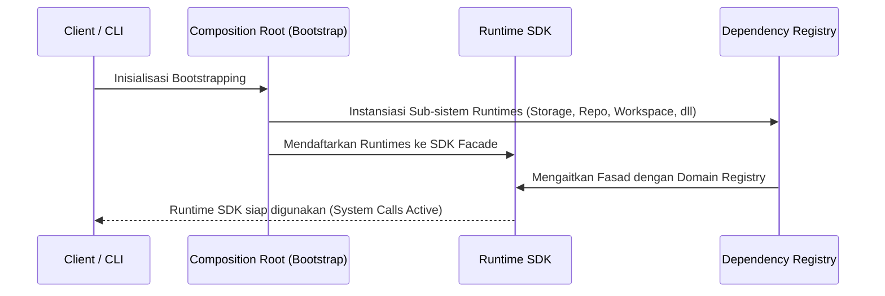
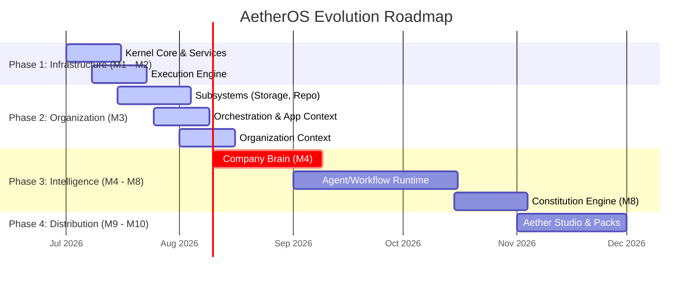

# AetherOS System Architecture Book

---
Status: Implemented
Version: 2.0.0
Owner: Core Platform Team
Last Updated: 2026-07-07
Depends On: None
Required Reading: README.md
Related ADR: ADR-0011, ADR-0017, ADR-0018, ADR-0019, ADR-0020, ADR-0024, ADR-0025, ADR-0027
Related RFC: RFC-0005, RFC-0011, RFC-0012
Implementation Status: Core Foundation Implemented (M1 - M3.5)
---

## 1. Visi & Filosofi

### "Build Organizations, not Agents"
AetherOS tidak dirancang untuk membangun agen kecerdasan buatan (*AI Agent*) yang berdiri sendiri. AetherOS adalah sebuah **Sistem Operasi Agen Terbuka (Open Agent Operating System)** yang menyediakan infrastruktur sistem lengkap agar berbagai agen dapat berinteraksi, berkolaborasi, dan beroperasi di bawah tata kelola birokrasi, sosial, dan hukum organisasi.

Dalam sistem operasi tradisional, unit eksekusi terkecil adalah proses (*process*). Di AetherOS, proses tersebut diperluas menjadi entitas kognitif agen (*Agent Worker*) yang bertindak atas nama bagian dari struktur organisasi (*Organization*).

---

## 2. Prinsip Arsitektur Utama

1. **Resource Universality**: Seluruh entitas di dalam OS (Workspace, Storage, Repository, Artifact, Agent, Workflow) diabstraksikan sebagai *Resource* yang diidentifikasi secara unik menggunakan format `ResourceURI` (contoh: `artifact://tenant/workspace/path`).
2. **Absolute Decoupling (Pemisahan Mutlak)**: Setiap lapisan runtime beroperasi secara terisolasi tanpa ada hubungan ketergantungan melintang (*horizontal dependency*). Ketergantungan murni mengalir dari bawah ke atas (*bottom-up*).
3. **No Blob Ownership Violation**: Setiap *runtime* hanya memegang kekuasaan atas data semantiknya sendiri. Sub-sistem *Repository* tidak menyimpan file, hanya menyimpan graf revisi (*Revision Graph*). Isi file (Blob/Streams) murni dikelola oleh *Storage Runtime*.
4. **Interface-Driven Facade**: Interaksi antar runtime tidak pernah diizinkan memanggil fungsi internal secara langsung. Semua akses didelegasikan melalui *Runtime SDK Facade* (`AetherRuntime`).

---

## 3. Runtime Ecosystem & Dependency Direction

Sesuai dengan **ADR-0025**, ketergantungan antar runtime didefinisikan secara vertikal.

```text
               ┌────────────────────────┐
               │      Company Brain     │  <-- Layer 4: Intelligence
               └───────────┬────────────┘
                           │
               ┌───────────▼────────────┐
               │   Organization Core    │  <-- Layer 3: Organization
               └───────────┬────────────┘
                           │
               ┌───────────▼────────────┐
               │ Workspace Application  │  <-- Layer 2: Orchestration (CQRS)
               └─────┬───┬───┬───┬──────┘
                     │   │   │   │
        ┌────────────┘   │   │   └────────────┐
        ▼                ▼   ▼                ▼
 ┌─────────────┐ ┌───────────┐ ┌────────────┐ ┌────────────┐
 │  Workspace  │ │  Storage  │ │ Repository │ │  Artifact  │ <-- Layer 1: Subsystems
 └─────────────┘ └───────────┘ └────────────┘ └────────────┘
        │                │           │                │
        └────────────┐   │   ┌───────┘                │
                     ▼   ▼   ▼                        ▼
               ┌────────────────────────┐
               │      Runtime SDK       │  <-- Facade (Syscall API)
               └───────────┬────────────┘
                           │
               ┌───────────▼────────────┐
               │   Execution & Kernel   │  <-- Layer 0: System Kernel
               └────────────────────────┘
```

---

## 4. Resource Ownership Matrix

Sesuai dengan **ADR-0024**, pembagian wewenang data diatur secara ketat:

| Subsystem | Tanggung Jawab Utama | Data yang Dimiliki | Referensi yang Disimpan | Ketergantungan |
|---|---|---|---|---|
| **Kernel** | System Services, Metrics, Telemetry | State internal OS, log aktivitas | — | — |
| **Execution** | Isolasi proses sandbox | Thread pools, Session State | Task ID, Session ID | Kernel |
| **Runtime SDK** | Fasad interaksi terpusat | — | Semua skema URI | Execution |
| **Storage** | Manipulasi Blob & File Stream | Hash/Blob fisik | `storage://` URI | Runtime SDK |
| **Repository** | Pengelolaan riwayat revisi kode | Revision Graph, Commits | Storage URI (`storage://`) | Storage |
| **Artifact** | Struktur semantik & metadata | Metadata, Hubungan (Relationships) | Repository/Storage URI | Repository |
| **Workspace** | Aggregate Root domain proyek | Status Workspace, Lease | Semua skema URI | Runtime SDK |
| **Organization** | Operating Context global | Identity, Directory, Roles, Policies | Workspace/Resource URI | Workspace App |

---

## 5. Universal Resource Model

AetherOS menggunakan skema penamaan **Universal Resource URI** (`scheme://authority/path?query`) berdasarkan **ADR-0017** dan **ADR-0022**:

- `storage://<provider>/<hash>`: Lokasi data blob biner fisik.
- `repository://<tenant>/<repo-id>/<commit>`: Lokasi node tertentu dalam graf revisi kode.
- `artifact://<tenant>/<workspace-id>/<artifact-id>`: Representasi dokumen pengetahuan semantik.
- `workspace://<tenant>/<workspace-id>`: Isolasi batas operasional proyek.
- `brain://<tenant>/graph`: Alamat sistem nalar (*Intelligence reasoning*).

---

## 6. Siklus Hidup Sistem (System Lifecycle)

Inisialisasi sistem AetherOS berjalan melalui tiga fase bootstrap:



---

## 7. Evolution Roadmap 2.0

Perkembangan sistem terbagi menjadi lima fase evolusi:


