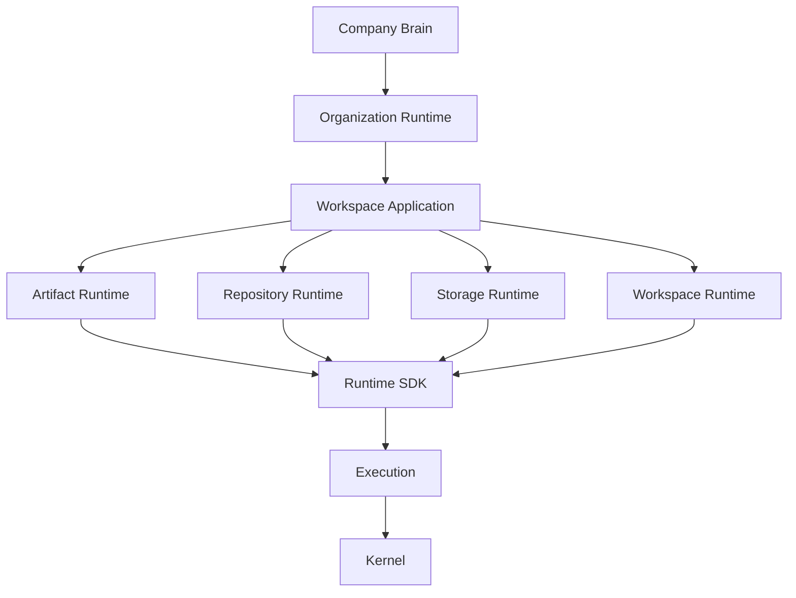

# Runtime Matrix & Dependencies

Matriks ini merupakan sumber kebenaran (source of truth) terkait batasan wewenang penyimpanan data dan relasi ketergantungan antar-runtime di dalam AetherOS.

## Ownership Matrix

Setiap runtime hanya boleh memanipulasi *state* yang berada dalam wilayah kekuasaannya.

| Runtime      | Responsibility | Owns Data     | References  | Depends On    |
| ------------ | -------------- | ------------- | ----------- | ------------- |
| Kernel       | OS Services    | Service State | —           | —             |
| Execution    | Proses / Run   | Isolasi       | —           | Kernel        |
| Runtime SDK  | Universal API  | —             | Semua URI   | Execution     |
| Storage      | Object / Blob  | Blob (File)   | URI         | Runtime SDK   |
| Repository   | Versioning     | Graph         | Storage URI | Storage       |
| Artifact     | Semantics      | Metadata      | Storage URI | Repository    |
| Workspace    | Context        | Aggregate     | Semua URI   | Runtime SDK   |
| Organization | Operating Ctx  | References    | URI         | Workspace App |

## Dependency Diagram

Sesuai ADR-0025, aliran pemanggilan selalu mengarah ke bawah (*bottom-up*) melalui `AetherRuntime` Facade. Tidak diperkenankan ketergantungan horizontal antar-runtime yang selevel.

