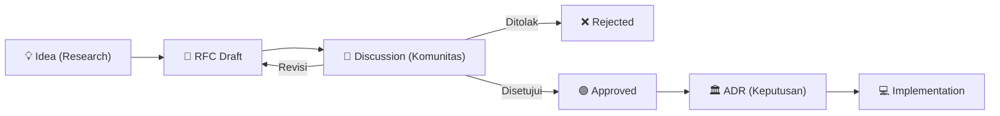

# 💬 Request for Comments (RFC)

AetherOS menggunakan sistem **RFC (Request for Comments)** untuk mengusulkan fitur besar atau perubahan arsitektural.

Proses yang terstruktur memastikan bahwa kontributor dari seluruh dunia dapat berdiskusi dan menyempurnakan suatu ide **sebelum** satu baris kode pun ditulis.

## Alur Hidup Sebuah Ide di AetherOS

Setiap inisiatif besar (yang memengaruhi Kernel, Company Brain, atau Protokol Komunikasi) harus melewati *pipeline* ini:

## Daftar RFC

| ID RFC | Judul | Penulis | Status | Tanggal |
|---|---|---|---|---|
| [RFC-0001](rfc-0001-execution-engine.md) | Aether Execution Engine | Principal Runtime Engineer | 🟢 Implemented | 2026-07-06 |
| [RFC-0011](../../../.gemini/antigravity-ide/brain/abe93bac-f782-4551-93ab-8d241ba05046/implementation_plan.md) | Organization Runtime (Operating Context) | Core Platform Team | 🟢 Implemented | 2026-07-07 |
| [RFC-0012](../../../.gemini/antigravity-ide/brain/abe93bac-f782-4551-93ab-8d241ba05046/implementation_plan.md) | Architecture Consolidation & Docs Freeze | Core Platform Team | 🟢 Implemented | 2026-07-07 |

---

## Cara Membuat RFC Baru

1. Buat *Branch* baru dari `main` dengan format `rfc/judul-singkat`.
2. Salin *template* (akan disediakan di `rfc-template.md`).
3. Jelaskan spesifikasi fitur, urgensi, dampak mundur (backward compatibility), dan rencana implementasi.
4. Buat *Pull Request* ke repositori utama agar komunitas dapat meninjau (Review).
