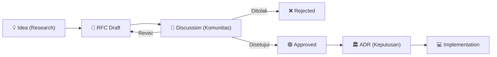

# 💬 Request for Comments (RFC)

Terinspirasi dari tata kelola proyek *open-source* berskala besar seperti Kubernetes, Python (PEP), dan CNCF, AetherOS menggunakan sistem **RFC (Request for Comments)** untuk mengusulkan fitur besar atau perubahan arsitektural.

Proses yang terstruktur memastikan bahwa kontributor dari seluruh dunia dapat berdiskusi dan menyempurnakan suatu ide **sebelum** satu baris kode pun ditulis.

## Alur Hidup Sebuah Ide di AetherOS

Setiap inisiatif besar (yang memengaruhi Kernel, Company Brain, atau Protokol Komunikasi) harus melewati *pipeline* ini:

## Daftar RFC Aktif

*(Tabel ini akan berisi daftar file RFC markdown yang sedang dalam masa peninjauan atau sudah disetujui)*

| ID RFC | Judul | Penulis | Status | Tanggal |
|---|---|---|---|---|
| RFC-000 | (Contoh) Migrasi dari FastAPI ke gRPC | @aminuddin12 | Draft | - |

---

## Cara Membuat RFC Baru

1. Buat *Branch* baru dari `main` dengan format `rfc/judul-singkat`.
2. Salin *template* (akan disediakan di `rfc-template.md`).
3. Jelaskan spesifikasi fitur, urgensi, dampak mundur (backward compatibility), dan rencana implementasi.
4. Buat *Pull Request* ke repositori utama agar komunitas dapat meninjau (Review).
