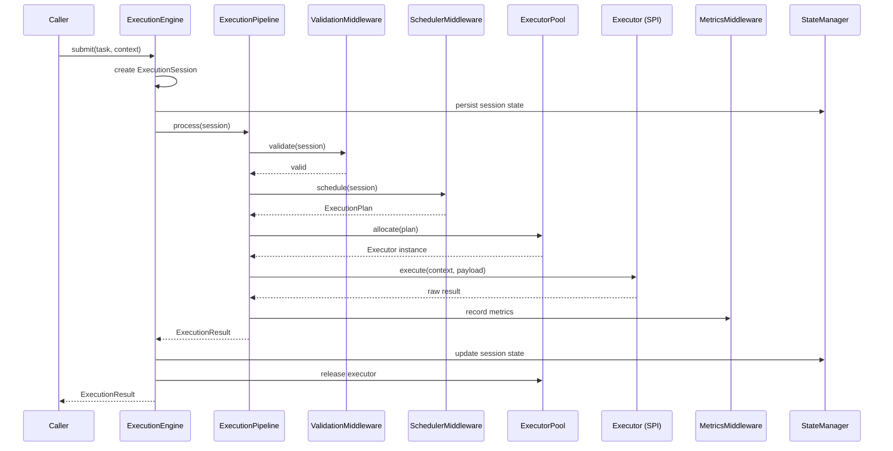

# RFC-0001: Aether Execution Engine

> **Status**: Proposed
> **Author**: Principal Runtime Engineer
> **Date**: 2026-07-06
> **Milestone**: 2

## 1. Motivation

Milestone 1 membangun Kernel sebagai infrastruktur OS dasar. Namun Kernel saat ini memiliki `WorkerRuntime` dan `KernelExecutionPipeline` yang masih bersifat *placeholder*. Kernel mengetahui cara mengorkestrasi, tetapi belum memiliki mesin eksekusi universal.

**Execution Engine** (`core/execution/`) adalah lapisan di atas Kernel yang bertanggung jawab menjalankan **apapun** — baik itu AI Agent, Docker Container, SSH Command, Human Task, atau Browser Automation — melalui satu antarmuka `Executor` yang seragam.

### Mengapa Terpisah dari Kernel?
- **Kernel** = Infrastruktur OS (Registry, DI, EventBus, Supervisor). Stabil, jarang berubah.
- **Execution Engine** = Runtime Execution (Executor Pool, Retry, Timeout, Cancellation, Strategy). Berevolusi cepat seiring bertambahnya jenis Executor.

Pemisahan ini mengikuti prinsip *Microkernel Architecture*: Kernel tetap kecil dan stabil, sementara kapabilitas eksekusi dapat berkembang tanpa menyentuh Kernel.

## 2. Scope

### In Scope
- Executor SPI (Service Provider Interface) untuk ekstensi.
- Executor Pool untuk alokasi dan manajemen lifecycle Executor.
- Execution Context, Session, Plan, Strategy, Policy (Retry, Timeout, Cancellation).
- Middleware-based Pipeline khusus eksekusi.
- Execution State, Metrics, Diagnostics, Lifecycle, dan Events.
- Resource Manager (in-memory slot management).

### Out of Scope
- Implementasi Executor spesifik (AI, Docker, SSH, Human, Browser, MCP).
- Database persistence.
- HTTP/REST/GraphQL API.
- Provider routing.

## 3. Dependency Rules

### Allowed
- `core/contracts/*` (API Freeze — read-only)
- `core/kernel/` **Public API only** (bootstrap, configuration, context, events, dispatcher, metrics, registry, lifecycle, dependency_injection, diagnostics, state, manifest, permissions, supervisor — melalui `__init__.py` exports)

### Forbidden
- `core/kernel/internal/*`
- Vendor libraries (openai, redis, sqlalchemy, fastapi, langgraph, openhands)

## 4. Architectural Decisions

### ADR-0014: Execution Engine Separated from Kernel
Pipeline di Kernel (`core/kernel/pipeline/`) berfungsi sebagai *system-level orchestrator*. Pipeline di Execution Engine (`core/execution/pipeline/`) berfungsi sebagai *execution-level orchestrator*. Keduanya menggunakan middleware pattern, tetapi pada layer yang berbeda.

### ADR-0015: Executor as Universal SPI
Setiap jenis eksekusi (AI, Docker, Human, CLI) harus mengimplementasikan satu SPI `Executor`. Execution Engine tidak mengetahui detail implementasinya.

### ADR-0016: CancellationToken Pattern
Mengadopsi pattern `.NET CancellationToken` untuk cooperative cancellation. Executor bertanggung jawab memeriksa token secara periodik.

### ADR-0017: ExecutionPlan as Immutable Directive
`ExecutionPlan` adalah arahan yang dihasilkan Scheduler. Ia bersifat immutable setelah dibuat. Perubahan strategi menghasilkan Plan baru, bukan mutasi.

### ADR-0018: Execution Session as Unit of Work
Setiap eksekusi dibungkus dalam `ExecutionSession` yang melacak timing, parent/child relationships, dan status. Session dapat di-nest untuk sub-task execution.

## 5. Public API (`api/`)

| Class | Tanggung Jawab |
|---|---|
| `ExecutionEngine` | Facade utama. Menerima Task, mengorkestrasi keseluruhan. |
| `ExecutionSession` | Session wrapper dengan timing dan status. |
| `ExecutionPlan` | Rencana eksekusi immutable. |
| `ExecutionResult` | Hasil eksekusi (success/failure/timeout/cancelled). |
| `ExecutionContext` | Context immutable yang diturunkan ke Executor. |
| `ExecutionDiagnostics` | Laporan status engine. |

## 6. SPI (`spi/`)

| Interface | Tanggung Jawab |
|---|---|
| `Executor` | Interface universal untuk semua jenis executor. |
| `ExecutionStrategy` | Menentukan *bagaimana* task dijalankan (Sequential, Parallel, Batch). |
| `ExecutionPolicy` | Menggabungkan RetryPolicy, TimeoutPolicy. |
| `ExecutionMiddleware` | Middleware untuk pipeline eksekusi. |
| `RetryPolicy` | Aturan retry (max attempts, backoff). |
| `TimeoutPolicy` | Aturan timeout (execution, session). |

## 7. Sequence Diagram



## 8. Execution Lifecycle

```
Created → Queued → Running → Completed
                         ↘ Cancelled
                         ↘ Failed
                         ↘ TimedOut
```

## 9. Compatibility Promise
- TIDAK mengubah `core/contracts/` (API Freeze).
- TIDAK mengubah `core/kernel/` public API (Architecture Freeze).
- TIDAK mengimpor dari `core/kernel/internal/`.

## 10. Extension Points
- Custom `Executor` via SPI.
- Custom `ExecutionStrategy` (Sequential, Parallel, MapReduce, dsb).
- Custom `ExecutionMiddleware` untuk pipeline.
- Custom `RetryPolicy` / `TimeoutPolicy`.
- Custom `ResourceManager` (future: distributed slot allocation).
