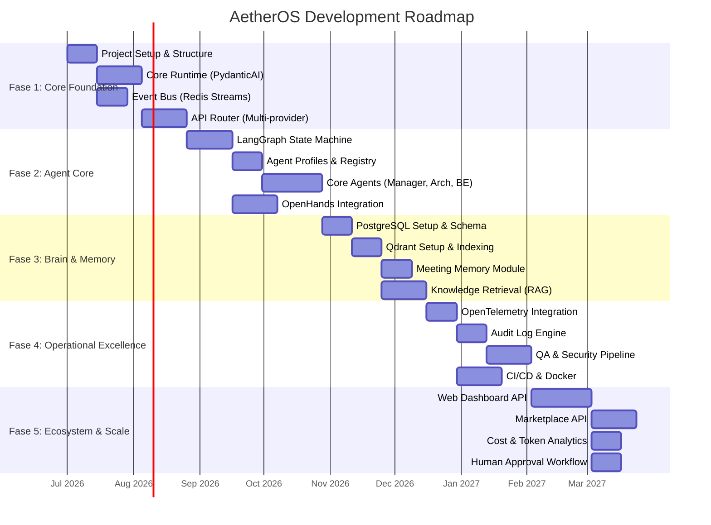
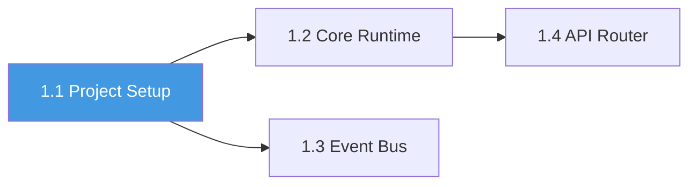
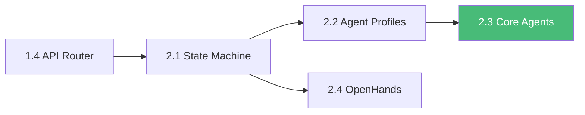

# 11 — Roadmap Pengembangan (Fase 1-5)

> Dokumen ini mendeskripsikan roadmap pengembangan AetherOS secara detail, termasuk deliverables, acceptance criteria, estimasi timeline, dan dependensi antar fase.

---

## 11.1 Timeline Overview

---

## 11.2 Fase 1 — Core Foundation

### Tujuan
Membangun fondasi teknis yang kokoh: runtime engine, komunikasi, dan abstraksi LLM.

### Deliverables

| # | Deliverable | Acceptance Criteria |
|---|-------------|---------------------|
| 1.1 | **Project Workspace & Directory Structure** | Struktur direktori sesuai spec, pyproject.toml configured, development environment berjalan |
| 1.2 | **Core Runtime Engine (PydanticAI)** | Agent base class dapat diinstansiasi, schema validation berjalan, output yang tidak sesuai schema di-reject |
| 1.3 | **Event Bus (Redis Streams)** | Publish/subscribe berfungsi, consumer groups aktif, message acknowledgment bekerja, DLQ configured |
| 1.4 | **API Router (Multi-provider LLM)** | Minimal 2 provider terhubung (OpenAI + Ollama), fallback berfungsi, cost tracking aktif |

### Dependensi

### KPIs

| KPI | Target |
|-----|--------|
| Runtime startup time | < 5 detik |
| Event bus throughput | > 100 messages/second |
| API Router fallback time | < 3 detik |
| Schema validation accuracy | 100% |

---

## 11.3 Fase 2 — Agent Core Development

### Tujuan
Membangun framework agen yang fungsional dengan state machine dan 3 agen inti.

### Deliverables

| # | Deliverable | Acceptance Criteria |
|---|-------------|---------------------|
| 2.1 | **LangGraph State Machine** | State transitions berfungsi, checkpoint/resume bekerja, state persisted ke storage |
| 2.2 | **Agent Profiles & Registry** | RBAC enforcement aktif, permission matrix berfungsi, agent discovery melalui registry |
| 2.3 | **Core Agents: Manager, Architect, Backend** | Manager dapat dekomposisi instruksi, Architect menghasilkan schema, Backend mengimplementasikan kode |
| 2.4 | **OpenHands Tool Integration** | File read/write dalam sandbox berfungsi, command execution dengan whitelist, atomic operations |

### Dependensi

### KPIs

| KPI | Target |
|-----|--------|
| Instruksi sederhana berhasil di-decompose | > 90% |
| Agent RBAC enforcement | 100% |
| Task completion rate (simple tasks) | > 80% |
| Sandbox isolation | Zero escapes |

---

## 11.4 Fase 3 — Brain & Memory Integration

### Tujuan
Membangun Project Brain yang memungkinkan pengetahuan persisten dan context injection.

### Deliverables

| # | Deliverable | Acceptance Criteria |
|---|-------------|---------------------|
| 3.1 | **PostgreSQL Infrastructure** | Schema deployed, migrations berjalan, ACID compliance verified |
| 3.2 | **Qdrant Vector Indexing** | Collections created, embedding pipeline berfungsi, similarity search < 200ms |
| 3.3 | **Meeting Memory Module** | Dapat merangkum interaksi, mengekstraksi intent, menyimpan ke Qdrant |
| 3.4 | **Knowledge Retrieval (RAG)** | Context injection berfungsi, relevance score > 0.7 untuk top-5 results |

### KPIs

| KPI | Target |
|-----|--------|
| Knowledge extraction rate | > 85% instruksi menghasilkan knowledge entry |
| Context injection relevance | > 70% top-5 relevant |
| Vector search latency (P95) | < 200ms |
| Knowledge survives model swap | 100% |

---

## 11.5 Fase 4 — Operational Excellence

### Tujuan
Membangun observabilitas, audit, QA pipeline, dan deployment otomatis.

### Deliverables

| # | Deliverable | Acceptance Criteria |
|---|-------------|---------------------|
| 4.1 | **OpenTelemetry Tracing** | TraceID propagasi end-to-end, spans visible di Jaeger, latency metrics di Grafana |
| 4.2 | **Audit Log Engine** | Semua aksi agen tercatat, query by trace_id berfungsi, immutable storage |
| 4.3 | **QA & Security Pipeline** | QA agent menjalankan tests otomatis, Security agent scan setiap commit, block merge on critical findings |
| 4.4 | **CI/CD & Docker** | Docker Compose stack berjalan, auto-deploy ke staging, health checks aktif |

### KPIs

| KPI | Target |
|-----|--------|
| Trace coverage | 100% instructions traceable |
| Audit log completeness | 100% actions logged |
| Security scan coverage | 100% commits scanned |
| CI pipeline execution time | < 10 menit |

---

## 11.6 Fase 5 — Ecosystem & Scale

### Tujuan
Membangun antarmuka pengguna, marketplace, dan optimasi biaya.

### Deliverables

| # | Deliverable | Acceptance Criteria |
|---|-------------|---------------------|
| 5.1 | **Web Dashboard API** | CRUD proyek, real-time task monitoring, trace explorer, responsive UI |
| 5.2 | **Marketplace API** | Plugin install/uninstall, search/filter, permission enforcement, sandboxed execution |
| 5.3 | **Cost & Token Analytics** | Per-project/per-agent cost breakdown, budget alerts, auto-downgrade |
| 5.4 | **Human Approval Workflow** | Checkpoint gates berfungsi, Dashboard menampilkan approval requests, approve/deny flow |

### KPIs

| KPI | Target |
|-----|--------|
| Dashboard page load time | < 2 detik |
| Real-time update latency | < 1 detik |
| Plugin install success rate | > 95% |
| Budget alert accuracy | 100% |
| HITL response time | < 24 jam (configurable) |

---

## 11.7 Post-Fase 5 — Future Roadmap

| Item | Deskripsi | Priority |
|------|-----------|----------|
| **Multi-tenant Support** | Isolasi per organisasi | High |
| **Self-Improving Agents** | Agen belajar dari feedback dan meningkatkan kemampuan | Medium |
| **Natural Language Dashboard** | Interaksi dengan dashboard menggunakan bahasa alami | Medium |
| **Cross-Project Knowledge** | Berbagi pengetahuan antar proyek (opt-in) | Low |
| **Mobile Dashboard** | Aplikasi mobile untuk monitoring dan approval | Low |
| **AI Agent Marketplace** | Komunitas membuat dan menjual custom agents | High |

---

🔗 **Selanjutnya:** [Glosarium →](../glossary/index.md)

🔗 **Kembali:** [Menu Utama ←](../README.md)

