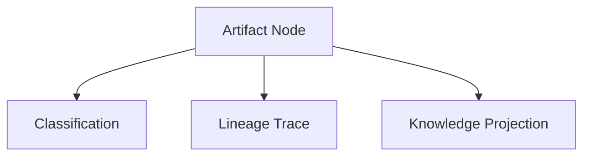

# Artifact Subsystem Documentation

---
Status: Implemented
Version: 1.0.0
Owner: Core Platform Team
Last Updated: 2026-07-07
Depends On: docs/id/runtime/repository.md
Related ADR: ADR-0020, ADR-0024
Related RFC: RFC-0009
Implementation Status: Implemented (M3.3)
---

## 1. Purpose
Artifact Subsystem bertanggung jawab mengelola *Semantic Resource* (Artifact) dengan memberikan klasifikasi, silsilah keturunan (*Lineage*), dan proyeksi pengetahuan semantik terhadap konten berkas yang tersimpan di repositori.

## 2. Motivation
Company Brain membutuhkan data yang terstruktur secara logika dan bermakna semantik (misal: "Dokumen RFC", "Gambar Arsitektur", "Hasil Test Suite"). Artifact mengubah berkas mentah menjadi node pengetahuan semantik yang hidup.

## 3. Responsibilities
- Mengelola metadata klasifikasi (*Classification Matrix*).
- Melacak silsilah transformasi dokumen (*Lineage*).
- Menghasilkan proyeksi pengetahuan semantik (*Knowledge Projection*).

## 4. Non-responsibilities
- Tidak mengelola riwayat revisi berkas biner (tanggung jawab Repository).
- Tidak mengurusi alokasi penyimpanan mentah (tanggung jawab Storage).

## 5. Architecture & Internal Components
```text
artifact/src/aether_artifact/
├── core/             # Artifact, Lineage, Projection Domain Models
├── classification/   # Aturan validasi tipe dokumen
└── registry/         # Registry pendaftaran global artifact
```



## 6. Lifecycle
1. Berkas mentah didaftarkan dari *Repository*.
2. Artifact dibuat dan diberi skema klasifikasi.
3. Node didaftarkan ke *Global Resource Catalog*.

## 7. Events
- `ArtifactRegisteredEvent`
- `ArtifactLineageUpdatedEvent`
- `ArtifactProjectedEvent`

## 8. Dependencies
- Bergantung pada `repository` dan `storage` untuk akses data mentah.

## 9. Public API
Diekspos via `runtime.artifact`:
- `runtime.artifact.registry.publish(artifact_data)`
- `runtime.artifact.lineage.trace(artifact_uri)`

## 10. Examples
Mempublikasikan artifact semantik baru:
```python
from aether_runtime.sdk import AetherRuntime

runtime = AetherRuntime()
artifact = await runtime.artifact.registry.publish({
    "uri": "artifact://tenant/workspace/spec-01",
    "classification": "ArchitectureDoc",
    "content_ref": "repository://tenant/core/commit-hash/docs/spec.md"
})
```
