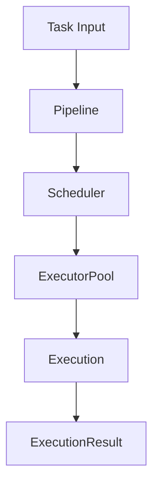

# Execution Engine Subsystem Documentation

---
Status: Implemented
Version: 1.0.0
Owner: Core Platform Team
Last Updated: 2026-07-07
Depends On: docs/id/runtime/kernel.md
Related ADR: ADR-0004, ADR-0006, ADR-0007, ADR-0008, ADR-0009, ADR-0010
Related RFC: RFC-0001
Implementation Status: Implemented
---

## 1. Purpose
Execution Engine berfungsi sebagai Universal Execution Runtime yang bertugas menjalankan tugas (*Tasks*) melalui executor terpilih dalam lingkungan terisolasi (Sandbox).

## 2. Motivation
Menjalankan kode dinamis atau logika pemecahan masalah yang dihasilkan oleh LLM memerlukan isolasi ketat (seperti Docker) dan kontrol kebijakan (timeout, retry, cancellation) agar tidak merusak lingkungan host OS.

## 3. Responsibilities
- Mengelola alokasi Executor dari Pool (`ExecutorPool`).
- Menerapkan Timeout, Retry, dan Cooperative Cancellation.
- Menyediakan *Unit of Work wrapper* melacak status (`ExecutionSession`).

## 4. Non-responsibilities
- Tidak menentukan logika kecerdasan agen (tanggung jawab Agent Runtime).
- Tidak mengelola file/data persisten proyek.

## 5. Architecture & Internal Components
```text
core/execution/
├── executor_pool/    # Manajemen alokasi executor
├── execution_plan/   # Rencana eksekusi immutable
├── execution_session/# Unit of Work pelacakan eksekusi
├── pipeline/         # Pipeline middleware pemrosesan task
├── timeout/          # Kontrol batas waktu
├── retry/            # Kontrol percobaan ulang
└── cancellation/     # Cooperative cancellation tokens
```



## 6. Lifecycle
1. `ExecutionPlan` dibuat dari input Task.
2. `ExecutionSession` diinisiasi untuk melacak status eksekusi.
3. Task dialokasikan ke Executor di `ExecutorPool`.
4. Jika sukses atau gagal, status diubah di `lifecycle/`.

## 7. Events
- `ExecutionStarted`
- `ExecutionCompleted`
- `ExecutionFailed`
- `ExecutionCancelled`

## 8. Dependencies
- Bergantung pada `core/kernel/` untuk log dan metrik.

## 9. Public API
Diekspos melalui `runtime.execution`:
- `runtime.execution.run_sync(plan)`
- `runtime.execution.spawn(plan)`

## 10. Examples
Menjalankan perintah asinkron:
```python
from aether_runtime.sdk import AetherRuntime

runtime = AetherRuntime()
# Spawning task execution
session_id = await runtime.execution.spawn(my_execution_plan)
```
