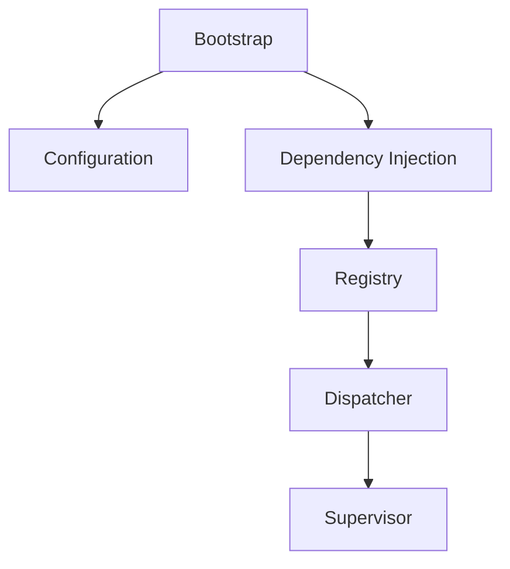

# Kernel Subsystem Documentation

---
Status: Implemented
Version: 1.0.0
Owner: Core Platform Team
Last Updated: 2026-07-07
Depends On: None
Required Reading: docs/id/architecture/book.md
Related ADR: ADR-0005
Related RFC: None
Implementation Status: Implemented
---

## 1. Purpose
Kernel Subsystem menyediakan layanan sistem operasi dasar (*system services*) seperti konfigurasi, manajemen perizinan (*permissions*), pelacakan telemetri (*telemetry*), logging, dan pengiriman event internal.

## 2. Motivation
Untuk membangun Sistem Operasi Agen yang andal, kita memerlukan fondasi terpusat yang sangat stabil dan ringan (Microkernel). Layanan dasar ini tidak boleh bergantung pada sub-sistem operasional tingkat atas untuk mencegah ketergantungan melingkar (*circular dependencies*).

## 3. Responsibilities
- Mengelola konfigurasi global dan sub-sistem.
- Menyediakan bus event internal tingkat rendah (*low-level dispatcher*).
- Mengumpulkan metrik sistem dan memanipulasi permission.
- Memantau kesehatan komponen sistem (*supervisor*).

## 4. Non-responsibilities
- Tidak mengelola isolasi eksekusi sandbox (tanggung jawab Execution Engine).
- Tidak mengelola Workspace atau data domain pengguna.

## 5. Architecture & Internal Components
```text
core/kernel/
├── bootstrap/        # Inisialisasi awal kernel
├── configuration/    # Manajemen konfigurasi sistem
├── context/          # Kaitan state context global
├── dependency_injection/ # Registrasi dependensi internal
├── diagnostics/      # Health check sistem
├── dispatcher/       # Event dispatcher internal
├── events/           # Definisi event global
├── supervisor/       # Pengawas siklus hidup subsistem
└── registry/         # Registry layanan kernel
```



## 6. Lifecycle
Inisialisasi Kernel berjalan paling awal saat boot sistem:
1. `bootstrap` memuat berkas konfigurasi.
2. `dependency_injection` mengonfigurasi registry internal.
3. `supervisor` mengaktifkan diagnostik kesehatan.

## 7. Events
Menerbitkan event sistem internal:
- `KernelStartedEvent`
- `KernelShutdownEvent`
- `SubsystemDegradedEvent`

## 8. Dependencies
- Hanya bergantung pada modul `core/contracts/`.

## 9. Public API
Diekspos melalui `runtime.kernel`:
- `runtime.kernel.metrics.record(metric_name, value)`
- `runtime.kernel.telemetry.trace(span_name)`

## 10. Examples
Merekam metrik sistem:
```python
from aether_runtime.sdk import AetherRuntime

runtime = AetherRuntime()
runtime.kernel.metrics.record("system.startup_time", 120)
```
