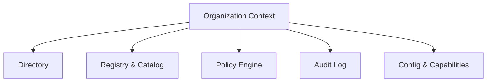

# Organization Subsystem Documentation

---
Status: Implemented
Version: 1.0.0
Owner: Core Platform Team
Last Updated: 2026-07-07
Depends On: docs/id/runtime/workspace.md
Related ADR: ADR-0027
Related RFC: RFC-0011
Implementation Status: Implemented (M3.5)
---

## 1. Purpose
Organization Subsystem berfungsi sebagai **Operating Context** tertinggi di dalam AetherOS yang mengoordinasikan identitas, keanggotaan (manusia & AI), direktori workspace, evaluasi kebijakan global, dan audit trail terpusat.

## 2. Motivation
Sebelum mengoperasikan *Company Brain* (M4) yang cerdas, kita memerlukan entitas hukum dan sosial (Organisasi) tempat seluruh batasan akses, aturan keamanan, audit log kepatuhan, dan kapasitas operasional telah dibakukan.

## 3. Responsibilities
- Mengelola data profil perusahaan (`OrganizationIdentity`).
- Mendaftarkan anggota manusia dan AI/non-manusia (`OrganizationDirectory`).
- Mengevaluasi kebijakan otorisasi (`OrganizationPolicyEngine`).
- Menyediakan rekam jejak kepatuhan (`OrganizationAuditLog`).

## 4. Non-responsibilities
- Tidak mengurusi orkestrasi internal workspace individu (tanggung jawab Workspace).
- Tidak mengelola model kecerdasan reasoning agen secara langsung.

## 5. Architecture & Internal Components
```text
organization/src/aether_organization/
├── core/             # OrganizationContext & Identity
├── directory/        # Membership & RBAC (Role -> Permission -> Policy)
├── registry/         # WorkspaceReference & ResourceCatalog Indexes
├── policies/         # OrganizationPolicyEngine
├── audit/            # OrganizationAuditLog (Event -> Entry -> Evidence)
└── config/           # Configuration & Capabilities Profiles
```



## 6. Lifecycle
1. Organisasi diinstansiasi dengan profil `OrganizationIdentity`.
2. Directory memetakan anggota dan peran awal.
3. Workspace didaftarkan sebagai referensi di `WorkspaceRegistry`.
4. Seluruh keputusan dicatat ke `OrganizationAuditLog`.

## 7. Events
- `OrganizationCreatedEvent`
- `MemberJoinedEvent`
- `WorkspaceRegisteredToOrganizationEvent`

## 8. Dependencies
- Bergantung pada Workspace App murni melalui *Runtime SDK Facade*.

## 9. Public API
Diekspos via `runtime.organization`:
- `runtime.organization.identity.describe()`
- `runtime.organization.directory.members()`
- `runtime.organization.registry.workspaces()`
- `runtime.organization.catalog.resources()`
- `runtime.organization.audit.history()`
- `runtime.organization.policy.evaluate()`
- `runtime.organization.configuration.current()`
- `runtime.organization.capabilities.available()`

## 10. Examples
Mengambil keanggotaan organisasi:
```python
from aether_runtime.sdk import AetherRuntime

runtime = AetherRuntime()
members = await runtime.organization.directory.members()
```
