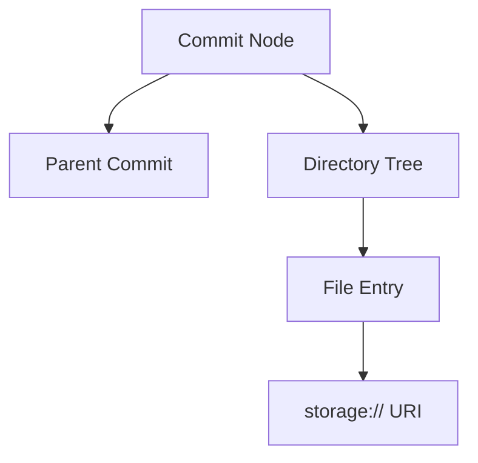

# Repository Subsystem Documentation

---
Status: Implemented
Version: 1.0.0
Owner: Core Platform Team
Last Updated: 2026-07-07
Depends On: docs/id/runtime/storage.md
Related ADR: ADR-0017, ADR-0024
Related RFC: None
Implementation Status: Implemented (M3.2)
---

## 1. Purpose
Repository Subsystem bertanggung jawab melacak riwayat revisi berkas (*version control*) dan perubahan kode menggunakan struktur *Revision Graph* (Commit History) yang bersih dari dependensi langsung ke biner sistem operasi (seperti Git cli).

## 2. Motivation
Perusahaan AI membutuhkan pencatatan riwayat kode yang tak terbantahkan. Namun mengikat sistem secara langsung ke biner Git mempersulit isolasi dalam kontainer terdistribusi. Repository Runtime mengabstraksi fungsionalitas ini menjadi model domain murni.

## 3. Responsibilities
- Mengelola graf komit (*Commit Graph*).
- Menghubungkan metadata komit ke berkas fisik di Storage (`storage://`).
- Menyediakan abstraksi *branching* dan *merging*.

## 4. Non-responsibilities
- Tidak membaca/menulis isi konten berkas secara langsung (tanggung jawab Storage).
- Tidak mengurusi arti atau klasifikasi fungsional kode (tanggung jawab Artifact).

## 5. Architecture & Internal Components
```text
repository/src/aether_repository/
├── core/             # Repository, Commit, Branch Domain Models
├── resolver/         # Penyelesaian alias commit/branch ke hash
├── uri/              # Router untuk repository:// URI
└── adapters/         # Git Adapter, Memory Adapter
```



## 6. Lifecycle
Inisialisasi adapter dilakukan via registry saat bootstrap:
1. Adapter (misal `GitAdapter`) memetakan repositori fisik.
2. Sesi transaksi revisi dibuka untuk pendaftaran komit baru.
3. Node ditambahkan ke dalam graf revisi lokal.

## 7. Events
- `CommitCreatedEvent`
- `BranchCreatedEvent`
- `RepositorySyncedEvent`

## 8. Dependencies
- Bergantung pada `storage` untuk resolusi penyimpanan berkas fisik.

## 9. Public API
Diekspos via `runtime.repository`:
- `runtime.repository.commits.create(branch, message, changes)`
- `runtime.repository.graph.traverse(repo_uri)`

## 10. Examples
Membuat komit revisi baru:
```python
from aether_runtime.sdk import AetherRuntime

runtime = AetherRuntime()
commit = await runtime.repository.commits.create(
    repo_uri="repository://tenant/core",
    message="Initial project structure",
    changes={"src/main.py": "storage://cas/hash..."}
)
```
