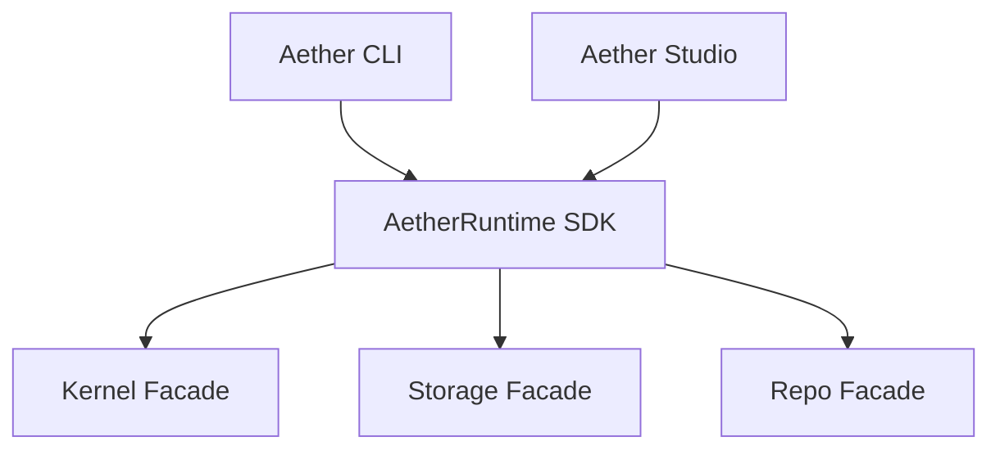

# Runtime SDK Subsystem Documentation

---
Status: Implemented
Version: 1.0.0
Owner: Core Platform Team
Last Updated: 2026-07-07
Depends On: docs/id/runtime/kernel.md, docs/id/runtime/execution.md
Related ADR: ADR-0011
Related RFC: None
Implementation Status: Implemented
---

## 1. Purpose
Runtime SDK bertindak sebagai gerbang terpadu (*Universal Facade*) yang mengekspos seluruh sub-sistem AetherOS ke aplikasi luar (seperti CLI, Aether Studio, REST Gateway) layaknya *System Call Interface* di OS tradisional.

## 2. Motivation
Tanpa SDK terpadu, antarmuka luar akan mengalami *tight-coupling* dengan memanggil modul internal runtime secara melintang. SDK menyederhanakan akses dan menjamin stabilitas API.

## 3. Responsibilities
- Menyediakan kelas fasad tunggal `AetherRuntime`.
- Merutekan panggilan asinkron ke masing-masing sub-sistem.
- Menjaga isolasi dependensi runtime internal.

## 4. Non-responsibilities
- Tidak memiliki logika bisnis atau logika domain sendiri.
- Tidak menyimpan state persisten.

## 5. Architecture & Internal Components
```text
runtime/
├── src/aether_runtime/
│   ├── sdk.py              # AetherRuntime Facade Utama
│   ├── facade/             # Sub-domain Facades (Storage, Repo, dll)
│   └── events/             # Event Dispatcher SDK
```



## 6. Lifecycle
Inisialisasi dilakukan secara terpusat:
```python
runtime = AetherRuntime()  # Memuat seluruh fasad subsistem
```

## 7. Events
Menyediakan mekanisme pelacakan event terpusat untuk aplikasi klien.

## 8. Dependencies
- Bergantung pada seluruh runtime pendukung di bawahnya.

## 9. Public API
- `runtime.kernel`
- `runtime.execution`
- `runtime.storage`
- `runtime.repository`
- `runtime.artifact`
- `runtime.workspace_app`
- `runtime.organization`

## 10. Examples
Menggunakan SDK secara universal:
```python
from aether_runtime.sdk import AetherRuntime

runtime = AetherRuntime()
status = await runtime.workspace.status("workspace://tenant/core")
```
