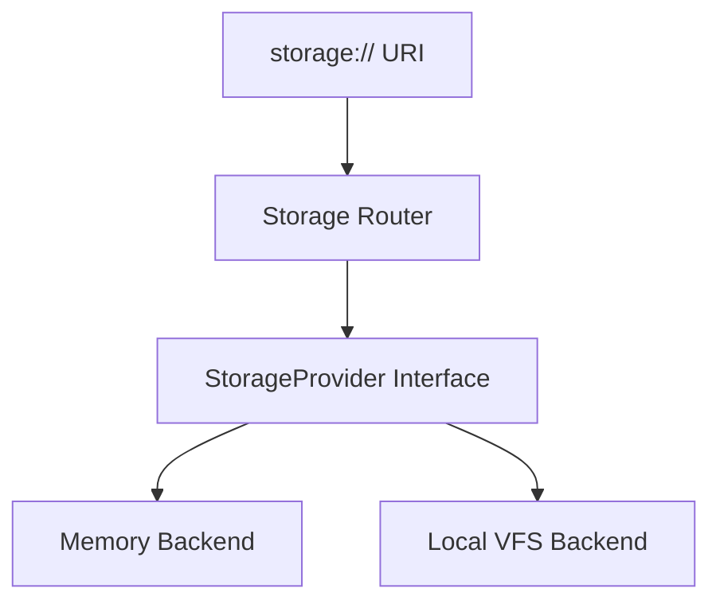

# Storage Subsystem Documentation

---
Status: Implemented
Version: 1.0.0
Owner: Core Platform Team
Last Updated: 2026-07-07
Depends On: docs/id/runtime/runtime-sdk.md
Related ADR: ADR-0017, ADR-0019, ADR-0024
Related RFC: None
Implementation Status: Implemented (M3.1)
---

## 1. Purpose
Storage Subsystem bertugas mengelola penyimpanan biner fisik (*Blob/Stream*) menggunakan prinsip *Content-Addressable Storage* (CAS) dan memproses resource berdasarkan alamat `storage://` URI.

## 2. Motivation
Untuk menjamin agnostisitas media penyimpanan (dapat menggunakan penyimpanan lokal, AWS S3, Google Cloud Storage, IPFS, atau database), logika domain AetherOS dilarang keras berasumsi menggunakan berkas jalur sistem operasi (*OS filesystem paths*).

## 3. Responsibilities
- Mengalirkan data stream secara asinkron (`StorageHandle`).
- Menghasilkan hash unik (SHA-256) untuk validasi integritas blob.
- Mengabstraksi backend fisik melalui `StorageProvider`.

## 4. Non-responsibilities
- Tidak mengenali struktur logika file (direktori) atau riwayat versi (tanggung jawab Repository).
- Tidak mengenali isi konten atau metadata semantiknya (tanggung jawab Artifact).

## 5. Architecture & Internal Components
```text
storage/src/aether_storage/
├── core/             # Abstraksi inti: StorageProvider, StorageHandle
├── uri/              # Router & Parser untuk storage:// URI
└── adapters/         # Implementasi fisik (Memory, Local VFS)
```



## 6. Lifecycle
Siklus hidup handle bersifat transient dan ditutup setelah operasi I/O selesai:
1. Provider dialokasikan berdasarkan skema URI.
2. Handle dibuka untuk pembacaan/penulisan.
3. Stream ditutup setelah I/O selesai.

## 7. Events
- `BlobStoredEvent`
- `BlobDeletedEvent`
- `StorageProviderRegisteredEvent`

## 8. Dependencies
- Bergantung murni pada `core/contracts/` dan `runtime/` (SDK).

## 9. Public API
Diekspos melalui `runtime.storage`:
- `runtime.storage.blobs.put(data_stream)`
- `runtime.storage.blobs.get(storage_uri)`

## 10. Examples
Menyimpan berkas baru:
```python
from aether_runtime.sdk import AetherRuntime

runtime = AetherRuntime()
uri = await runtime.storage.blobs.put(b"Hello, AetherOS!")
print(uri)  # storage://cas/sha256-hash
```
