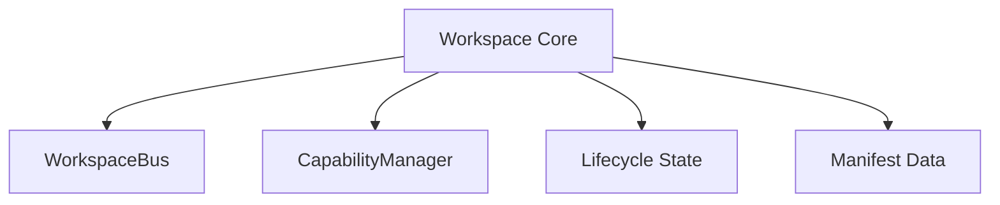

# Workspace Subsystem Documentation

---
Status: Implemented
Version: 1.0.0
Owner: Core Platform Team
Last Updated: 2026-07-07
Depends On: docs/id/runtime/runtime-sdk.md
Related ADR: ADR-0012, ADR-0013, ADR-0014, ADR-0015, ADR-0016
Related RFC: RFC-0005, RFC-0009
Implementation Status: Implemented (M3.0 & M3.4)
---

## 1. Purpose
Workspace Subsystem menyediakan batas operasional proyek (*Aggregate Root boundary*) yang mengoordinasikan status repositori, metadata, file, serta kebijakan akses dalam lingkup proyek tunggal.

## 2. Motivation
Untuk memelihara proyek AI yang bersih dan berumur panjang, kita memerlukan unit operasional yang mengunci seluruh interaksi modifikasi data dalam batas proyek (*Workspace*). Hal ini mencegah kebocoran state antar-proyek dan menyederhanakan pelacakan riwayat pengerjaan agen.

## 3. Responsibilities
- Mengelola status daur hidup proyek (*Created, Active, Locked, Archived*).
- Menyediakan bus komunikasi internal per-workspace (`WorkspaceBus`).
- Memvalidasi perizinan operasi berdasarkan `CapabilityManager`.
- Melakukan diagnostik kesehatan proyek (`WorkspaceDiagnostics`).

## 4. Non-responsibilities
- Tidak mengelola file biner/blob secara fisik (tanggung jawab Storage).
- Tidak mengelola repositori Git tingkat rendah (tanggung jawab Repository).
- Tidak mengelola hierarki organisasi tingkat atas (tanggung jawab Organization).

## 5. Architecture & Internal Components

```text
workspace/src/aether_workspace/
├── core/             # Workspace Aggregate Root & Domain Logic
├── application/      # CQRS Command/Query Handlers
├── bus/              # Event Bus internal per-workspace
├── capabilities/     # Evaluasi perizinan akses Workspace
├── manifest/         # Parser descriptor proyek (workspace.yaml)
└── lifecycle/        # State Machine Workspace
```



### Komponen Internal Utama:
1. **Workspace Domain**: Logika domain murni yang mewakili aggregate root.
2. **Workspace CQRS**: Segregasi penulisan (*Commands*) dan pembacaan (*Queries*) untuk modifikasi Workspace.
3. **Workspace Bus**: Saluran distribusi pesan lokal dalam satu batas Workspace.
4. **Workspace Context & Environment**: Kumpulan metadata lingkungan tempat workspace dijalankan.
5. **Capability Manager**: Pengendali otorisasi resource lokal.
6. **Workspace Diagnostics**: Sistem pengawasan integritas struktur file dan dependensi workspace.

## 6. Lifecycle
Siklus hidup Workspace diatur melalui `lifecycle/`:
```text
[Created] ──(Init)──> [Active] ──(Lock)──> [Locked] ──(Archive)──> [Archived]
```

## 7. Events
- `WorkspaceInitializedEvent`
- `WorkspaceLockedEvent`
- `WorkspaceCapabilityUpdatedEvent`

## 8. Dependencies
- Menggunakan `core/contracts/` untuk pertukaran data DTO.
- Diorkestrasikan oleh `aether-workspace-app` pada tingkat aplikasi.

## 9. Public API
Diakses via `runtime.workspace`:
- `runtime.workspace.init(uri)`
- `runtime.workspace.status(uri)`

## 10. Examples
Menginisiasi workspace baru:
```python
from aether_runtime.sdk import AetherRuntime

runtime = AetherRuntime()
result = await runtime.workspace.init("workspace://tenant/my-project")
print(result.status)
```
